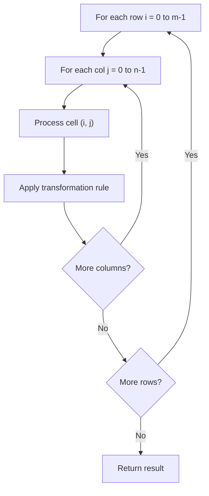

# Problem 1886: Determine Whether Matrix Can Be Obtained By Rotation

**Difficulty:** Easy  
**Tags:** Array, Matrix  
**Pattern:** Matrix / 2D Array  
**Link:** [leetcode.com/problems/determine-whether-matrix-can-be-obtained-by-rotation](https://leetcode.com/problems/determine-whether-matrix-can-be-obtained-by-rotation/)

## Description

Given two `n x n` binary matrices `mat` and `target`, return `true`* if it is possible to make *`mat`* equal to *`target`* by **rotating** *`mat`* in **90-degree increments**, or *`false`* otherwise.*

 

Example 1:

```

**Input:** mat = [[0,1],[1,0]], target = [[1,0],[0,1]]
**Output:** true
**Explanation: **We can rotate mat 90 degrees clockwise to make mat equal target.

```

Example 2:

```

**Input:** mat = [[0,1],[1,1]], target = [[1,0],[0,1]]
**Output:** false
**Explanation:** It is impossible to make mat equal to target by rotating mat.

```

Example 3:

```

**Input:** mat = [[0,0,0],[0,1,0],[1,1,1]], target = [[1,1,1],[0,1,0],[0,0,0]]
**Output:** true
**Explanation: **We can rotate mat 90 degrees clockwise two times to make mat equal target.

```

 

**Constraints:**

	- `n == mat.length == target.length`
	- `n == mat[i].length == target[i].length`
	- `1 <= n <= 10`
	- `mat[i][j]` and `target[i][j]` are either `0` or `1`.

## Approach: Matrix / 2D Array

Process the matrix row by row or column by column. Common patterns: rotation, spiral traversal, in-place modification, transposition.

## Pseudocode

```
1. For each row i:
   For each column j:
     Process cell (i, j) based on neighbors or rules
2. Handle boundary conditions
3. Return modified matrix or computed result
```

## Algorithm Flow



## Complexity Analysis

- **Time:** O(m * n)
- **Space:** O(1) extra

## Solution (Python3)

```python
class Solution:
    def findRotation(self, mat: List[List[int]], target: List[List[int]]) -> bool:
        # Matrix manipulation - O(m*n) time
        if not mat:
            return False
        m, n = len(mat), len(mat[0])
        # Process matrix in-place or build result
        for i in range(m):
            for j in range(n):
                pass  # Process mat[i][j]
        return False
```

## Solution (C++)

```cpp
#include <string>
#include <vector>
using namespace std;

class Solution {
public:
    bool findRotation(vector<vector<int>>& mat, vector<vector<int>>& target) {
        // Matrix manipulation - O(m*n) time
        if (mat.empty()) return false;
        int m = mat.size(), n = mat[0].size();
        for (int i = 0; i < m; i++) {
            for (int j = 0; j < n; j++) {
                // Process matrix[i][j]
            }
        }
        return false;
    }
};
```
