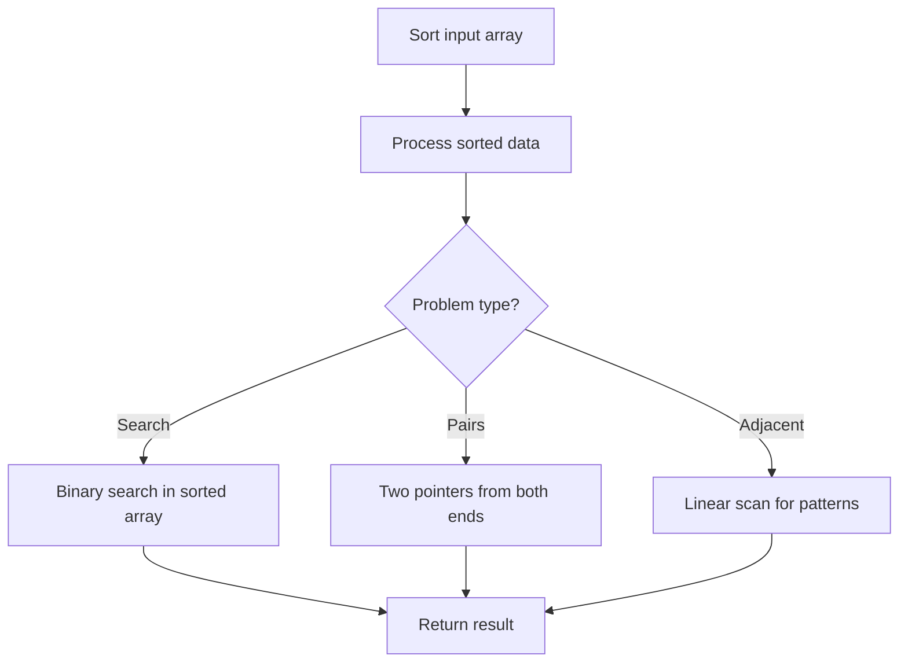

# Problem 1887: Reduction Operations to Make the Array Elements Equal

**Difficulty:** Medium  
**Tags:** Array, Sorting  
**Pattern:** Sorting  
**Link:** [leetcode.com/problems/reduction-operations-to-make-the-array-elements-equal](https://leetcode.com/problems/reduction-operations-to-make-the-array-elements-equal/)

## Description

Given an integer array `nums`, your goal is to make all elements in `nums` equal. To complete one operation, follow these steps:

	- Find the **largest** value in `nums`. Let its index be `i` (**0-indexed**) and its value be `largest`. If there are multiple elements with the largest value, pick the smallest `i`.
	- Find the **next largest** value in `nums` **strictly smaller** than `largest`. Let its value be `nextLargest`.
	- Reduce `nums[i]` to `nextLargest`.

Return *the number of operations to make all elements in *`nums`* equal*.

 

Example 1:

```

**Input:** nums = [5,1,3]
**Output:** 3
**Explanation:** It takes 3 operations to make all elements in nums equal:
1. largest = 5 at index 0. nextLargest = 3. Reduce nums[0] to 3. nums = [3,1,3].
2. largest = 3 at index 0. nextLargest = 1. Reduce nums[0] to 1. nums = [1,1,3].
3. largest = 3 at index 2. nextLargest = 1. Reduce nums[2] to 1. nums = [1,1,1].

```

Example 2:

```

**Input:** nums = [1,1,1]
**Output:** 0
**Explanation:** All elements in nums are already equal.

```

Example 3:

```

**Input:** nums = [1,1,2,2,3]
**Output:** 4
**Explanation:** It takes 4 operations to make all elements in nums equal:
1. largest = 3 at index 4. nextLargest = 2. Reduce nums[4] to 2. nums = [1,1,2,2,2].
2. largest = 2 at index 2. nextLargest = 1. Reduce nums[2] to 1. nums = [1,1,1,2,2].
3. largest = 2 at index 3. nextLargest = 1. Reduce nums[3] to 1. nums = [1,1,1,1,2].
4. largest = 2 at index 4. nextLargest = 1. Reduce nums[4] to 1. nums = [1,1,1,1,1].

```

 

**Constraints:**

	- `1 <= nums.length <= 5 * 10^4`
	- `1 <= nums[i] <= 5 * 10^4`

## Approach: Sorting

Sort the data to enable efficient processing. After sorting, use techniques like binary search, two pointers, or linear scan to solve the problem.

## Pseudocode

```
1. Sort the input array
2. Process sorted data:
   - Use binary search for lookups
   - Use two pointers for pair finding
   - Scan for adjacent patterns
3. Return result
```

## Algorithm Flow



## Complexity Analysis

- **Time:** O(n log n)
- **Space:** O(n)

## Solution (Python3)

```python
class Solution:
    def reductionOperations(self, nums: List[int]) -> int:
        # Sort-based approach - O(n log n) time
        nums.sort(key=lambda x: x[0] if isinstance(x, (list, tuple)) else x)
        result = [nums[0]]
        for i in range(1, len(nums)):
            curr = nums[i]
            if isinstance(curr, (list, tuple)) and isinstance(result[-1], (list, tuple)):
                if curr[0] <= result[-1][1]:
                    result[-1] = [result[-1][0], max(result[-1][1], curr[1])]
                else:
                    result.append(curr)
            else:
                result.append(curr)
        return result
```

## Solution (C++)

```cpp
#include <algorithm>
#include <string>
#include <vector>
using namespace std;

class Solution {
public:
    int reductionOperations(vector<int>& nums) {
        // Sort-based approach - O(n log n) time
        sort(nums.begin(), nums.end());
        vector<vector<int>> result;
        result.push_back(nums[0]);
        for (int i = 1; i < (int)nums.size(); i++) {
            if (nums[i][0] <= result.back()[1]) {
                result.back()[1] = max(result.back()[1], nums[i][1]);
            } else {
                result.push_back(nums[i]);
            }
        }
        return result;
    }
};
```
