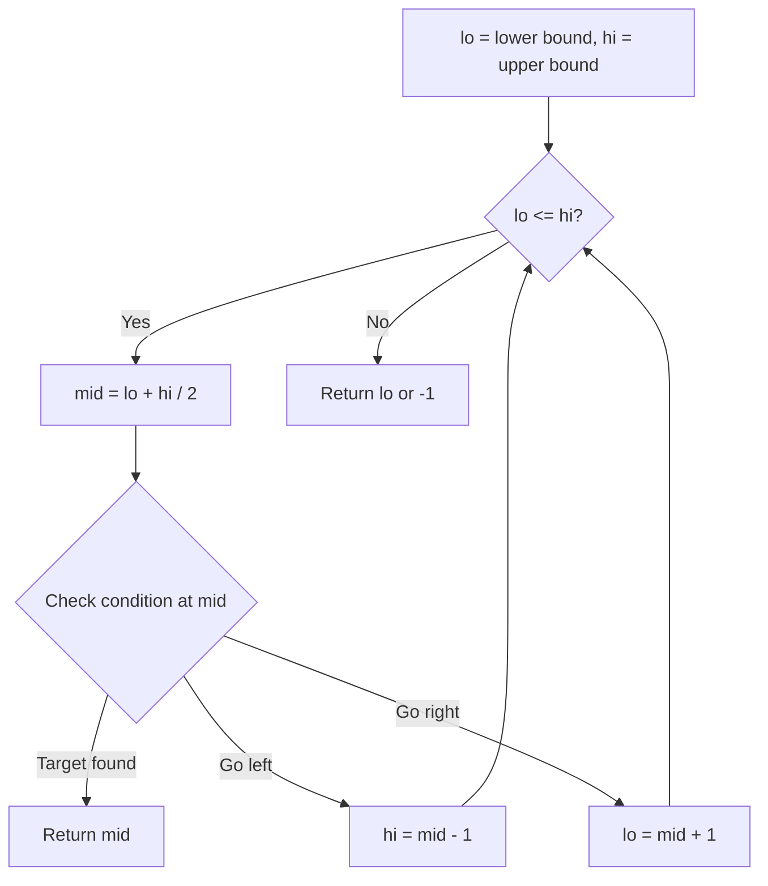
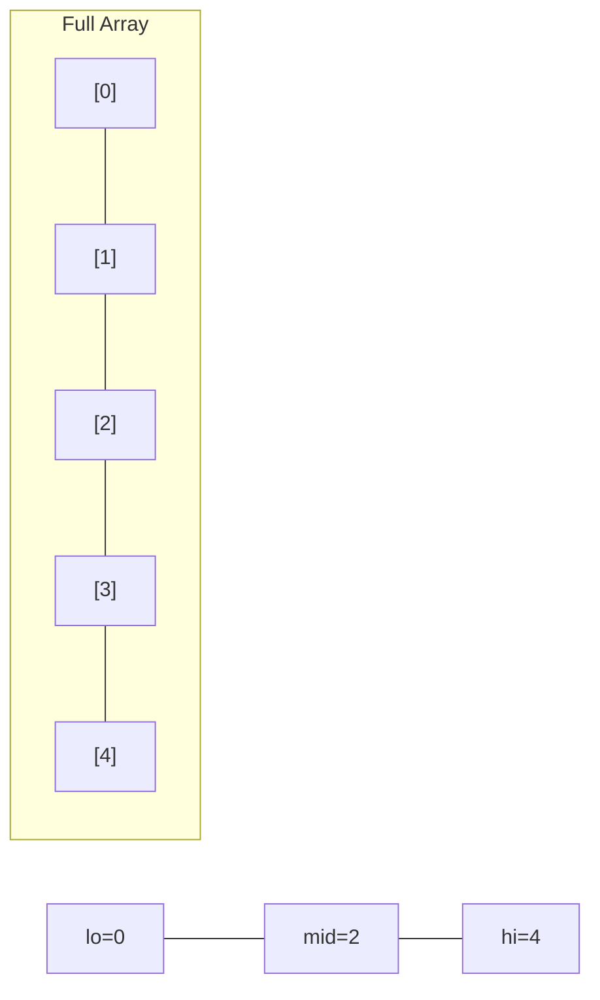
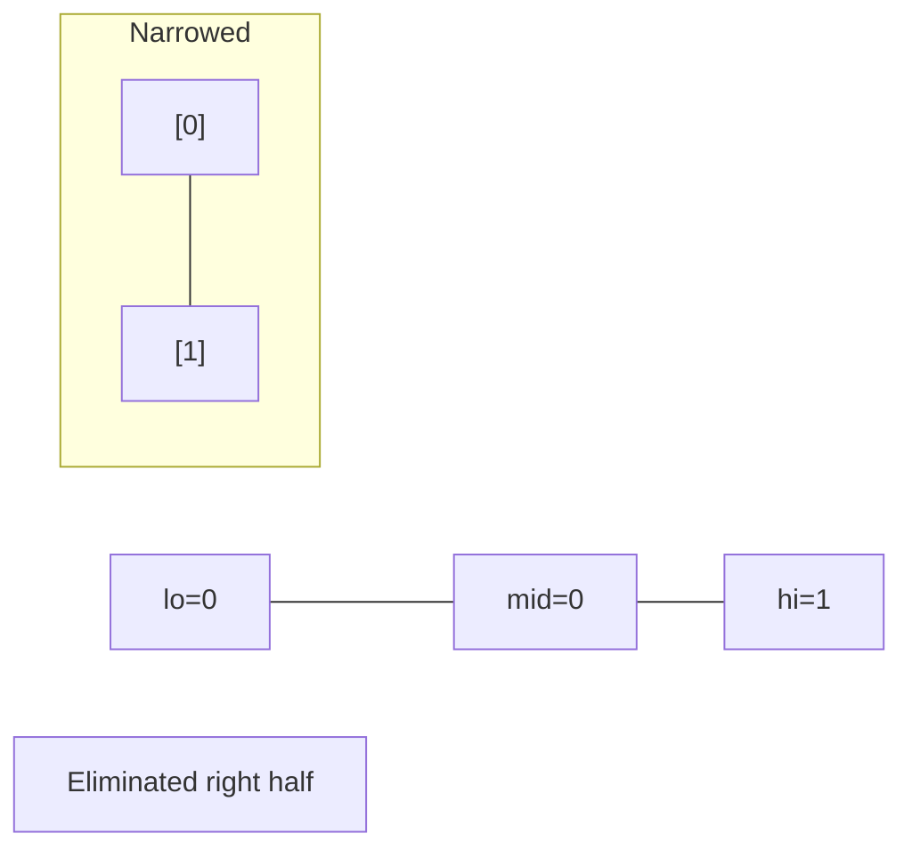
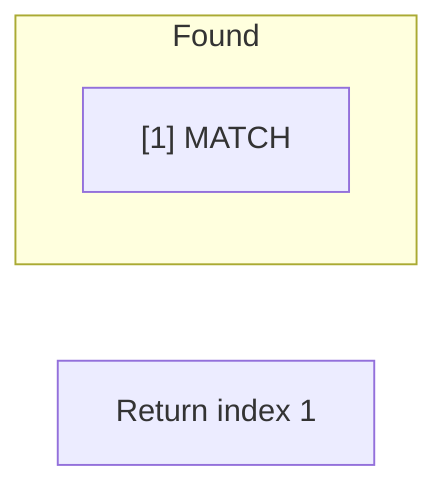

# Problem 1889: Minimum Space Wasted From Packaging

**Difficulty:** Hard  
**Tags:** Array, Binary Search, Sorting, Prefix Sum  
**Pattern:** Binary Search  
**Link:** [leetcode.com/problems/minimum-space-wasted-from-packaging](https://leetcode.com/problems/minimum-space-wasted-from-packaging/)

## Description

You have `n` packages that you are trying to place in boxes, **one package in each box**. There are `m` suppliers that each produce boxes of **different sizes** (with infinite supply). A package can be placed in a box if the size of the package is **less than or equal to** the size of the box.

The package sizes are given as an integer array `packages`, where `packages[i]` is the **size** of the `i^th` package. The suppliers are given as a 2D integer array `boxes`, where `boxes[j]` is an array of **box sizes** that the `j^th` supplier produces.

You want to choose a **single supplier** and use boxes from them such that the **total wasted space **is **minimized**. For each package in a box, we define the space **wasted** to be `size of the box - size of the package`. The **total wasted space** is the sum of the space wasted in **all** the boxes.

	- For example, if you have to fit packages with sizes `[2,3,5]` and the supplier offers boxes of sizes `[4,8]`, you can fit the packages of size-`2` and size-`3` into two boxes of size-`4` and the package with size-`5` into a box of size-`8`. This would result in a waste of `(4-2) + (4-3) + (8-5) = 6`.

Return *the **minimum total wasted space** by choosing the box supplier **optimally**, or *`-1` *if it is **impossible** to fit all the packages inside boxes. *Since the answer may be **large**, return it **modulo **`10^9 + 7`.

 

Example 1:

```

**Input:** packages = [2,3,5], boxes = [[4,8],[2,8]]
**Output:** 6
**Explanation**: It is optimal to choose the first supplier, using two size-4 boxes and one size-8 box.
The total waste is (4-2) + (4-3) + (8-5) = 6.

```

Example 2:

```

**Input:** packages = [2,3,5], boxes = [[1,4],[2,3],[3,4]]
**Output:** -1
**Explanation:** There is no box that the package of size 5 can fit in.

```

Example 3:

```

**Input:** packages = [3,5,8,10,11,12], boxes = [[12],[11,9],[10,5,14]]
**Output:** 9
**Explanation:** It is optimal to choose the third supplier, using two size-5 boxes, two size-10 boxes, and two size-14 boxes.
The total waste is (5-3) + (5-5) + (10-8) + (10-10) + (14-11) + (14-12) = 9.

```

 

**Constraints:**

	- `n == packages.length`
	- `m == boxes.length`
	- `1 <= n <= 10^5`
	- `1 <= m <= 10^5`
	- `1 <= packages[i] <= 10^5`
	- `1 <= boxes[j].length <= 10^5`
	- `1 <= boxes[j][k] <= 10^5`
	- `sum(boxes[j].length) <= 10^5`
	- The elements in `boxes[j]` are **distinct**.

## Approach: Binary Search

Use binary search to halve the search space each iteration. Define the search range [lo, hi], compute mid, and decide which half to keep based on the problem's monotonic condition.

## Pseudocode

```
1. lo = lower_bound, hi = upper_bound
2. While lo <= hi (or lo < hi):
   a. mid = (lo + hi) // 2
   b. If condition(mid) is satisfied: record answer, search left half
   c. Else: search right half
3. Return answer
```

## Algorithm Flow



## Visual State Transitions

**Binary Search Step-by-Step:**

**Frame 1: Initial search space**


**Frame 2: Compare mid, narrow search**


**Frame 3: Found target**



## Complexity Analysis

- **Time:** O(log n)
- **Space:** O(1)

## Solution (Python3)

```python
class Solution:
    def minWastedSpace(self, packages: List[int], boxes: List[List[int]]) -> int:
        # Binary search - O(log n) time, O(1) space
        lo, hi = 0, len(packages) - 1
        while lo <= hi:
            mid = lo + (hi - lo) // 2
            if packages[mid] == boxes:
                return mid
            elif packages[mid] < boxes:
                lo = mid + 1
            else:
                hi = mid - 1
        return 0
```

## Solution (C++)

```cpp
#include <string>
#include <vector>
using namespace std;

class Solution {
public:
    int minWastedSpace(vector<int>& packages, vector<vector<int>>& boxes) {
        // Binary search - O(log n) time, O(1) space
        int lo = 0, hi = packages.size() - 1;
        while (lo <= hi) {
            int mid = lo + (hi - lo) / 2;
            if (packages[mid] == boxes) {
                return mid;
            } else if (packages[mid] < boxes) {
                lo = mid + 1;
            } else {
                hi = mid - 1;
            }
        }
        return 0;
    }
};
```
