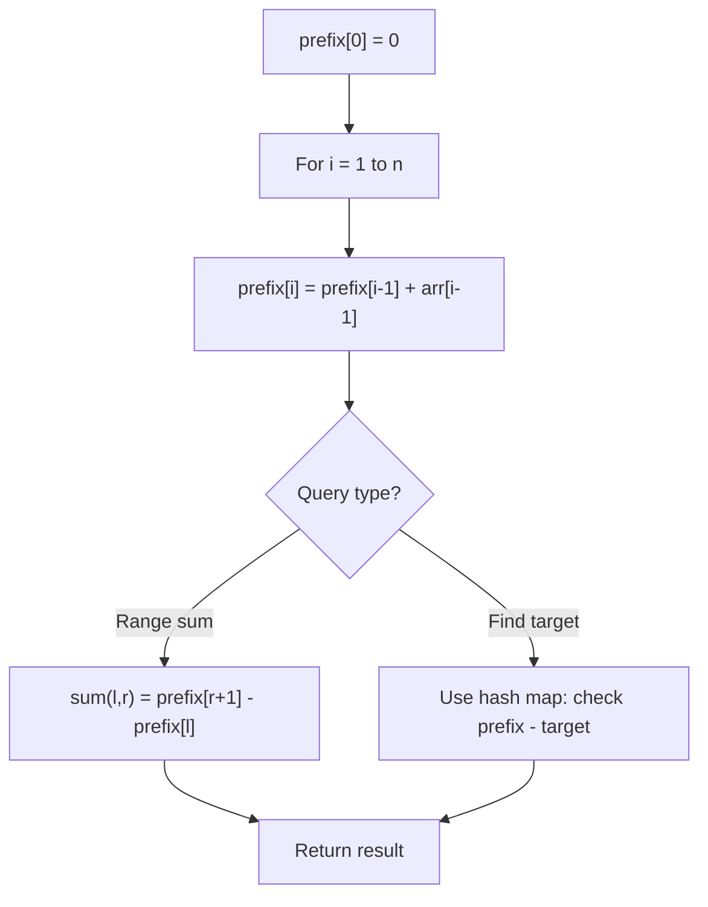

# Problem 1893: Check if All the Integers in a Range Are Covered

**Difficulty:** Easy  
**Tags:** Array, Hash Table, Prefix Sum  
**Pattern:** Prefix Sum  
**Link:** [leetcode.com/problems/check-if-all-the-integers-in-a-range-are-covered](https://leetcode.com/problems/check-if-all-the-integers-in-a-range-are-covered/)

## Description

You are given a 2D integer array `ranges` and two integers `left` and `right`. Each `ranges[i] = [starti, endi]` represents an **inclusive** interval between `starti` and `endi`.

Return `true` *if each integer in the inclusive range* `[left, right]` *is covered by **at least one** interval in* `ranges`. Return `false` *otherwise*.

An integer `x` is covered by an interval `ranges[i] = [starti, endi]` if `starti <= x <= endi`.

 

Example 1:

```

**Input:** ranges = [[1,2],[3,4],[5,6]], left = 2, right = 5
**Output:** true
**Explanation:** Every integer between 2 and 5 is covered:
- 2 is covered by the first range.
- 3 and 4 are covered by the second range.
- 5 is covered by the third range.

```

Example 2:

```

**Input:** ranges = [[1,10],[10,20]], left = 21, right = 21
**Output:** false
**Explanation:** 21 is not covered by any range.

```

 

**Constraints:**

	- `1 <= ranges.length <= 50`
	- `1 <= starti <= endi <= 50`
	- `1 <= left <= right <= 50`

## Approach: Prefix Sum

Build a prefix sum array where prefix[i] = sum of elements 0..i-1. Any subarray sum [l..r] = prefix[r+1] - prefix[l]. Combine with hash map for O(n) subarray sum queries.

## Pseudocode

```
1. Build prefix sum array: prefix[0]=0, prefix[i]=prefix[i-1]+arr[i-1]
2. Use prefix sums to answer queries:
   - Subarray sum [l..r] = prefix[r+1] - prefix[l]
   - Or use hash map to find prefix[j]-prefix[i] == target
3. Return result
```

## Algorithm Flow



## Complexity Analysis

- **Time:** O(n)
- **Space:** O(n)

## Solution (Python3)

```python
class Solution:
    def isCovered(self, ranges: List[List[int]], left: int, right: int) -> bool:
        # Prefix sum approach - O(n) time, O(n) space
        prefix = {0: -1}
        curr_sum = 0
        result = 0
        target = left if isinstance(left, int) else 0
        for i, val in enumerate(ranges):
            curr_sum += val
            if curr_sum - target in prefix:
                result = max(result, i - prefix[curr_sum - target])
            if curr_sum not in prefix:
                prefix[curr_sum] = i
        return result
```

## Solution (C++)

```cpp
#include <algorithm>
#include <string>
#include <unordered_map>
#include <vector>
using namespace std;

class Solution {
public:
    bool isCovered(vector<vector<int>>& ranges, int left, int right) {
        // Prefix sum approach - O(n) time, O(n) space
        unordered_map<int, int> prefix;
        prefix[0] = -1;
        int curr_sum = 0, result = 0;
        int target = left;
        for (int i = 0; i < (int)ranges.size(); i++) {
            curr_sum += ranges[i];
            if (prefix.count(curr_sum - target)) {
                result = max(result, i - prefix[curr_sum - target]);
            }
            if (!prefix.count(curr_sum)) {
                prefix[curr_sum] = i;
            }
        }
        return result;
    }
};
```
