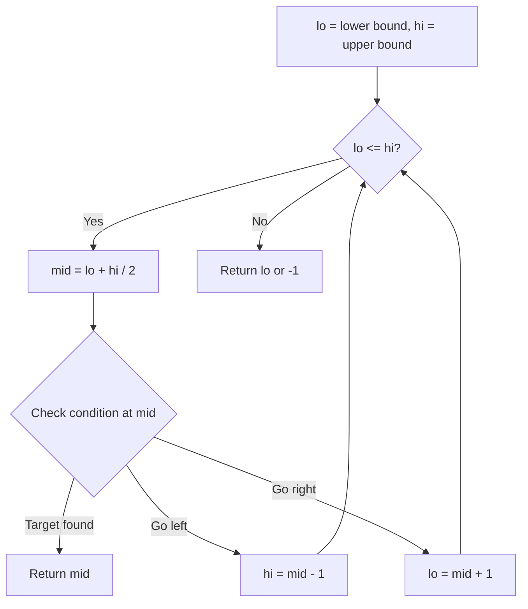
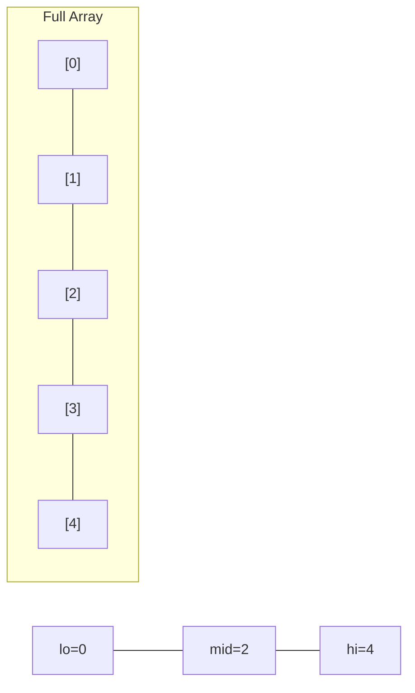
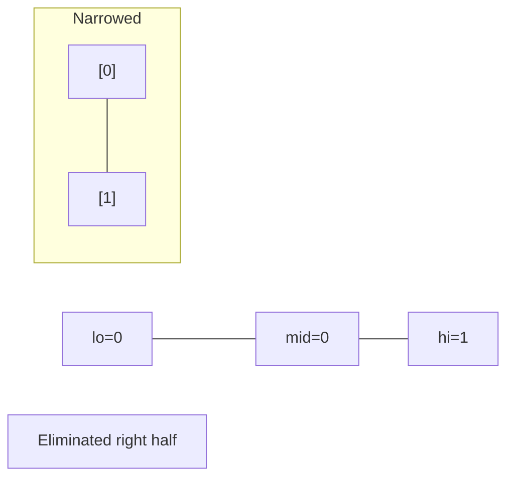
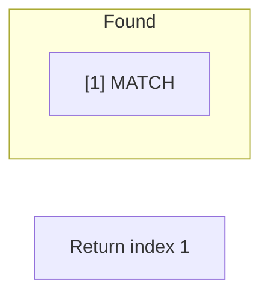

# Problem 1894: Find the Student that Will Replace the Chalk

**Difficulty:** Medium  
**Tags:** Array, Binary Search, Simulation, Prefix Sum  
**Pattern:** Binary Search  
**Link:** [leetcode.com/problems/find-the-student-that-will-replace-the-chalk](https://leetcode.com/problems/find-the-student-that-will-replace-the-chalk/)

## Description

There are `n` students in a class numbered from `0` to `n - 1`. The teacher will give each student a problem starting with the student number `0`, then the student number `1`, and so on until the teacher reaches the student number `n - 1`. After that, the teacher will restart the process, starting with the student number `0` again.

You are given a **0-indexed** integer array `chalk` and an integer `k`. There are initially `k` pieces of chalk. When the student number `i` is given a problem to solve, they will use `chalk[i]` pieces of chalk to solve that problem. However, if the current number of chalk pieces is **strictly less** than `chalk[i]`, then the student number `i` will be asked to **replace** the chalk.

Return *the **index** of the student that will **replace** the chalk pieces*.

 

Example 1:

```

**Input:** chalk = [5,1,5], k = 22
**Output:** 0
**Explanation: **The students go in turns as follows:
- Student number 0 uses 5 chalk, so k = 17.
- Student number 1 uses 1 chalk, so k = 16.
- Student number 2 uses 5 chalk, so k = 11.
- Student number 0 uses 5 chalk, so k = 6.
- Student number 1 uses 1 chalk, so k = 5.
- Student number 2 uses 5 chalk, so k = 0.
Student number 0 does not have enough chalk, so they will have to replace it.
```

Example 2:

```

**Input:** chalk = [3,4,1,2], k = 25
**Output:** 1
**Explanation: **The students go in turns as follows:
- Student number 0 uses 3 chalk so k = 22.
- Student number 1 uses 4 chalk so k = 18.
- Student number 2 uses 1 chalk so k = 17.
- Student number 3 uses 2 chalk so k = 15.
- Student number 0 uses 3 chalk so k = 12.
- Student number 1 uses 4 chalk so k = 8.
- Student number 2 uses 1 chalk so k = 7.
- Student number 3 uses 2 chalk so k = 5.
- Student number 0 uses 3 chalk so k = 2.
Student number 1 does not have enough chalk, so they will have to replace it.

```

 

**Constraints:**

	- `chalk.length == n`
	- `1 <= n <= 10^5`
	- `1 <= chalk[i] <= 10^5`
	- `1 <= k <= 10^9`

## Approach: Binary Search

Use binary search to halve the search space each iteration. Define the search range [lo, hi], compute mid, and decide which half to keep based on the problem's monotonic condition.

## Pseudocode

```
1. lo = lower_bound, hi = upper_bound
2. While lo <= hi (or lo < hi):
   a. mid = (lo + hi) // 2
   b. If condition(mid) is satisfied: record answer, search left half
   c. Else: search right half
3. Return answer
```

## Algorithm Flow



## Visual State Transitions

**Binary Search Step-by-Step:**

**Frame 1: Initial search space**


**Frame 2: Compare mid, narrow search**


**Frame 3: Found target**



## Complexity Analysis

- **Time:** O(log n)
- **Space:** O(1)

## Solution (Python3)

```python
class Solution:
    def chalkReplacer(self, chalk: List[int], k: int) -> int:
        # Binary search - O(log n) time, O(1) space
        lo, hi = 0, len(chalk) - 1
        while lo <= hi:
            mid = lo + (hi - lo) // 2
            if chalk[mid] == k:
                return mid
            elif chalk[mid] < k:
                lo = mid + 1
            else:
                hi = mid - 1
        return 0
```

## Solution (C++)

```cpp
#include <string>
#include <vector>
using namespace std;

class Solution {
public:
    int chalkReplacer(vector<int>& chalk, int k) {
        // Binary search - O(log n) time, O(1) space
        int lo = 0, hi = chalk.size() - 1;
        while (lo <= hi) {
            int mid = lo + (hi - lo) / 2;
            if (chalk[mid] == k) {
                return mid;
            } else if (chalk[mid] < k) {
                lo = mid + 1;
            } else {
                hi = mid - 1;
            }
        }
        return 0;
    }
};
```
