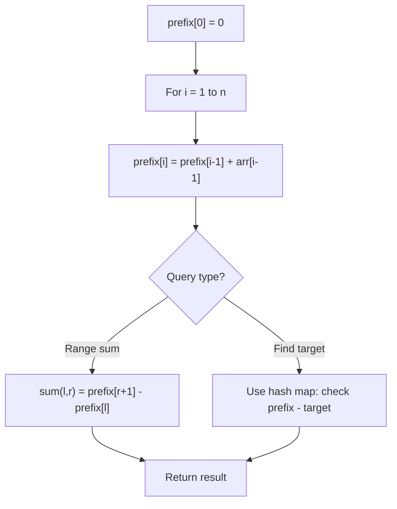

# Problem 1895: Largest Magic Square

**Difficulty:** Medium  
**Tags:** Array, Matrix, Prefix Sum  
**Pattern:** Prefix Sum  
**Link:** [leetcode.com/problems/largest-magic-square](https://leetcode.com/problems/largest-magic-square/)

## Description

A `k x k` **magic square** is a `k x k` grid filled with integers such that every row sum, every column sum, and both diagonal sums are **all equal**. The integers in the magic square **do not have to be distinct**. Every `1 x 1` grid is trivially a **magic square**.

Given an `m x n` integer `grid`, return *the **size** (i.e., the side length *`k`*) of the **largest magic square** that can be found within this grid*.

 

Example 1:

```

**Input:** grid = [[7,1,4,5,6],[2,5,1,6,4],[1,5,4,3,2],[1,2,7,3,4]]
**Output:** 3
**Explanation:** The largest magic square has a size of 3.
Every row sum, column sum, and diagonal sum of this magic square is equal to 12.
- Row sums: 5+1+6 = 5+4+3 = 2+7+3 = 12
- Column sums: 5+5+2 = 1+4+7 = 6+3+3 = 12
- Diagonal sums: 5+4+3 = 6+4+2 = 12

```

Example 2:

```

**Input:** grid = [[5,1,3,1],[9,3,3,1],[1,3,3,8]]
**Output:** 2

```

 

**Constraints:**

	- `m == grid.length`
	- `n == grid[i].length`
	- `1 <= m, n <= 50`
	- `1 <= grid[i][j] <= 10^6`

## Approach: Prefix Sum

Build a prefix sum array where prefix[i] = sum of elements 0..i-1. Any subarray sum [l..r] = prefix[r+1] - prefix[l]. Combine with hash map for O(n) subarray sum queries.

## Pseudocode

```
1. Build prefix sum array: prefix[0]=0, prefix[i]=prefix[i-1]+arr[i-1]
2. Use prefix sums to answer queries:
   - Subarray sum [l..r] = prefix[r+1] - prefix[l]
   - Or use hash map to find prefix[j]-prefix[i] == target
3. Return result
```

## Algorithm Flow



## Complexity Analysis

- **Time:** O(n)
- **Space:** O(n)

## Solution (Python3)

```python
class Solution:
    def largestMagicSquare(self, grid: List[List[int]]) -> int:
        # Prefix sum approach - O(n) time, O(n) space
        prefix = {0: -1}
        curr_sum = 0
        result = 0
        target = grid if isinstance(grid, int) else 0
        for i, val in enumerate(grid):
            curr_sum += val
            if curr_sum - target in prefix:
                result = max(result, i - prefix[curr_sum - target])
            if curr_sum not in prefix:
                prefix[curr_sum] = i
        return result
```

## Solution (C++)

```cpp
#include <algorithm>
#include <string>
#include <unordered_map>
#include <vector>
using namespace std;

class Solution {
public:
    int largestMagicSquare(vector<vector<int>>& grid) {
        // Prefix sum approach - O(n) time, O(n) space
        unordered_map<int, int> prefix;
        prefix[0] = -1;
        int curr_sum = 0, result = 0;
        int target = grid;
        for (int i = 0; i < (int)grid.size(); i++) {
            curr_sum += grid[i];
            if (prefix.count(curr_sum - target)) {
                result = max(result, i - prefix[curr_sum - target]);
            }
            if (!prefix.count(curr_sum)) {
                prefix[curr_sum] = i;
            }
        }
        return result;
    }
};
```
