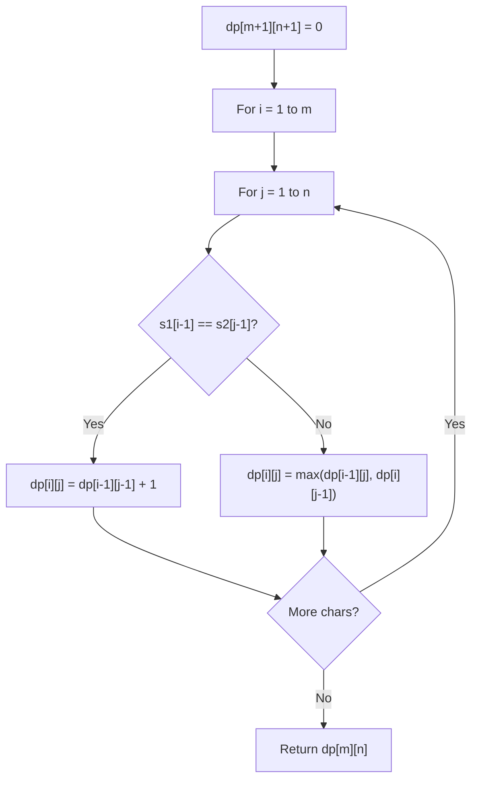

# Problem 1896: Minimum Cost to Change the Final Value of Expression

**Difficulty:** Hard  
**Tags:** Math, String, Dynamic Programming, Stack  
**Pattern:** Dynamic Programming (String)  
**Link:** [leetcode.com/problems/minimum-cost-to-change-the-final-value-of-expression](https://leetcode.com/problems/minimum-cost-to-change-the-final-value-of-expression/)

## Description

You are given a **valid** boolean expression as a string `expression` consisting of the characters `'1'`,`'0'`,`'&'` (bitwise **AND** operator),`'|'` (bitwise **OR** operator),`'('`, and `')'`.

	- For example, `"()1|1"` and `"(1)&()"` are **not valid** while `"1"`, `"(((1))|(0))"`, and `"1|(0&(1))"` are **valid** expressions.

Return* the **minimum cost** to change the final value of the expression*.

	- For example, if `expression = "1|1|(0&0)&1"`, its **value** is `1|1|(0&0)&1 = 1|1|0&1 = 1|0&1 = 1&1 = 1`. We want to apply operations so that the** new** expression evaluates to `0`.

The **cost** of changing the final value of an expression is the **number of operations** performed on the expression. The types of **operations** are described as follows:

	- Turn a `'1'` into a `'0'`.
	- Turn a `'0'` into a `'1'`.
	- Turn a `'&'` into a `'|'`.
	- Turn a `'|'` into a `'&'`.

**Note:** `'&'` does **not** take precedence over `'|'` in the **order of calculation**. Evaluate parentheses **first**, then in **left-to-right** order.

 

Example 1:

```

**Input:** expression = "1&(0|1)"
**Output:** 1
**Explanation:** We can turn "1&(0**|**1)" into "1&(0**&**1)" by changing the '|' to a '&' using 1 operation.
The new expression evaluates to 0. 

```

Example 2:

```

**Input:** expression = "(0&0)&(0&0&0)"
**Output:** 3
**Explanation:** We can turn "(0**&0**)**&**(0&0&0)" into "(0**|1**)**|**(0&0&0)" using 3 operations.
The new expression evaluates to 1.

```

Example 3:

```

**Input:** expression = "(0|(1|0&1))"
**Output:** 1
**Explanation:** We can turn "(0|(**1**|0&1))" into "(0|(**0**|0&1))" using 1 operation.
The new expression evaluates to 0.
```

 

**Constraints:**

	- `1 <= expression.length <= 10^5`
	- `expression` only contains `'1'`,`'0'`,`'&'`,`'|'`,`'('`, and `')'`
	- All parentheses are properly matched.
	- There will be no empty parentheses (i.e: `"()"` is not a substring of `expression`).

## Approach: Dynamic Programming (String)

Compare or match two strings using a 2D DP table. dp[i][j] represents the answer for substrings s1[0..i-1] and s2[0..j-1]. Common patterns: LCS, edit distance, regex matching.

## Pseudocode

```
1. Create dp[m+1][n+1]
2. Initialize base cases
3. For i from 1 to m:
   For j from 1 to n:
     If s1[i-1] == s2[j-1]: dp[i][j] = dp[i-1][j-1] + 1
     Else: dp[i][j] = best of (dp[i-1][j], dp[i][j-1], dp[i-1][j-1])
4. Return dp[m][n]
```

## Algorithm Flow



## Complexity Analysis

- **Time:** O(m * n)
- **Space:** O(m * n)

## Solution (Python3)

```python
class Solution:
    def minOperationsToFlip(self, expression: str) -> int:
        # String DP - O(m*n) time and space
        m, n = len(expression), len(expression)
        dp = [[0] * (n + 1) for _ in range(m + 1)]
        for i in range(1, m + 1):
            for j in range(1, n + 1):
                if expression[i-1] == expression[j-1]:
                    dp[i][j] = dp[i-1][j-1] + 1
                else:
                    dp[i][j] = max(dp[i-1][j], dp[i][j-1])
        return dp[m][n]
```

## Solution (C++)

```cpp
#include <algorithm>
#include <string>
#include <vector>
using namespace std;

class Solution {
public:
    int minOperationsToFlip(string& expression) {
        // String DP - O(m*n) time and space
        int m = expression.size(), n = expression.size();
        vector<vector<int>> dp(m + 1, vector<int>(n + 1, 0));
        for (int i = 1; i <= m; i++) {
            for (int j = 1; j <= n; j++) {
                if (expression[i-1] == expression[j-1])
                    dp[i][j] = dp[i-1][j-1] + 1;
                else
                    dp[i][j] = max(dp[i-1][j], dp[i][j-1]);
            }
        }
        return dp[m][n];
    }
};
```
