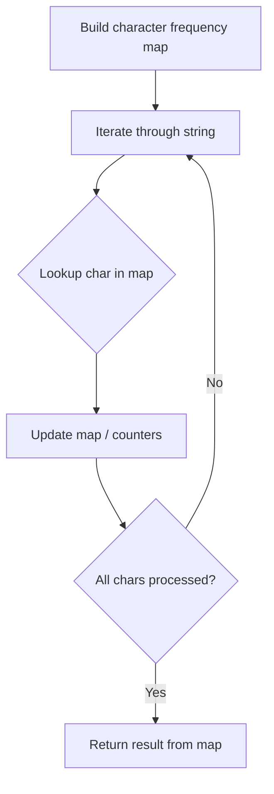

# Problem 1897: Redistribute Characters to Make All Strings Equal

**Difficulty:** Easy  
**Tags:** Hash Table, String, Counting  
**Pattern:** Hash Map String Processing  
**Link:** [leetcode.com/problems/redistribute-characters-to-make-all-strings-equal](https://leetcode.com/problems/redistribute-characters-to-make-all-strings-equal/)

## Description

You are given an array of strings `words` (**0-indexed**).

In one operation, pick two **distinct** indices `i` and `j`, where `words[i]` is a non-empty string, and move **any** character from `words[i]` to **any** position in `words[j]`.

Return `true` *if you can make** every** string in *`words`* **equal **using **any** number of operations*,* and *`false` *otherwise*.

 

Example 1:

```

**Input:** words = ["abc","aabc","bc"]
**Output:** true
**Explanation:** Move the first 'a' in words[1] to the front of words[2],
to make `words[1]` = "abc" and words[2] = "abc".
All the strings are now equal to "abc", so return `true`.

```

Example 2:

```

**Input:** words = ["ab","a"]
**Output:** false
**Explanation:** It is impossible to make all the strings equal using the operation.

```

 

**Constraints:**

	- `1 <= words.length <= 100`
	- `1 <= words[i].length <= 100`
	- `words[i]` consists of lowercase English letters.

## Approach: Hash Map String Processing

Use a hash map to count character frequencies or map characters/strings for O(1) lookups. Process the string in one or two passes.

## Pseudocode

```
1. Build frequency map / char-to-index map
2. Iterate through string:
   a. Look up character in map
   b. Update counts or mappings
3. Return result based on map state
```

## Algorithm Flow



## Complexity Analysis

- **Time:** O(n)
- **Space:** O(n)

## Solution (Python3)

```python
class Solution:
    def makeEqual(self, words: List[str]) -> bool:
        # Hash map for string/character frequency - O(n) time
        freq = {}
        for ch in words:
            freq[ch] = freq.get(ch, 0) + 1
        # Process frequency map
        for ch, cnt in freq.items():
            if cnt == 1:
                return words.index(ch)
        return False
```

## Solution (C++)

```cpp
#include <string>
#include <unordered_map>
#include <vector>
using namespace std;

class Solution {
public:
    bool makeEqual(vector<string>& words) {
        // Hash map for string/character frequency - O(n) time
        unordered_map<char, int> freq;
        for (char ch : words) {
            freq[ch]++;
        }
        // Process frequency map
        for (int i = 0; i < words.size(); i++) {
            if (freq[words[i]] == 1) return i;
        }
        return false;
    }
};
```
