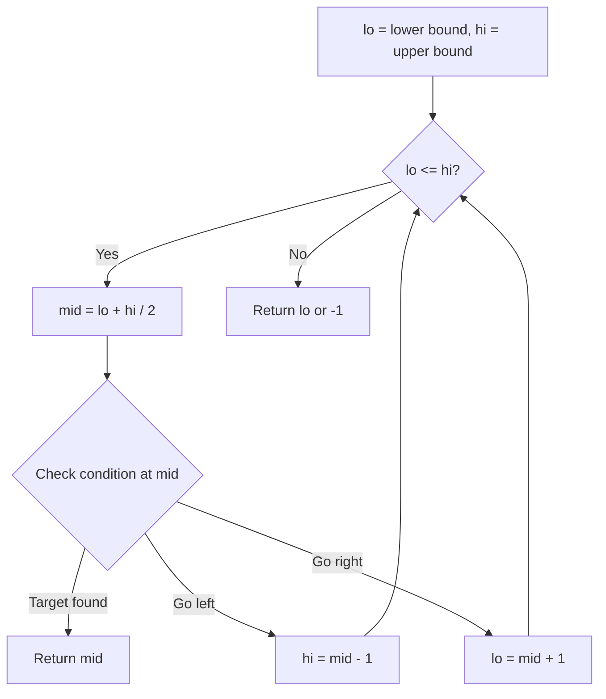
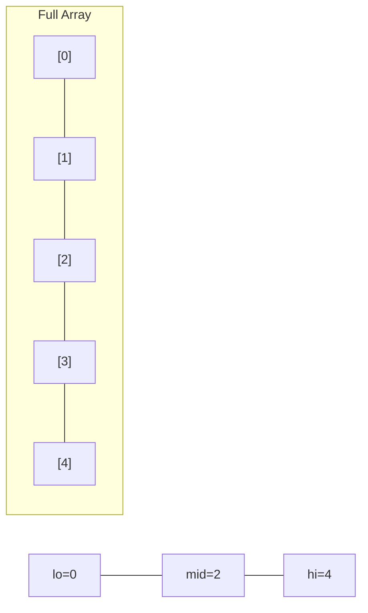
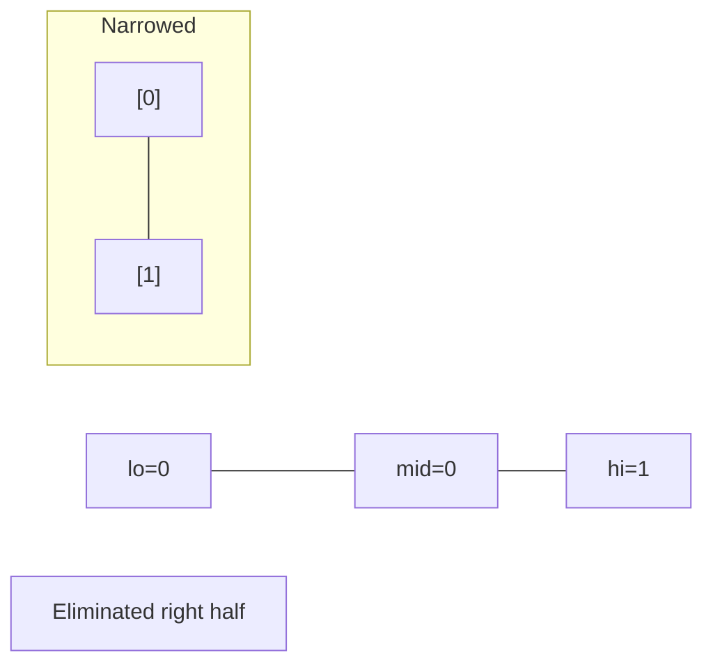
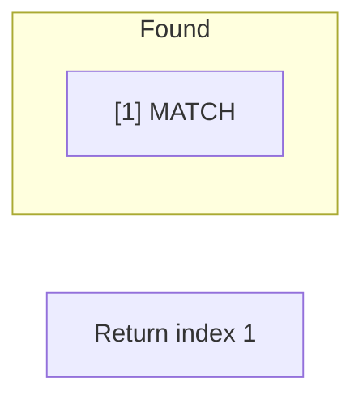

# Problem 1898: Maximum Number of Removable Characters

**Difficulty:** Medium  
**Tags:** Array, Two Pointers, String, Binary Search  
**Pattern:** Binary Search  
**Link:** [leetcode.com/problems/maximum-number-of-removable-characters](https://leetcode.com/problems/maximum-number-of-removable-characters/)

## Description

You are given two strings `s` and `p` where `p` is a **subsequence **of `s`. You are also given a **distinct 0-indexed **integer array `removable` containing a subset of indices of `s` (`s` is also **0-indexed**).

You want to choose an integer `k` (`0 <= k <= removable.length`) such that, after removing `k` characters from `s` using the **first** `k` indices in `removable`, `p` is still a **subsequence** of `s`. More formally, you will mark the character at `s[removable[i]]` for each `0 <= i < k`, then remove all marked characters and check if `p` is still a subsequence.

Return *the **maximum** *`k`* you can choose such that *`p`* is still a **subsequence** of *`s`* after the removals*.

A **subsequence** of a string is a new string generated from the original string with some characters (can be none) deleted without changing the relative order of the remaining characters.

 

Example 1:

```

**Input:** s = "abcacb", p = "ab", removable = [3,1,0]
**Output:** 2
**Explanation**: After removing the characters at indices 3 and 1, "a**b**c**a**cb" becomes "accb".
"ab" is a subsequence of "**a**cc**b**".
If we remove the characters at indices 3, 1, and 0, "**ab**c**a**cb" becomes "ccb", and "ab" is no longer a subsequence.
Hence, the maximum k is 2.

```

Example 2:

```

**Input:** s = "abcbddddd", p = "abcd", removable = [3,2,1,4,5,6]
**Output:** 1
**Explanation**: After removing the character at index 3, "abc**b**ddddd" becomes "abcddddd".
"abcd" is a subsequence of "**abcd**dddd".

```

Example 3:

```

**Input:** s = "abcab", p = "abc", removable = [0,1,2,3,4]
**Output:** 0
**Explanation**: If you remove the first index in the array removable, "abc" is no longer a subsequence.

```

 

**Constraints:**

	- `1 <= p.length <= s.length <= 10^5`
	- `0 <= removable.length < s.length`
	- `0 <= removable[i] < s.length`
	- `p` is a **subsequence** of `s`.
	- `s` and `p` both consist of lowercase English letters.
	- The elements in `removable` are **distinct**.

## Approach: Binary Search

Use binary search to halve the search space each iteration. Define the search range [lo, hi], compute mid, and decide which half to keep based on the problem's monotonic condition.

## Pseudocode

```
1. lo = lower_bound, hi = upper_bound
2. While lo <= hi (or lo < hi):
   a. mid = (lo + hi) // 2
   b. If condition(mid) is satisfied: record answer, search left half
   c. Else: search right half
3. Return answer
```

## Algorithm Flow



## Visual State Transitions

**Binary Search Step-by-Step:**

**Frame 1: Initial search space**


**Frame 2: Compare mid, narrow search**


**Frame 3: Found target**



## Complexity Analysis

- **Time:** O(log n)
- **Space:** O(1)

## Solution (Python3)

```python
class Solution:
    def maximumRemovals(self, s: str, p: str, removable: List[int]) -> int:
        # Binary search - O(log n) time, O(1) space
        lo, hi = 0, len(s) - 1
        while lo <= hi:
            mid = lo + (hi - lo) // 2
            if s[mid] == p:
                return mid
            elif s[mid] < p:
                lo = mid + 1
            else:
                hi = mid - 1
        return 0
```

## Solution (C++)

```cpp
#include <string>
#include <vector>
using namespace std;

class Solution {
public:
    int maximumRemovals(string& s, string& p, vector<int>& removable) {
        // Binary search - O(log n) time, O(1) space
        int lo = 0, hi = s.size() - 1;
        while (lo <= hi) {
            int mid = lo + (hi - lo) / 2;
            if (s[mid] == p) {
                return mid;
            } else if (s[mid] < p) {
                lo = mid + 1;
            } else {
                hi = mid - 1;
            }
        }
        return 0;
    }
};
```
