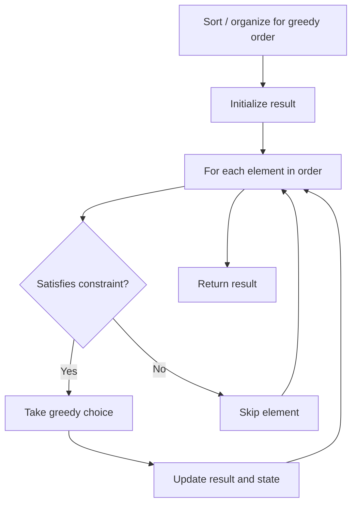

# Problem 1899: Merge Triplets to Form Target Triplet

**Difficulty:** Medium  
**Tags:** Array, Greedy  
**Pattern:** Greedy  
**Link:** [leetcode.com/problems/merge-triplets-to-form-target-triplet](https://leetcode.com/problems/merge-triplets-to-form-target-triplet/)

## Description

A **triplet** is an array of three integers. You are given a 2D integer array `triplets`, where `triplets[i] = [ai, bi, ci]` describes the `i^th` **triplet**. You are also given an integer array `target = [x, y, z]` that describes the **triplet** you want to obtain.

To obtain `target`, you may apply the following operation on `triplets` **any number** of times (possibly **zero**):

	- Choose two indices (**0-indexed**) `i` and `j` (`i != j`) and **update** `triplets[j]` to become `[max(ai, aj), max(bi, bj), max(ci, cj)]`.

	
		For example, if `triplets[i] = [2, 5, 3]` and `triplets[j] = [1, 7, 5]`, `triplets[j]` will be updated to `[max(2, 1), max(5, 7), max(3, 5)] = [2, 7, 5]`.
	
	

Return `true` *if it is possible to obtain the *`target`* **triplet** *`[x, y, z]`* as an** element** of *`triplets`*, or *`false`* otherwise*.

 

Example 1:

```

**Input:** triplets = [[2,5,3],[1,8,4],[1,7,5]], target = [2,7,5]
**Output:** true
**Explanation:** Perform the following operations:
- Choose the first and last triplets [[2,5,3],[1,8,4],[1,7,5]]. Update the last triplet to be [max(2,1), max(5,7), max(3,5)] = [2,7,5]. triplets = [[2,5,3],[1,8,4],[2,7,5]]
The target triplet [2,7,5] is now an element of triplets.

```

Example 2:

```

**Input:** triplets = [[3,4,5],[4,5,6]], target = [3,2,5]
**Output:** false
**Explanation:** It is impossible to have [3,2,5] as an element because there is no 2 in any of the triplets.

```

Example 3:

```

**Input:** triplets = [[2,5,3],[2,3,4],[1,2,5],[5,2,3]], target = [5,5,5]
**Output:** true
**Explanation: **Perform the following operations:
- Choose the first and third triplets [[2,5,3],[2,3,4],[1,2,5],[5,2,3]]. Update the third triplet to be [max(2,1), max(5,2), max(3,5)] = [2,5,5]. triplets = [[2,5,3],[2,3,4],[2,5,5],[5,2,3]].
- Choose the third and fourth triplets [[2,5,3],[2,3,4],[2,5,5],[5,2,3]]. Update the fourth triplet to be [max(2,5), max(5,2), max(5,3)] = [5,5,5]. triplets = [[2,5,3],[2,3,4],[2,5,5],[5,5,5]].
The target triplet [5,5,5] is now an element of triplets.

```

 

**Constraints:**

	- `1 <= triplets.length <= 10^5`
	- `triplets[i].length == target.length == 3`
	- `1 <= ai, bi, ci, x, y, z <= 1000`

## Approach: Greedy

A triplet is usable if no value exceeds target. Check if all target values are achievable.

## Pseudocode

```
1. Sort or organize data for greedy ordering
2. Initialize result
3. For each element in greedy order:
   a. If element satisfies constraint:
      - Take the greedy choice
      - Update result and state
4. Return result
```

## Algorithm Flow



## Complexity Analysis

- **Time:** O(n)
- **Space:** O(1)

## Solution (Python3)

```python
class Solution:
    def mergeTriplets(self, triplets, target):
        good = set()
        for t in triplets:
            if t[0] <= target[0] and t[1] <= target[1] and t[2] <= target[2]:
                for i in range(3):
                    if t[i] == target[i]:
                        good.add(i)
        return len(good) == 3
```

## Solution (C++)

```cpp
#include <algorithm>
#include <string>
#include <vector>
using namespace std;

class Solution {
public:
    bool mergeTriplets(vector<vector<int>>& triplets, vector<int>& target) {
        // Greedy approach - O(n) time
        int result = 0, curr_max = 0;
        for (int i = 0; i < (int)triplets.size(); i++) {
            curr_max = max(curr_max, triplets[i]);
            result = max(result, curr_max);
        }
        return result;
    }
};
```
