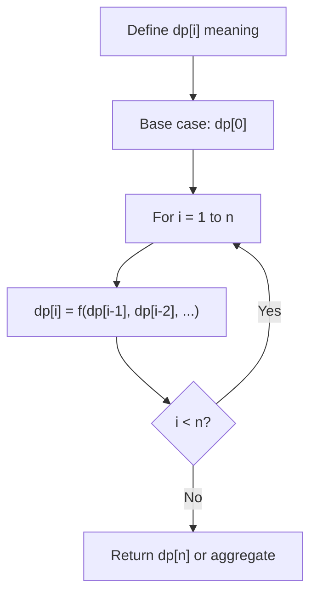
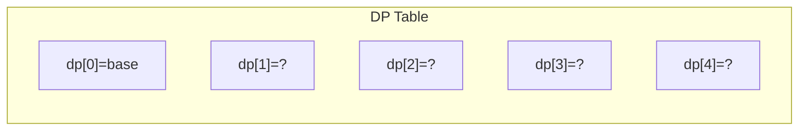
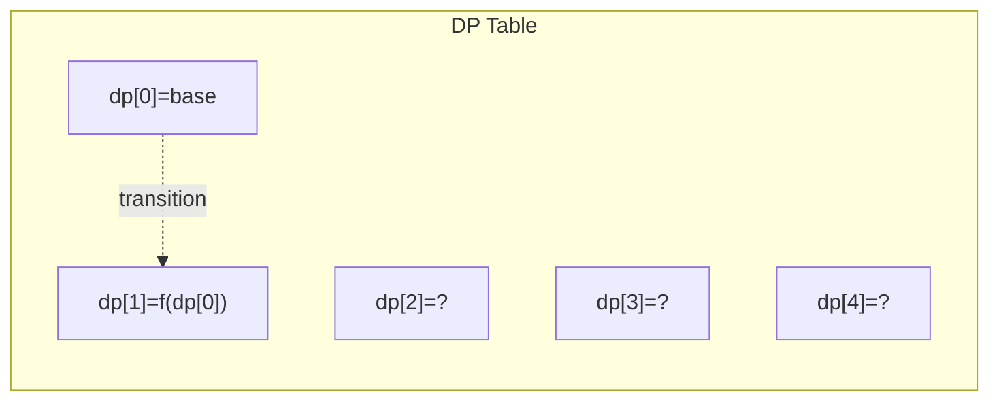
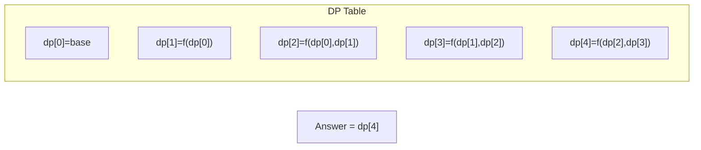

# Problem 1900: The Earliest and Latest Rounds Where Players Compete

**Difficulty:** Hard  
**Tags:** Dynamic Programming, Memoization  
**Pattern:** Dynamic Programming (1D)  
**Link:** [leetcode.com/problems/the-earliest-and-latest-rounds-where-players-compete](https://leetcode.com/problems/the-earliest-and-latest-rounds-where-players-compete/)

## Description

There is a tournament where `n` players are participating. The players are standing in a single row and are numbered from `1` to `n` based on their **initial** standing position (player `1` is the first player in the row, player `2` is the second player in the row, etc.).

The tournament consists of multiple rounds (starting from round number `1`). In each round, the `i^th` player from the front of the row competes against the `i^th` player from the end of the row, and the winner advances to the next round. When the number of players is odd for the current round, the player in the middle automatically advances to the next round.

	- For example, if the row consists of players `1, 2, 4, 6, 7`

	
		Player `1` competes against player `7`.
		- Player `2` competes against player `6`.
		- Player `4` automatically advances to the next round.
	
	

After each round is over, the winners are lined back up in the row based on the **original ordering** assigned to them initially (ascending order).

The players numbered `firstPlayer` and `secondPlayer` are the best in the tournament. They can win against any other player before they compete against each other. If any two other players compete against each other, either of them might win, and thus you may **choose** the outcome of this round.

Given the integers `n`, `firstPlayer`, and `secondPlayer`, return *an integer array containing two values, the **earliest** possible round number and the **latest** possible round number in which these two players will compete against each other, respectively*.

 

Example 1:

```

**Input:** n = 11, firstPlayer = 2, secondPlayer = 4
**Output:** [3,4]
**Explanation:**
One possible scenario which leads to the earliest round number:
First round: 1, 2, 3, 4, 5, 6, 7, 8, 9, 10, 11
Second round: 2, 3, 4, 5, 6, 11
Third round: 2, 3, 4
One possible scenario which leads to the latest round number:
First round: 1, 2, 3, 4, 5, 6, 7, 8, 9, 10, 11
Second round: 1, 2, 3, 4, 5, 6
Third round: 1, 2, 4
Fourth round: 2, 4

```

Example 2:

```

**Input:** n = 5, firstPlayer = 1, secondPlayer = 5
**Output:** [1,1]
**Explanation:** The players numbered 1 and 5 compete in the first round.
There is no way to make them compete in any other round.

```

 

**Constraints:**

	- `2 <= n <= 28`
	- `1 <= firstPlayer < secondPlayer <= n`

## Approach: Dynamic Programming (1D)

Break the problem into overlapping subproblems. Define dp[i] as the optimal value for the subproblem ending at or considering index i. Build the solution bottom-up, using previously computed dp values.

## Pseudocode

```
1. Define dp[i] = optimal value for subproblem i
2. Base case: dp[0] = initial value
3. For i from 1 to n:
   a. dp[i] = recurrence(dp[i-1], dp[i-2], ...)
4. Return dp[n] or max/min of dp
```

## Algorithm Flow



## Visual State Transitions

**1D Dynamic Programming Table Build:**

**Frame 1: Initialize base cases**


**Frame 2: Fill dp[1] from dp[0]**


**Frame 3: Fill remaining cells**



## Complexity Analysis

- **Time:** O(n)
- **Space:** O(n)

## Solution (Python3)

```python
class Solution:
    def earliestAndLatest(self, n: int, firstPlayer: int, secondPlayer: int) -> List[int]:
        # Dynamic programming (1D) - O(n) time, O(n) space
        if not n:
            return 0
        n = len(n) if isinstance(n, list) else n
        dp = [0] * (n + 1)
        dp[0] = 1  # base case
        for i in range(1, n + 1):
            dp[i] = dp[i-1]  # transition (customize per problem)
            if i >= 2:
                dp[i] += dp[i-2]
        return dp[n]
```

## Solution (C++)

```cpp
#include <string>
#include <vector>
using namespace std;

class Solution {
public:
    vector<int> earliestAndLatest(int n, int firstPlayer, int secondPlayer) {
        // Dynamic programming (1D) - O(n) time, O(n) space
        int n = n;
        if (n <= 0) return 0;
        vector<int> dp(n + 1, 0);
        dp[0] = 1;
        for (int i = 1; i <= n; i++) {
            dp[i] = dp[i-1];
            if (i >= 2) dp[i] += dp[i-2];
        }
        return dp[n];
    }
};
```
