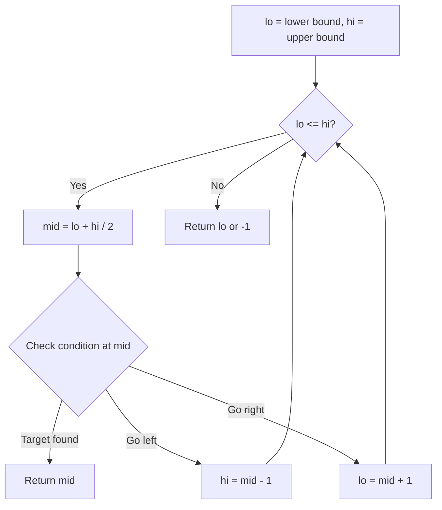
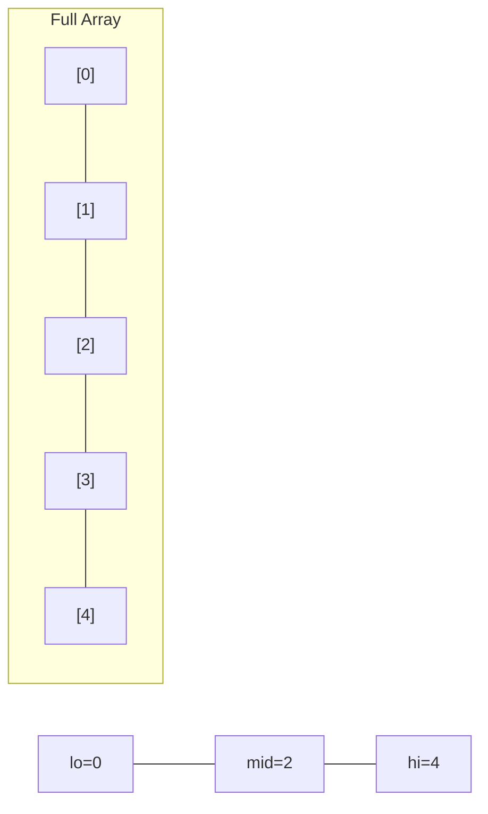
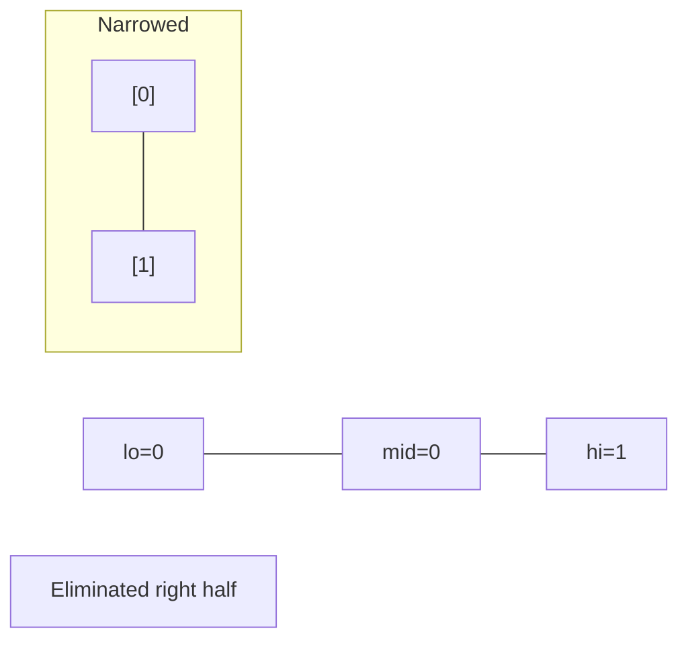
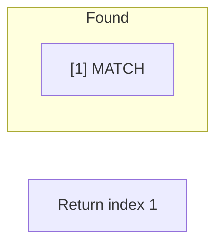

# Problem 1901: Find a Peak Element II

**Difficulty:** Medium  
**Tags:** Array, Binary Search, Matrix  
**Pattern:** Binary Search  
**Link:** [leetcode.com/problems/find-a-peak-element-ii](https://leetcode.com/problems/find-a-peak-element-ii/)

## Description

A **peak** element in a 2D grid is an element that is **strictly greater** than all of its **adjacent **neighbors to the left, right, top, and bottom.

Given a **0-indexed** `m x n` matrix `mat` where **no two adjacent cells are equal**, find **any** peak element `mat[i][j]` and return *the length 2 array *`[i,j]`.

You may assume that the entire matrix is surrounded by an **outer perimeter** with the value `-1` in each cell.

You must write an algorithm that runs in `O(m log(n))` or `O(n log(m))` time.

 

Example 1:

```

**Input:** mat = [[1,4],[3,2]]
**Output:** [0,1]
**Explanation:** Both 3 and 4 are peak elements so [1,0] and [0,1] are both acceptable answers.

```

Example 2:

****

```

**Input:** mat = [[10,20,15],[21,30,14],[7,16,32]]
**Output:** [1,1]
**Explanation:** Both 30 and 32 are peak elements so [1,1] and [2,2] are both acceptable answers.

```

 

**Constraints:**

	- `m == mat.length`
	- `n == mat[i].length`
	- `1 <= m, n <= 500`
	- `1 <= mat[i][j] <= 10^5`
	- No two adjacent cells are equal.

## Approach: Binary Search

Use binary search to halve the search space each iteration. Define the search range [lo, hi], compute mid, and decide which half to keep based on the problem's monotonic condition.

## Pseudocode

```
1. lo = lower_bound, hi = upper_bound
2. While lo <= hi (or lo < hi):
   a. mid = (lo + hi) // 2
   b. If condition(mid) is satisfied: record answer, search left half
   c. Else: search right half
3. Return answer
```

## Algorithm Flow



## Visual State Transitions

**Binary Search Step-by-Step:**

**Frame 1: Initial search space**


**Frame 2: Compare mid, narrow search**


**Frame 3: Found target**



## Complexity Analysis

- **Time:** O(log n)
- **Space:** O(1)

## Solution (Python3)

```python
class Solution:
    def findPeakGrid(self, mat: List[List[int]]) -> List[int]:
        # Binary search - O(log n) time, O(1) space
        lo, hi = 0, len(mat) - 1
        while lo <= hi:
            mid = lo + (hi - lo) // 2
            if mat[mid] == mat:
                return mid
            elif mat[mid] < mat:
                lo = mid + 1
            else:
                hi = mid - 1
        return []
```

## Solution (C++)

```cpp
#include <string>
#include <vector>
using namespace std;

class Solution {
public:
    vector<int> findPeakGrid(vector<vector<int>>& mat) {
        // Binary search - O(log n) time, O(1) space
        int lo = 0, hi = mat.size() - 1;
        while (lo <= hi) {
            int mid = lo + (hi - lo) / 2;
            if (mat[mid] == mat) {
                return mid;
            } else if (mat[mid] < mat) {
                lo = mid + 1;
            } else {
                hi = mid - 1;
            }
        }
        return {};
    }
};
```
