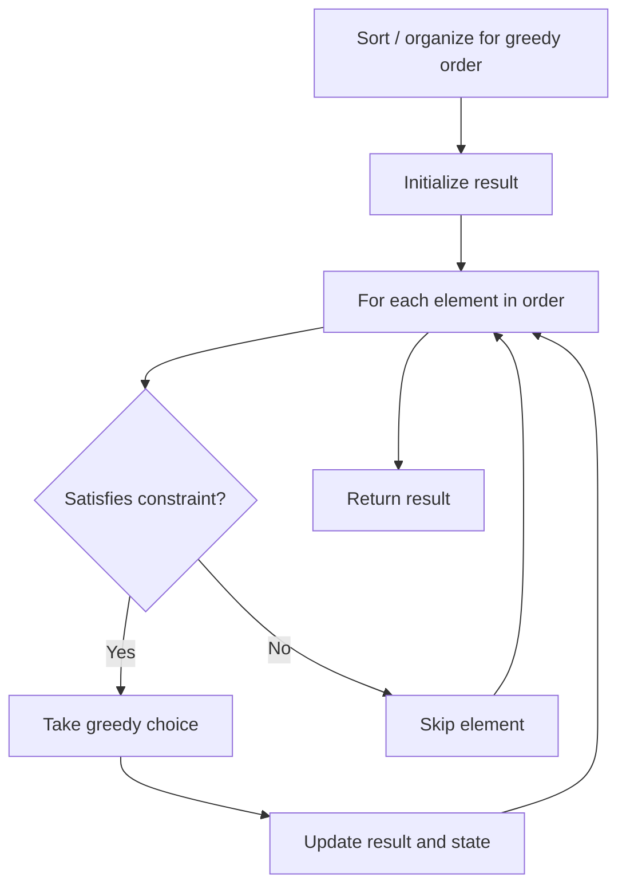

# Problem 1903: Largest Odd Number in String

**Difficulty:** Easy  
**Tags:** Math, String, Greedy  
**Pattern:** Greedy  
**Link:** [leetcode.com/problems/largest-odd-number-in-string](https://leetcode.com/problems/largest-odd-number-in-string/)

## Description

You are given a string `num`, representing a large integer. Return *the **largest-valued odd** integer (as a string) that is a **non-empty substring** of *`num`*, or an empty string *`""`* if no odd integer exists*.

A **substring** is a contiguous sequence of characters within a string.

 

Example 1:

```

**Input:** num = "52"
**Output:** "5"
**Explanation:** The only non-empty substrings are "5", "2", and "52". "5" is the only odd number.

```

Example 2:

```

**Input:** num = "4206"
**Output:** ""
**Explanation:** There are no odd numbers in "4206".

```

Example 3:

```

**Input:** num = "35427"
**Output:** "35427"
**Explanation:** "35427" is already an odd number.

```

 

**Constraints:**

	- `1 <= num.length <= 10^5`
	- `num` only consists of digits and does not contain any leading zeros.

## Approach: Greedy

Make the locally optimal choice at each step, trusting it leads to a global optimum. Greedy works when the problem has the greedy-choice property and optimal substructure.

## Pseudocode

```
1. Sort or organize data for greedy ordering
2. Initialize result
3. For each element in greedy order:
   a. If element satisfies constraint:
      - Take the greedy choice
      - Update result and state
4. Return result
```

## Algorithm Flow



## Complexity Analysis

- **Time:** O(n log n)
- **Space:** O(1)

## Solution (Python3)

```python
class Solution:
    def largestOddNumber(self, num: str) -> str:
        # Greedy approach - O(n) time
        result = 0
        curr_max = 0
        for i in range(len(num)):
            if isinstance(num[i], int):
                curr_max = max(curr_max, num[i])
                result = max(result, curr_max)
            else:
                result += 1
        return result
```

## Solution (C++)

```cpp
#include <algorithm>
#include <string>
#include <vector>
using namespace std;

class Solution {
public:
    string largestOddNumber(string& num) {
        // Greedy approach - O(n) time
        int result = 0, curr_max = 0;
        for (int i = 0; i < (int)num.size(); i++) {
            curr_max = max(curr_max, num[i]);
            result = max(result, curr_max);
        }
        return result;
    }
};
```
