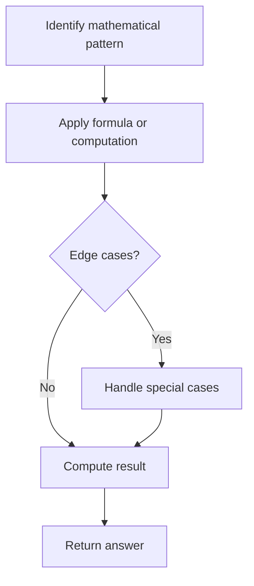

# Problem 1904: The Number of Full Rounds You Have Played

**Difficulty:** Medium  
**Tags:** Math, String  
**Pattern:** Math  
**Link:** [leetcode.com/problems/the-number-of-full-rounds-you-have-played](https://leetcode.com/problems/the-number-of-full-rounds-you-have-played/)

## Description

You are participating in an online chess tournament. There is a chess round that starts every `15` minutes. The first round of the day starts at `00:00`, and after every `15` minutes, a new round starts.

	- For example, the second round starts at `00:15`, the fourth round starts at `00:45`, and the seventh round starts at `01:30`.

You are given two strings `loginTime` and `logoutTime` where:

	- `loginTime` is the time you will login to the game, and
	- `logoutTime` is the time you will logout from the game.

If `logoutTime` is **earlier** than `loginTime`, this means you have played from `loginTime` to midnight and from midnight to `logoutTime`.

Return *the number of full chess rounds you have played in the tournament*.

**Note:** All the given times follow the 24-hour clock. That means the first round of the day starts at `00:00` and the last round of the day starts at `23:45`.

 

Example 1:

```

**Input:** loginTime = "09:31", logoutTime = "10:14"
**Output:** 1
**Explanation:** You played one full round from 09:45 to 10:00.
You did not play the full round from 09:30 to 09:45 because you logged in at 09:31 after it began.
You did not play the full round from 10:00 to 10:15 because you logged out at 10:14 before it ended.

```

Example 2:

```

**Input:** loginTime = "21:30", logoutTime = "03:00"
**Output:** 22
**Explanation:** You played 10 full rounds from 21:30 to 00:00 and 12 full rounds from 00:00 to 03:00.
10 + 12 = 22.

```

 

**Constraints:**

	- `loginTime` and `logoutTime` are in the format `hh:mm`.
	- `00 <= hh <= 23`
	- `00 <= mm <= 59`
	- `loginTime` and `logoutTime` are not equal.

## Approach: Math

Apply mathematical properties, formulas, or number-theoretic concepts. Look for patterns, modular arithmetic, or closed-form solutions.

## Pseudocode

```
1. Identify the mathematical pattern or formula
2. Apply computation:
   - Modular arithmetic for large numbers
   - GCD/LCM for divisibility
   - Sieve for primes
3. Handle edge cases
4. Return result
```

## Algorithm Flow



## Complexity Analysis

- **Time:** O(n) or O(sqrt(n))
- **Space:** O(1)

## Solution (Python3)

```python
class Solution:
    def numberOfRounds(self, loginTime: str, logoutTime: str) -> int:
        # Mathematical approach
        result = 0
        x = loginTime
        while x != 0:
            result = result * 10 + x % 10
            x //= 10 if isinstance(x, int) else 1
        return result
```

## Solution (C++)

```cpp
#include <string>
#include <vector>
using namespace std;

class Solution {
public:
    int numberOfRounds(string& loginTime, string& logoutTime) {
        // Mathematical approach
        long long result = 0;
        int x = loginTime;
        while (x != 0) {
            result = result * 10 + x % 10;
            x /= 10;
        }
        return (int)result;
    }
};
```
