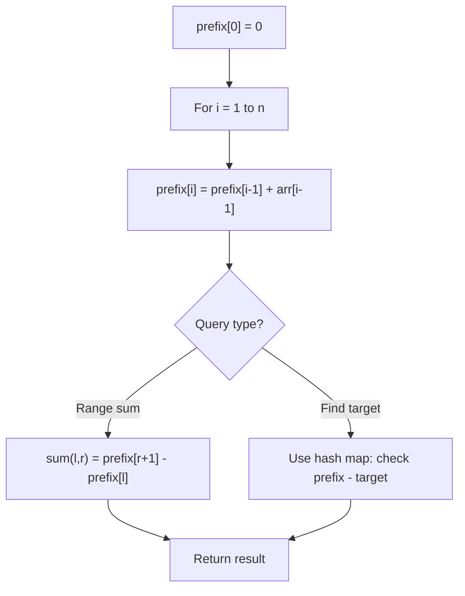

# Problem 1906: Minimum Absolute Difference Queries

**Difficulty:** Medium  
**Tags:** Array, Prefix Sum  
**Pattern:** Prefix Sum  
**Link:** [leetcode.com/problems/minimum-absolute-difference-queries](https://leetcode.com/problems/minimum-absolute-difference-queries/)

## Description

The **minimum absolute difference** of an array `a` is defined as the **minimum value** of `|a[i] - a[j]|`, where `0 <= i < j < a.length` and `a[i] != a[j]`. If all elements of `a` are the **same**, the minimum absolute difference is `-1`.

	- For example, the minimum absolute difference of the array `[5,2,3,7,2]` is `|2 - 3| = 1`. Note that it is not `0` because `a[i]` and `a[j]` must be different.

You are given an integer array `nums` and the array `queries` where `queries[i] = [li, ri]`. For each query `i`, compute the **minimum absolute difference** of the **subarray** `nums[li...ri]` containing the elements of `nums` between the **0-based** indices `li` and `ri` (**inclusive**).

Return *an **array** *`ans` *where* `ans[i]` *is the answer to the* `i^th` *query*.

A **subarray** is a contiguous sequence of elements in an array.

The value of `|x|` is defined as:

	- `x` if `x >= 0`.
	- `-x` if `x < 0`.

 

Example 1:

```

**Input:** nums = [1,3,4,8], queries = [[0,1],[1,2],[2,3],[0,3]]
**Output:** [2,1,4,1]
**Explanation:** The queries are processed as follows:
- queries[0] = [0,1]: The subarray is [1,3] and the minimum absolute difference is |1-3| = 2.
- queries[1] = [1,2]: The subarray is [3,4] and the minimum absolute difference is |3-4| = 1.
- queries[2] = [2,3]: The subarray is [4,8] and the minimum absolute difference is |4-8| = 4.
- queries[3] = [0,3]: The subarray is [1,3,4,8] and the minimum absolute difference is |3-4| = 1.

```

Example 2:

```

**Input:** nums = [4,5,2,2,7,10], queries = [[2,3],[0,2],[0,5],[3,5]]
**Output:** [-1,1,1,3]
**Explanation: **The queries are processed as follows:
- queries[0] = [2,3]: The subarray is [2,2] and the minimum absolute difference is -1 because all the
  elements are the same.
- queries[1] = [0,2]: The subarray is [4,5,2] and the minimum absolute difference is |4-5| = 1.
- queries[2] = [0,5]: The subarray is [4,5,2,2,7,10] and the minimum absolute difference is |4-5| = 1.
- queries[3] = [3,5]: The subarray is [2,7,10] and the minimum absolute difference is |7-10| = 3.

```

 

**Constraints:**

	- `2 <= nums.length <= 10^5`
	- `1 <= nums[i] <= 100`
	- `1 <= queries.length <= 2 * 10^4`
	- `0 <= li < ri < nums.length`

## Approach: Prefix Sum

Build a prefix sum array where prefix[i] = sum of elements 0..i-1. Any subarray sum [l..r] = prefix[r+1] - prefix[l]. Combine with hash map for O(n) subarray sum queries.

## Pseudocode

```
1. Build prefix sum array: prefix[0]=0, prefix[i]=prefix[i-1]+arr[i-1]
2. Use prefix sums to answer queries:
   - Subarray sum [l..r] = prefix[r+1] - prefix[l]
   - Or use hash map to find prefix[j]-prefix[i] == target
3. Return result
```

## Algorithm Flow



## Complexity Analysis

- **Time:** O(n)
- **Space:** O(n)

## Solution (Python3)

```python
class Solution:
    def minDifference(self, nums: List[int], queries: List[List[int]]) -> List[int]:
        # Prefix sum approach - O(n) time, O(n) space
        prefix = {0: -1}
        curr_sum = 0
        result = 0
        target = queries if isinstance(queries, int) else 0
        for i, val in enumerate(nums):
            curr_sum += val
            if curr_sum - target in prefix:
                result = max(result, i - prefix[curr_sum - target])
            if curr_sum not in prefix:
                prefix[curr_sum] = i
        return result
```

## Solution (C++)

```cpp
#include <algorithm>
#include <string>
#include <unordered_map>
#include <vector>
using namespace std;

class Solution {
public:
    vector<int> minDifference(vector<int>& nums, vector<vector<int>>& queries) {
        // Prefix sum approach - O(n) time, O(n) space
        unordered_map<int, int> prefix;
        prefix[0] = -1;
        int curr_sum = 0, result = 0;
        int target = queries;
        for (int i = 0; i < (int)nums.size(); i++) {
            curr_sum += nums[i];
            if (prefix.count(curr_sum - target)) {
                result = max(result, i - prefix[curr_sum - target]);
            }
            if (!prefix.count(curr_sum)) {
                prefix[curr_sum] = i;
            }
        }
        return result;
    }
};
```
