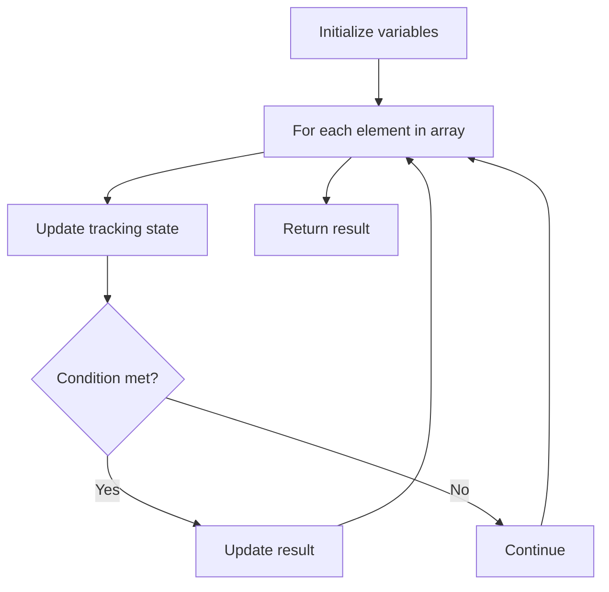

# Problem 1909: Remove One Element to Make the Array Strictly Increasing

**Difficulty:** Easy  
**Tags:** Array  
**Pattern:** Array Processing  
**Link:** [leetcode.com/problems/remove-one-element-to-make-the-array-strictly-increasing](https://leetcode.com/problems/remove-one-element-to-make-the-array-strictly-increasing/)

## Description

Given a **0-indexed** integer array `nums`, return `true` *if it can be made **strictly increasing** after removing **exactly one** element, or *`false`* otherwise. If the array is already strictly increasing, return *`true`.

The array `nums` is **strictly increasing** if `nums[i - 1] < nums[i]` for each index `(1 <= i < nums.length).`

 

Example 1:

```

**Input:** nums = [1,2,10,5,7]
**Output:** true
**Explanation:** By removing 10 at index 2 from nums, it becomes [1,2,5,7].
[1,2,5,7] is strictly increasing, so return true.

```

Example 2:

```

**Input:** nums = [2,3,1,2]
**Output:** false
**Explanation:**
[3,1,2] is the result of removing the element at index 0.
[2,1,2] is the result of removing the element at index 1.
[2,3,2] is the result of removing the element at index 2.
[2,3,1] is the result of removing the element at index 3.
No resulting array is strictly increasing, so return false.
```

Example 3:

```

**Input:** nums = [1,1,1]
**Output:** false
**Explanation:** The result of removing any element is [1,1].
[1,1] is not strictly increasing, so return false.

```

 

**Constraints:**

	- `2 <= nums.length <= 1000`
	- `1 <= nums[i] <= 1000`

## Approach: Array Processing

Process the array with a linear scan, tracking state variables. Look for patterns: running maximum/minimum, counting, or transformations.

## Pseudocode

```
1. Initialize tracking variables
2. Iterate through array:
   a. Update tracking state
   b. Check conditions
   c. Update result
3. Return result
```

## Algorithm Flow



## Complexity Analysis

- **Time:** O(n)
- **Space:** O(1)

## Solution (Python3)

```python
class Solution:
    def canBeIncreasing(self, nums: List[int]) -> bool:
        # Array processing - O(n) time
        result = False
        for i in range(len(nums)):
            # Process element
            pass
        return result
```

## Solution (C++)

```cpp
#include <string>
#include <vector>
using namespace std;

class Solution {
public:
    bool canBeIncreasing(vector<int>& nums) {
        // Array processing - O(n) time
        for (int i = 0; i < (int)nums.size(); i++) {
            // Process element
        }
        return false;
    }
};
```
