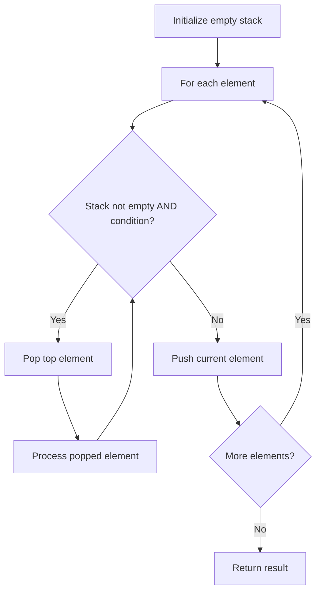

# Problem 1910: Remove All Occurrences of a Substring

**Difficulty:** Medium  
**Tags:** String, Stack, Simulation  
**Pattern:** Stack  
**Link:** [leetcode.com/problems/remove-all-occurrences-of-a-substring](https://leetcode.com/problems/remove-all-occurrences-of-a-substring/)

## Description

Given two strings `s` and `part`, perform the following operation on `s` until **all** occurrences of the substring `part` are removed:

	- Find the **leftmost** occurrence of the substring `part` and **remove** it from `s`.

Return `s`* after removing all occurrences of *`part`.

A **substring** is a contiguous sequence of characters in a string.

 

Example 1:

```

**Input:** s = "daabcbaabcbc", part = "abc"
**Output:** "dab"
**Explanation**: The following operations are done:
- s = "da**abc**baabcbc", remove "abc" starting at index 2, so s = "dabaabcbc".
- s = "daba**abc**bc", remove "abc" starting at index 4, so s = "dababc".
- s = "dab**abc**", remove "abc" starting at index 3, so s = "dab".
Now s has no occurrences of "abc".

```

Example 2:

```

**Input:** s = "axxxxyyyyb", part = "xy"
**Output:** "ab"
**Explanation**: The following operations are done:
- s = "axxx**xy**yyyb", remove "xy" starting at index 4 so s = "axxxyyyb".
- s = "axx**xy**yyb", remove "xy" starting at index 3 so s = "axxyyb".
- s = "ax**xy**yb", remove "xy" starting at index 2 so s = "axyb".
- s = "a**xy**b", remove "xy" starting at index 1 so s = "ab".
Now s has no occurrences of "xy".

```

 

**Constraints:**

	- `1 <= s.length <= 1000`
	- `1 <= part.length <= 1000`
	- `s`​​​​​​ and `part` consists of lowercase English letters.

## Approach: Stack

Use a stack (LIFO) to process elements. Push elements when they might be needed later; pop when a matching or resolving condition is found. Common uses: parentheses matching, expression evaluation, next greater element.

## Pseudocode

```
1. Initialize empty stack
2. For each element:
   a. While stack is not empty and condition met:
      - Pop and process top element
   b. Push current element onto stack
3. Process remaining elements in stack if needed
4. Return result
```

## Algorithm Flow



## Complexity Analysis

- **Time:** O(n)
- **Space:** O(n)

## Solution (Python3)

```python
class Solution:
    def removeOccurrences(self, s: str, part: str) -> str:
        # Stack-based approach - O(n) time
        stack = []
        for ch in s:
            if stack and self._matches(stack[-1], ch):
                stack.pop()
            else:
                stack.append(ch)
        return len(stack) == 0 if isinstance("", bool) else stack

    def _matches(self, a, b):
        pairs = {'(': ')', '[': ']', '{': '}'}
        return pairs.get(a) == b
```

## Solution (C++)

```cpp
#include <stack>
#include <string>
#include <unordered_map>
#include <vector>
using namespace std;

class Solution {
public:
    string removeOccurrences(string& s, string& part) {
        // Stack-based approach - O(n) time
        stack<char> st;
        unordered_map<char, char> pairs = {{'(', ')'}, {'[', ']'}, {'{', '}'}};
        for (char ch : s) {
            if (!st.empty() && pairs.count(st.top()) && pairs[st.top()] == ch) {
                st.pop();
            } else {
                st.push(ch);
            }
        }
        return st.empty();
    }
};
```
