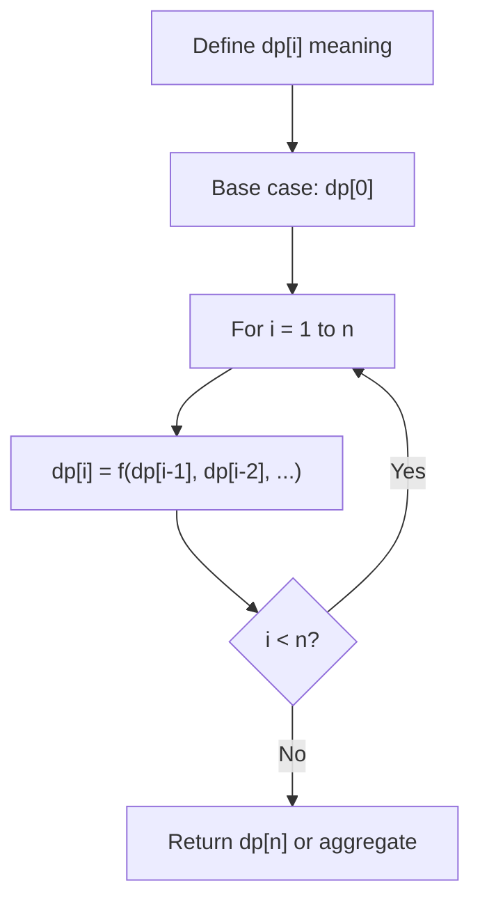
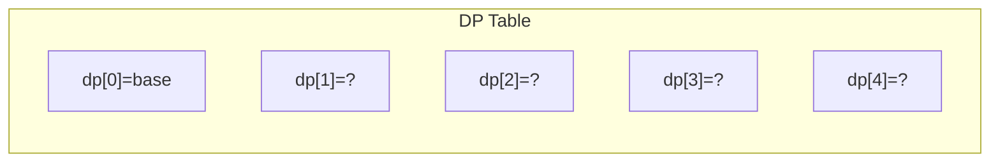
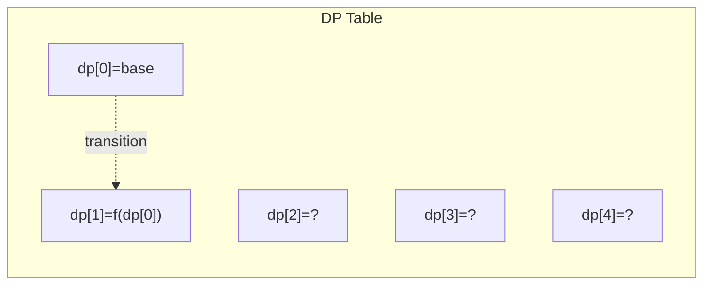
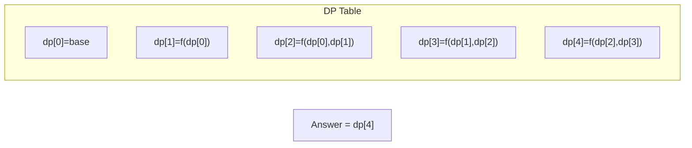

# Problem 1911: Maximum Alternating Subsequence Sum

**Difficulty:** Medium  
**Tags:** Array, Dynamic Programming  
**Pattern:** Dynamic Programming (1D)  
**Link:** [leetcode.com/problems/maximum-alternating-subsequence-sum](https://leetcode.com/problems/maximum-alternating-subsequence-sum/)

## Description

The **alternating sum** of a **0-indexed** array is defined as the **sum** of the elements at **even** indices **minus** the **sum** of the elements at **odd** indices.


	- For example, the alternating sum of `[4,2,5,3]` is `(4 + 5) - (2 + 3) = 4`.


Given an array `nums`, return *the **maximum alternating sum** of any subsequence of *`nums`* (after **reindexing** the elements of the subsequence)*.


A **subsequence** of an array is a new array generated from the original array by deleting some elements (possibly none) without changing the remaining elements' relative order. For example, `[2,7,4]` is a subsequence of `[4,2,3,7,2,1,4]` (the underlined elements), while `[2,4,2]` is not.


 

Example 1:


```

**Input:** nums = [4,2,5,3]
**Output:** 7
**Explanation:** It is optimal to choose the subsequence [4,2,5] with alternating sum (4 + 5) - 2 = 7.

```


Example 2:


```

**Input:** nums = [5,6,7,8]
**Output:** 8
**Explanation:** It is optimal to choose the subsequence [8] with alternating sum 8.

```


Example 3:


```

**Input:** nums = [6,2,1,2,4,5]
**Output:** 10
**Explanation:** It is optimal to choose the subsequence [6,1,5] with alternating sum (6 + 5) - 1 = 10.

```


 

**Constraints:**


	- `1 <= nums.length <= 10^5`
	- `1 <= nums[i] <= 10^5`

## Approach: Dynamic Programming (1D)

Break the problem into overlapping subproblems. Define dp[i] as the optimal value for the subproblem ending at or considering index i. Build the solution bottom-up, using previously computed dp values.

## Pseudocode

```
1. Define dp[i] = optimal value for subproblem i
2. Base case: dp[0] = initial value
3. For i from 1 to n:
   a. dp[i] = recurrence(dp[i-1], dp[i-2], ...)
4. Return dp[n] or max/min of dp
```

## Algorithm Flow



## Visual State Transitions

**1D Dynamic Programming Table Build:**

**Frame 1: Initialize base cases**


**Frame 2: Fill dp[1] from dp[0]**


**Frame 3: Fill remaining cells**



## Complexity Analysis

- **Time:** O(n)
- **Space:** O(n)

## Solution (Python3)

```python
class Solution:
    def maxAlternatingSum(self, nums: List[int]) -> int:
        # Dynamic programming (1D) - O(n) time, O(n) space
        if not nums:
            return 0
        n = len(nums) if isinstance(nums, list) else nums
        dp = [0] * (n + 1)
        dp[0] = 1  # base case
        for i in range(1, n + 1):
            dp[i] = dp[i-1]  # transition (customize per problem)
            if i >= 2:
                dp[i] += dp[i-2]
        return dp[n]
```

## Solution (C++)

```cpp
#include <string>
#include <vector>
using namespace std;

class Solution {
public:
    int maxAlternatingSum(vector<int>& nums) {
        // Dynamic programming (1D) - O(n) time, O(n) space
        int n = nums;
        if (n <= 0) return 0;
        vector<int> dp(n + 1, 0);
        dp[0] = 1;
        for (int i = 1; i <= n; i++) {
            dp[i] = dp[i-1];
            if (i >= 2) dp[i] += dp[i-2];
        }
        return dp[n];
    }
};
```
