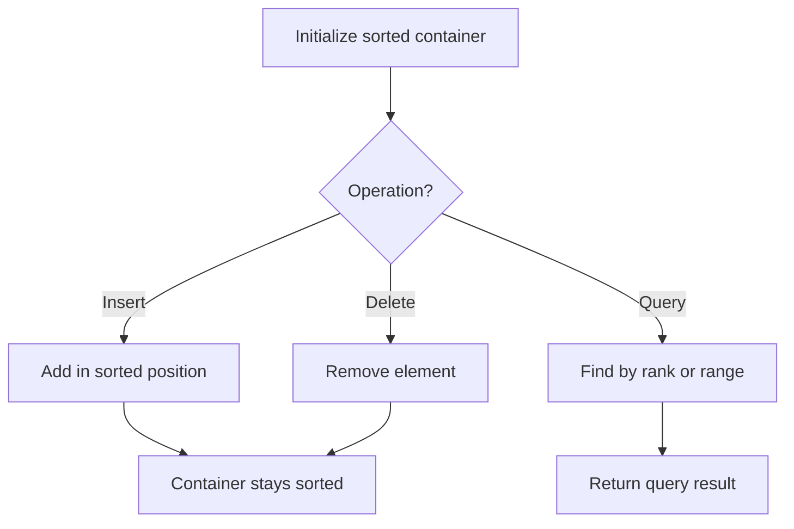

# Problem 1912: Design Movie Rental System

**Difficulty:** Hard  
**Tags:** Array, Hash Table, Design, Heap (Priority Queue), Ordered Set  
**Pattern:** Ordered Set / SortedList  
**Link:** [leetcode.com/problems/design-movie-rental-system](https://leetcode.com/problems/design-movie-rental-system/)

## Description

You have a movie renting company consisting of `n` shops. You want to implement a renting system that supports searching for, booking, and returning movies. The system should also support generating a report of the currently rented movies.

Each movie is given as a 2D integer array `entries` where `entries[i] = [shopi, moviei, pricei]` indicates that there is a copy of movie `moviei` at shop `shopi` with a rental price of `pricei`. Each shop carries **at most one** copy of a movie `moviei`.

The system should support the following functions:

	- **Search**: Finds the **cheapest 5 shops** that have an **unrented copy** of a given movie. The shops should be sorted by **price** in ascending order, and in case of a tie, the one with the **smaller **`shopi` should appear first. If there are less than 5 matching shops, then all of them should be returned. If no shop has an unrented copy, then an empty list should be returned.
	- **Rent**: Rents an **unrented copy** of a given movie from a given shop.
	- **Drop**: Drops off a **previously rented copy** of a given movie at a given shop.
	- **Report**: Returns the **cheapest 5 rented movies** (possibly of the same movie ID) as a 2D list `res` where `res[j] = [shopj, moviej]` describes that the `j^th` cheapest rented movie `moviej` was rented from the shop `shopj`. The movies in `res` should be sorted by **price **in ascending order, and in case of a tie, the one with the **smaller **`shopj` should appear first, and if there is still tie, the one with the **smaller **`moviej` should appear first. If there are fewer than 5 rented movies, then all of them should be returned. If no movies are currently being rented, then an empty list should be returned.

Implement the `MovieRentingSystem` class:

	- `MovieRentingSystem(int n, int[][] entries)` Initializes the `MovieRentingSystem` object with `n` shops and the movies in `entries`.
	- `List<Integer> search(int movie)` Returns a list of shops that have an **unrented copy** of the given `movie` as described above.
	- `void rent(int shop, int movie)` Rents the given `movie` from the given `shop`.
	- `void drop(int shop, int movie)` Drops off a previously rented `movie` at the given `shop`.
	- `List<List<Integer>> report()` Returns a list of cheapest **rented** movies as described above.

**Note:** The test cases will be generated such that `rent` will only be called if the shop has an **unrented** copy of the movie, and `drop` will only be called if the shop had **previously rented** out the movie.

 

Example 1:

```

**Input**
["MovieRentingSystem", "search", "rent", "rent", "report", "drop", "search"]
[[3, [[0, 1, 5], [0, 2, 6], [0, 3, 7], [1, 1, 4], [1, 2, 7], [2, 1, 5]]], [1], [0, 1], [1, 2], [], [1, 2], [2]]
**Output**
[null, [1, 0, 2], null, null, [[0, 1], [1, 2]], null, [0, 1]]

**Explanation**
MovieRentingSystem movieRentingSystem = new MovieRentingSystem(3, [[0, 1, 5], [0, 2, 6], [0, 3, 7], [1, 1, 4], [1, 2, 7], [2, 1, 5]]);
movieRentingSystem.search(1);  // return [1, 0, 2], Movies of ID 1 are unrented at shops 1, 0, and 2. Shop 1 is cheapest; shop 0 and 2 are the same price, so order by shop number.
movieRentingSystem.rent(0, 1); // Rent movie 1 from shop 0. Unrented movies at shop 0 are now [2,3].
movieRentingSystem.rent(1, 2); // Rent movie 2 from shop 1. Unrented movies at shop 1 are now [1].
movieRentingSystem.report();   // return [[0, 1], [1, 2]]. Movie 1 from shop 0 is cheapest, followed by movie 2 from shop 1.
movieRentingSystem.drop(1, 2); // Drop off movie 2 at shop 1. Unrented movies at shop 1 are now [1,2].
movieRentingSystem.search(2);  // return [0, 1]. Movies of ID 2 are unrented at shops 0 and 1. Shop 0 is cheapest, followed by shop 1.

```

 

**Constraints:**

	- `1 <= n <= 3 * 10^5`
	- `1 <= entries.length <= 10^5`
	- `0 <= shopi < n`
	- `1 <= moviei, pricei <= 10^4`
	- Each shop carries **at most one** copy of a movie `moviei`.
	- At most `10^5` calls **in total** will be made to `search`, `rent`, `drop` and `report`.

## Approach: Ordered Set / SortedList

Maintain elements in sorted order for efficient insertion, deletion, and rank queries. Use balanced BST, skip list, or sorted container.

## Pseudocode

```
1. Initialize sorted container
2. For each operation:
   - Insert: add element in sorted position O(log n)
   - Delete: remove element O(log n)
   - Query: find kth element, count, or range O(log n)
3. Return results
```

## Algorithm Flow



## Complexity Analysis

- **Time:** O(n log n)
- **Space:** O(n)

## Solution (Python3)

```python
class MovieRentingSystem:
    def __init__(self, n: int, entries: List[List[int]]):
        # Initialize data structure
        self.n = n
        self.entries = entries

    def search(self, movie: int) -> List[int]:
        return []

    def rent(self, shop: int, movie: int) -> None:
        return None

    def drop(self, shop: int, movie: int) -> None:
        return None

    def report(self) -> List[List[int]]:
        return []

```

## Solution (C++)

```cpp
#include <algorithm>
#include <set>
#include <string>
#include <vector>
using namespace std;

class MovieRentingSystem {
public:
    MovieRentingSystem(int n, vector<vector<int>>& entries) {
        // Initialize
    }

    vector<int> search(int movie) {
        return {};
    }

    void rent(int shop, int movie) {
        return ;
    }

    void drop(int shop, int movie) {
        return ;
    }

    vector<vector<int>> report() {
        return {};
    }

};
```
