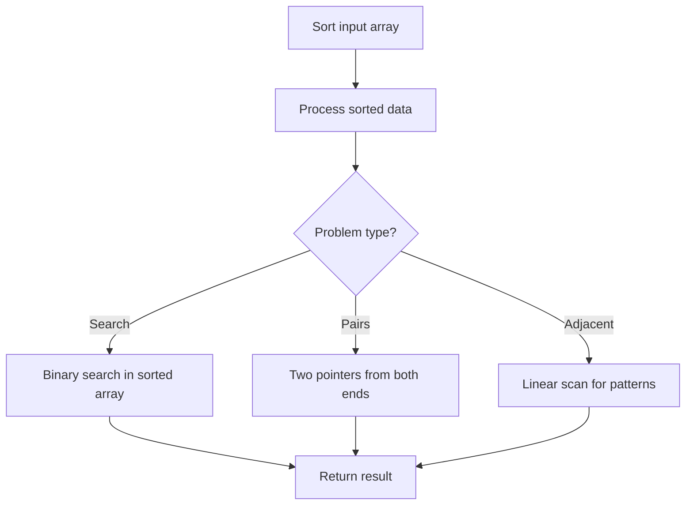

# Problem 1913: Maximum Product Difference Between Two Pairs

**Difficulty:** Easy  
**Tags:** Array, Sorting  
**Pattern:** Sorting  
**Link:** [leetcode.com/problems/maximum-product-difference-between-two-pairs](https://leetcode.com/problems/maximum-product-difference-between-two-pairs/)

## Description

The **product difference** between two pairs `(a, b)` and `(c, d)` is defined as `(a * b) - (c * d)`.


	- For example, the product difference between `(5, 6)` and `(2, 7)` is `(5 * 6) - (2 * 7) = 16`.


Given an integer array `nums`, choose four **distinct** indices `w`, `x`, `y`, and `z` such that the **product difference** between pairs `(nums[w], nums[x])` and `(nums[y], nums[z])` is **maximized**.


Return *the **maximum** such product difference*.


 

Example 1:


```

**Input:** nums = [5,6,2,7,4]
**Output:** 34
**Explanation:** We can choose indices 1 and 3 for the first pair (6, 7) and indices 2 and 4 for the second pair (2, 4).
The product difference is (6 * 7) - (2 * 4) = 34.

```


Example 2:


```

**Input:** nums = [4,2,5,9,7,4,8]
**Output:** 64
**Explanation:** We can choose indices 3 and 6 for the first pair (9, 8) and indices 1 and 5 for the second pair (2, 4).
The product difference is (9 * 8) - (2 * 4) = 64.

```


 

**Constraints:**


	- `4 <= nums.length <= 10^4`
	- `1 <= nums[i] <= 10^4`

## Approach: Sorting

Sort the data to enable efficient processing. After sorting, use techniques like binary search, two pointers, or linear scan to solve the problem.

## Pseudocode

```
1. Sort the input array
2. Process sorted data:
   - Use binary search for lookups
   - Use two pointers for pair finding
   - Scan for adjacent patterns
3. Return result
```

## Algorithm Flow



## Complexity Analysis

- **Time:** O(n log n)
- **Space:** O(n)

## Solution (Python3)

```python
class Solution:
    def maxProductDifference(self, nums: List[int]) -> int:
        # Sort-based approach - O(n log n) time
        nums.sort(key=lambda x: x[0] if isinstance(x, (list, tuple)) else x)
        result = [nums[0]]
        for i in range(1, len(nums)):
            curr = nums[i]
            if isinstance(curr, (list, tuple)) and isinstance(result[-1], (list, tuple)):
                if curr[0] <= result[-1][1]:
                    result[-1] = [result[-1][0], max(result[-1][1], curr[1])]
                else:
                    result.append(curr)
            else:
                result.append(curr)
        return result
```

## Solution (C++)

```cpp
#include <algorithm>
#include <string>
#include <vector>
using namespace std;

class Solution {
public:
    int maxProductDifference(vector<int>& nums) {
        // Sort-based approach - O(n log n) time
        sort(nums.begin(), nums.end());
        vector<vector<int>> result;
        result.push_back(nums[0]);
        for (int i = 1; i < (int)nums.size(); i++) {
            if (nums[i][0] <= result.back()[1]) {
                result.back()[1] = max(result.back()[1], nums[i][1]);
            } else {
                result.push_back(nums[i]);
            }
        }
        return result;
    }
};
```
