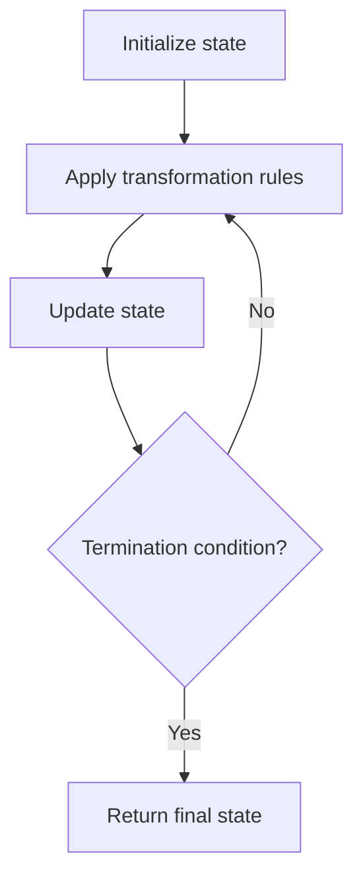

# Problem 1914: Cyclically Rotating a Grid

**Difficulty:** Medium  
**Tags:** Array, Matrix, Simulation  
**Pattern:** Simulation  
**Link:** [leetcode.com/problems/cyclically-rotating-a-grid](https://leetcode.com/problems/cyclically-rotating-a-grid/)

## Description

You are given an `m x n` integer matrix `grid`​​​, where `m` and `n` are both **even** integers, and an integer `k`.


The matrix is composed of several layers, which is shown in the below image, where each color is its own layer:


A cyclic rotation of the matrix is done by cyclically rotating **each layer** in the matrix. To cyclically rotate a layer once, each element in the layer will take the place of the adjacent element in the **counter-clockwise** direction. An example rotation is shown below:


Return *the matrix after applying *`k` *cyclic rotations to it*.


 

Example 1:


```

**Input:** grid = [[40,10],[30,20]], k = 1
**Output:** [[10,20],[40,30]]
**Explanation:** The figures above represent the grid at every state.

```


Example 2:

**** **** ****


```

**Input:** grid = [[1,2,3,4],[5,6,7,8],[9,10,11,12],[13,14,15,16]], k = 2
**Output:** [[3,4,8,12],[2,11,10,16],[1,7,6,15],[5,9,13,14]]
**Explanation:** The figures above represent the grid at every state.

```


 

**Constraints:**


	- `m == grid.length`
	- `n == grid[i].length`
	- `2 <= m, n <= 50`
	- Both `m` and `n` are **even** integers.
	- `1 <= grid[i][j] <=^ 5000`
	- `1 <= k <= 10^9`

## Approach: Simulation

Simulate the process described in the problem step by step. Follow the rules exactly, tracking state at each step.

## Pseudocode

```
1. Initialize state (grid, pointers, counters)
2. For each step / iteration:
   a. Apply the transformation rules
   b. Update state
   c. Check termination condition
3. Return final state or result
```

## Algorithm Flow



## Complexity Analysis

- **Time:** O(n) or O(n * k)
- **Space:** O(n)

## Solution (Python3)

```python
class Solution:
    def rotateGrid(self, grid: List[List[int]], k: int) -> List[List[int]]:
        # Simulation approach - follow the rules step by step
        result = []
        for i in range(len(grid) if isinstance(grid, list) else grid):
            # Simulate each step
            pass
        return result
```

## Solution (C++)

```cpp
#include <string>
#include <vector>
using namespace std;

class Solution {
public:
    vector<vector<int>> rotateGrid(vector<vector<int>>& grid, int k) {
        // Simulation approach
        int n = grid.size();
        for (int i = 0; i < n; i++) {
            // Simulate each step
        }
        return {};
    }
};
```
