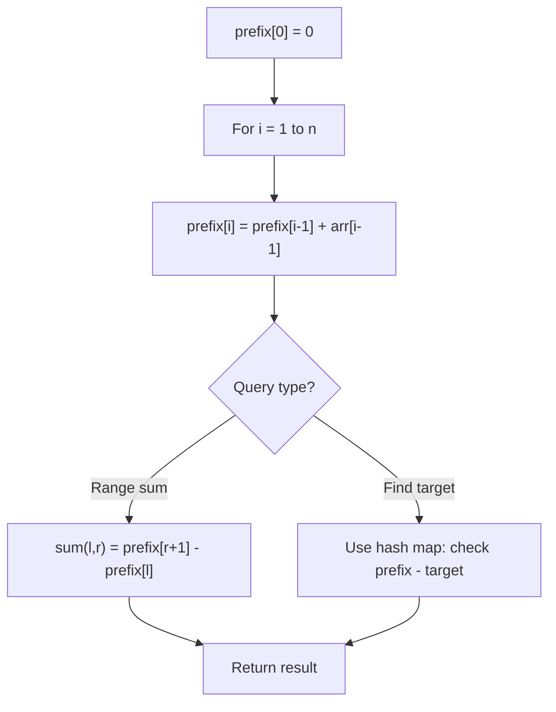

# Problem 1915: Number of Wonderful Substrings

**Difficulty:** Medium  
**Tags:** Hash Table, String, Bit Manipulation, Prefix Sum  
**Pattern:** Prefix Sum  
**Link:** [leetcode.com/problems/number-of-wonderful-substrings](https://leetcode.com/problems/number-of-wonderful-substrings/)

## Description

A **wonderful** string is a string where **at most one** letter appears an **odd** number of times.


	- For example, `"ccjjc"` and `"abab"` are wonderful, but `"ab"` is not.


Given a string `word` that consists of the first ten lowercase English letters (`'a'` through `'j'`), return *the **number of wonderful non-empty substrings** in *`word`*. If the same substring appears multiple times in *`word`*, then count **each occurrence** separately.*


A **substring** is a contiguous sequence of characters in a string.


 

Example 1:


```

**Input:** word = "aba"
**Output:** 4
**Explanation:** The four wonderful substrings are underlined below:
- "**a**ba" -> "a"
- "a**b**a" -> "b"
- "ab**a**" -> "a"
- "**aba**" -> "aba"

```


Example 2:


```

**Input:** word = "aabb"
**Output:** 9
**Explanation:** The nine wonderful substrings are underlined below:
- "**a**abb" -> "a"
- "**aa**bb" -> "aa"
- "**aab**b" -> "aab"
- "**aabb**" -> "aabb"
- "a**a**bb" -> "a"
- "a**abb**" -> "abb"
- "aa**b**b" -> "b"
- "aa**bb**" -> "bb"
- "aab**b**" -> "b"

```


Example 3:


```

**Input:** word = "he"
**Output:** 2
**Explanation:** The two wonderful substrings are underlined below:
- "**h**e" -> "h"
- "h**e**" -> "e"

```


 

**Constraints:**


	- `1 <= word.length <= 10^5`
	- `word` consists of lowercase English letters from `'a'` to `'j'`.

## Approach: Prefix Sum

Build a prefix sum array where prefix[i] = sum of elements 0..i-1. Any subarray sum [l..r] = prefix[r+1] - prefix[l]. Combine with hash map for O(n) subarray sum queries.

## Pseudocode

```
1. Build prefix sum array: prefix[0]=0, prefix[i]=prefix[i-1]+arr[i-1]
2. Use prefix sums to answer queries:
   - Subarray sum [l..r] = prefix[r+1] - prefix[l]
   - Or use hash map to find prefix[j]-prefix[i] == target
3. Return result
```

## Algorithm Flow



## Complexity Analysis

- **Time:** O(n)
- **Space:** O(n)

## Solution (Python3)

```python
class Solution:
    def wonderfulSubstrings(self, word: str) -> int:
        # Prefix sum approach - O(n) time, O(n) space
        prefix = {0: -1}
        curr_sum = 0
        result = 0
        target = word if isinstance(word, int) else 0
        for i, val in enumerate(word):
            curr_sum += val
            if curr_sum - target in prefix:
                result = max(result, i - prefix[curr_sum - target])
            if curr_sum not in prefix:
                prefix[curr_sum] = i
        return result
```

## Solution (C++)

```cpp
#include <algorithm>
#include <string>
#include <unordered_map>
#include <vector>
using namespace std;

class Solution {
public:
    int wonderfulSubstrings(string& word) {
        // Prefix sum approach - O(n) time, O(n) space
        unordered_map<int, int> prefix;
        prefix[0] = -1;
        int curr_sum = 0, result = 0;
        int target = word;
        for (int i = 0; i < (int)word.size(); i++) {
            curr_sum += word[i];
            if (prefix.count(curr_sum - target)) {
                result = max(result, i - prefix[curr_sum - target]);
            }
            if (!prefix.count(curr_sum)) {
                prefix[curr_sum] = i;
            }
        }
        return result;
    }
};
```
