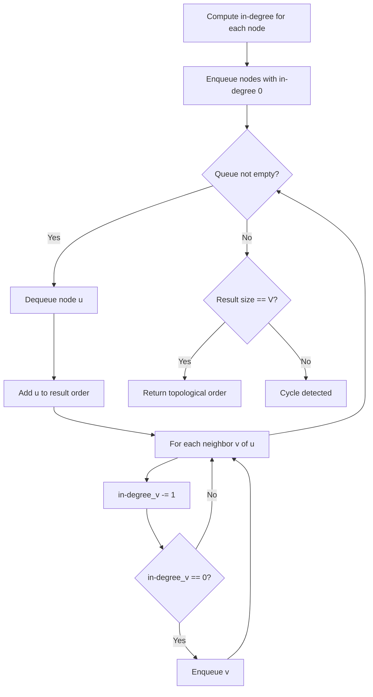
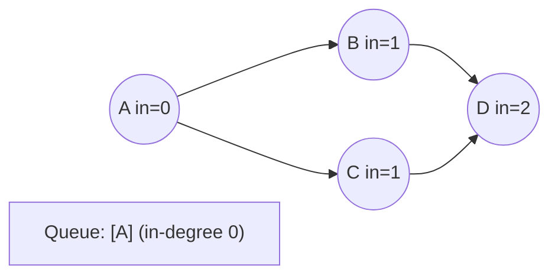
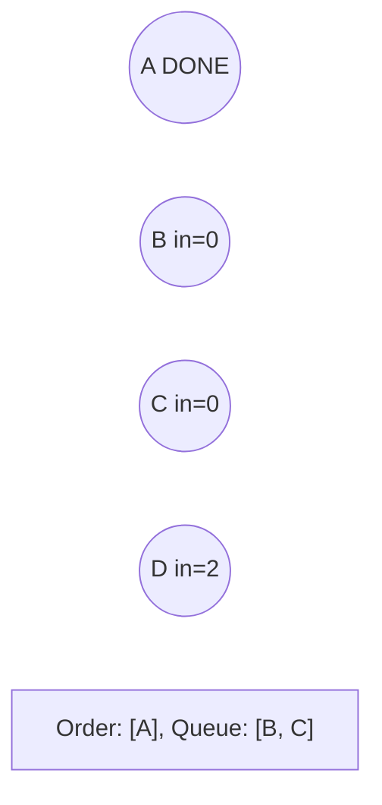
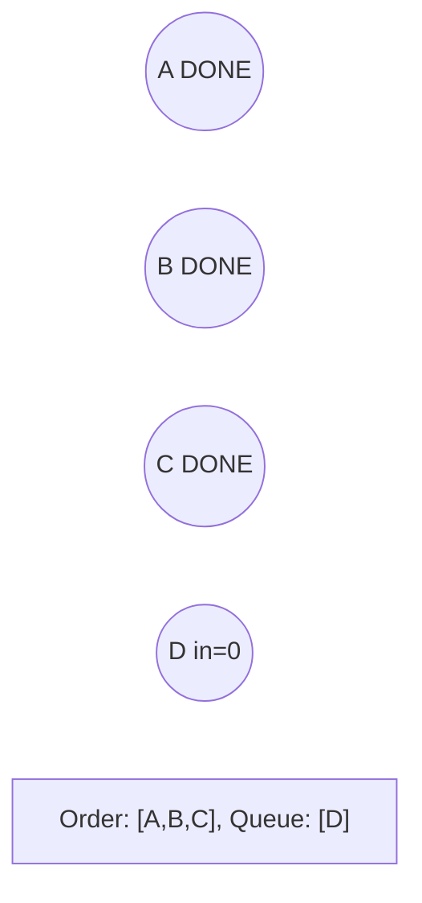
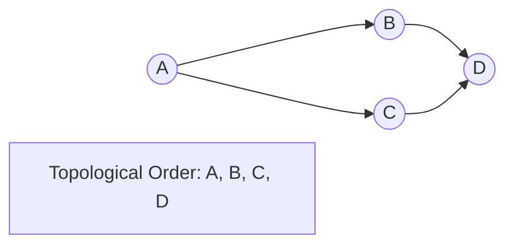

# Problem 1916: Count Ways to Build Rooms in an Ant Colony

**Difficulty:** Hard  
**Tags:** Array, Math, Dynamic Programming, Tree, Depth-First Search, Graph Theory, Topological Sort, Combinatorics  
**Pattern:** Topological Sort  
**Link:** [leetcode.com/problems/count-ways-to-build-rooms-in-an-ant-colony](https://leetcode.com/problems/count-ways-to-build-rooms-in-an-ant-colony/)

## Description

You are an ant tasked with adding `n` new rooms numbered `0` to `n-1` to your colony. You are given the expansion plan as a **0-indexed** integer array of length `n`, `prevRoom`, where `prevRoom[i]` indicates that you must build room `prevRoom[i]` before building room `i`, and these two rooms must be connected **directly**. Room `0` is already built, so `prevRoom[0] = -1`. The expansion plan is given such that once all the rooms are built, every room will be reachable from room `0`.


You can only build **one room** at a time, and you can travel freely between rooms you have **already built** only if they are **connected**. You can choose to build **any room** as long as its **previous room** is already built.


Return *the **number of different orders** you can build all the rooms in*. Since the answer may be large, return it **modulo** `10^9 + 7`.


 

Example 1:


```

**Input:** prevRoom = [-1,0,1]
**Output:** 1
**Explanation:** There is only one way to build the additional rooms: 0 → 1 → 2

```


Example 2:

****


```

**Input:** prevRoom = [-1,0,0,1,2]
**Output:** 6
Explanation:
The 6 ways are:
0 → 1 → 3 → 2 → 4
0 → 2 → 4 → 1 → 3
0 → 1 → 2 → 3 → 4
0 → 1 → 2 → 4 → 3
0 → 2 → 1 → 3 → 4
0 → 2 → 1 → 4 → 3

```


 

**Constraints:**


	- `n == prevRoom.length`
	- `2 <= n <= 10^5`
	- `prevRoom[0] == -1`
	- `0 <= prevRoom[i] < n` for all `1 <= i < n`
	- Every room is reachable from room `0` once all the rooms are built.

## Approach: Topological Sort

Order nodes in a DAG so every edge u->v has u before v. Use Kahn's algorithm (BFS with in-degree tracking) or DFS-based ordering.

## Pseudocode

```
1. Compute in-degree for every node
2. Enqueue all nodes with in-degree 0
3. While queue not empty:
   a. Dequeue node u, add to result order
   b. For each neighbor v of u:
      - Decrease in-degree of v
      - If in-degree becomes 0: enqueue v
4. If result size != V: cycle exists
5. Return topological order
```

## Algorithm Flow



## Visual State Transitions

**Topological Sort (Kahn's Algorithm):**

**Frame 1: Compute in-degrees**


**Frame 2: Process A, reduce neighbors**


**Frame 3: Process B and C**


**Frame 4: Complete**



## Complexity Analysis

- **Time:** O(V + E)
- **Space:** O(V + E)

## Solution (Python3)

```python
class Solution:
    def waysToBuildRooms(self, prevRoom: List[int]) -> int:
        # Topological sort (Kahn's algorithm) - O(V+E)
        from collections import deque, defaultdict
        graph = defaultdict(list)
        n = prevRoom if isinstance(prevRoom, int) else len(prevRoom)
        indegree = [0] * n
        # Build graph from prerequisites
        prereqs = prevRoom if isinstance(prevRoom, list) else prevRoom
        for edge in prereqs:
            if isinstance(edge, (list, tuple)) and len(edge) >= 2:
                graph[edge[1]].append(edge[0])
                indegree[edge[0]] += 1
        queue = deque([i for i in range(n) if indegree[i] == 0])
        order = []
        while queue:
            node = queue.popleft()
            order.append(node)
            for neighbor in graph[node]:
                indegree[neighbor] -= 1
                if indegree[neighbor] == 0:
                    queue.append(neighbor)
        return len(order) == n if isinstance(0, bool) else order
```

## Solution (C++)

```cpp
#include <queue>
#include <string>
#include <vector>
using namespace std;

class Solution {
public:
    int waysToBuildRooms(vector<int>& prevRoom) {
        // Topological sort (Kahn's) - O(V+E)
        int n = prevRoom;
        vector<vector<int>> graph(n);
        vector<int> indegree(n, 0);
        for (auto& edge : prevRoom) {
            graph[edge[1]].push_back(edge[0]);
            indegree[edge[0]]++;
        }
        queue<int> q;
        for (int i = 0; i < n; i++)
            if (indegree[i] == 0) q.push(i);
        vector<int> order;
        while (!q.empty()) {
            int node = q.front(); q.pop();
            order.push_back(node);
            for (int neighbor : graph[node]) {
                if (--indegree[neighbor] == 0) q.push(neighbor);
            }
        }
        return order.size() == n;
    }
};
```
