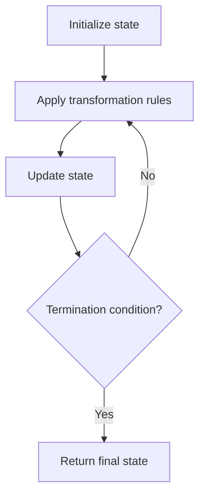

# Problem 1920: Build Array from Permutation

**Difficulty:** Easy  
**Tags:** Array, Simulation  
**Pattern:** Simulation  
**Link:** [leetcode.com/problems/build-array-from-permutation](https://leetcode.com/problems/build-array-from-permutation/)

## Description

Given a **zero-based permutation** `nums` (**0-indexed**), build an array `ans` of the **same length** where `ans[i] = nums[nums[i]]` for each `0 <= i < nums.length` and return it.

A **zero-based permutation** `nums` is an array of **distinct** integers from `0` to `nums.length - 1` (**inclusive**).

 

Example 1:

```

**Input:** nums = [0,2,1,5,3,4]
**Output:** [0,1,2,4,5,3]
Explanation: The array ans is built as follows: 
ans = [nums[nums[0]], nums[nums[1]], nums[nums[2]], nums[nums[3]], nums[nums[4]], nums[nums[5]]]
    = [nums[0], nums[2], nums[1], nums[5], nums[3], nums[4]]
    = [0,1,2,4,5,3]
```

Example 2:

```

**Input:** nums = [5,0,1,2,3,4]
**Output:** [4,5,0,1,2,3]
**Explanation:** The array ans is built as follows:
ans = [nums[nums[0]], nums[nums[1]], nums[nums[2]], nums[nums[3]], nums[nums[4]], nums[nums[5]]]
    = [nums[5], nums[0], nums[1], nums[2], nums[3], nums[4]]
    = [4,5,0,1,2,3]
```

 

**Constraints:**

	- `1 <= nums.length <= 1000`
	- `0 <= nums[i] < nums.length`
	- The elements in `nums` are **distinct**.

 

**Follow-up:** Can you solve it without using an extra space (i.e., `O(1)` memory)?

## Approach: Simulation

Simulate the process described in the problem step by step. Follow the rules exactly, tracking state at each step.

## Pseudocode

```
1. Initialize state (grid, pointers, counters)
2. For each step / iteration:
   a. Apply the transformation rules
   b. Update state
   c. Check termination condition
3. Return final state or result
```

## Algorithm Flow



## Complexity Analysis

- **Time:** O(n) or O(n * k)
- **Space:** O(n)

## Solution (Python3)

```python
class Solution:
    def buildArray(self, nums: List[int]) -> List[int]:
        # Simulation approach - follow the rules step by step
        result = []
        for i in range(len(nums) if isinstance(nums, list) else nums):
            # Simulate each step
            pass
        return result
```

## Solution (C++)

```cpp
#include <string>
#include <vector>
using namespace std;

class Solution {
public:
    vector<int> buildArray(vector<int>& nums) {
        // Simulation approach
        int n = nums.size();
        for (int i = 0; i < n; i++) {
            // Simulate each step
        }
        return {};
    }
};
```
