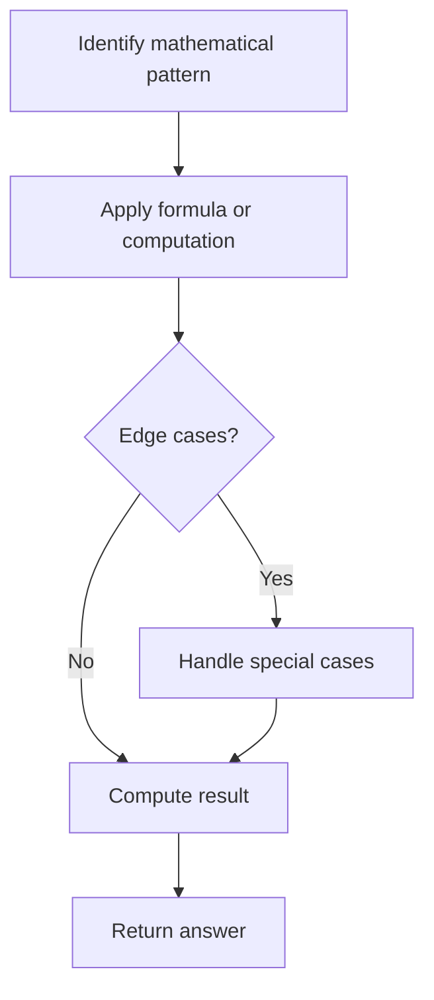

# Problem 1922: Count Good Numbers

**Difficulty:** Medium  
**Tags:** Math, Recursion  
**Pattern:** Math  
**Link:** [leetcode.com/problems/count-good-numbers](https://leetcode.com/problems/count-good-numbers/)

## Description

A digit string is **good** if the digits **(0-indexed)** at **even** indices are **even** and the digits at **odd** indices are **prime** (`2`, `3`, `5`, or `7`).

	- For example, `"2582"` is good because the digits (`2` and `8`) at even positions are even and the digits (`5` and `2`) at odd positions are prime. However, `"3245"` is **not** good because `3` is at an even index but is not even.

Given an integer `n`, return *the **total** number of good digit strings of length *`n`. Since the answer may be large, **return it modulo **`10^9 + 7`.

A **digit string** is a string consisting of digits `0` through `9` that may contain leading zeros.

 

Example 1:

```

**Input:** n = 1
**Output:** 5
**Explanation:** The good numbers of length 1 are "0", "2", "4", "6", "8".

```

Example 2:

```

**Input:** n = 4
**Output:** 400

```

Example 3:

```

**Input:** n = 50
**Output:** 564908303

```

 

**Constraints:**

	- `1 <= n <= 10^15`

## Approach: Math

Apply mathematical properties, formulas, or number-theoretic concepts. Look for patterns, modular arithmetic, or closed-form solutions.

## Pseudocode

```
1. Identify the mathematical pattern or formula
2. Apply computation:
   - Modular arithmetic for large numbers
   - GCD/LCM for divisibility
   - Sieve for primes
3. Handle edge cases
4. Return result
```

## Algorithm Flow



## Complexity Analysis

- **Time:** O(n) or O(sqrt(n))
- **Space:** O(1)

## Solution (Python3)

```python
class Solution:
    def countGoodNumbers(self, n: int) -> int:
        # Mathematical approach
        result = 0
        x = n
        while x != 0:
            result = result * 10 + x % 10
            x //= 10 if isinstance(x, int) else 1
        return result
```

## Solution (C++)

```cpp
#include <string>
#include <vector>
using namespace std;

class Solution {
public:
    int countGoodNumbers(int n) {
        // Mathematical approach
        long long result = 0;
        int x = n;
        while (x != 0) {
            result = result * 10 + x % 10;
            x /= 10;
        }
        return (int)result;
    }
};
```
