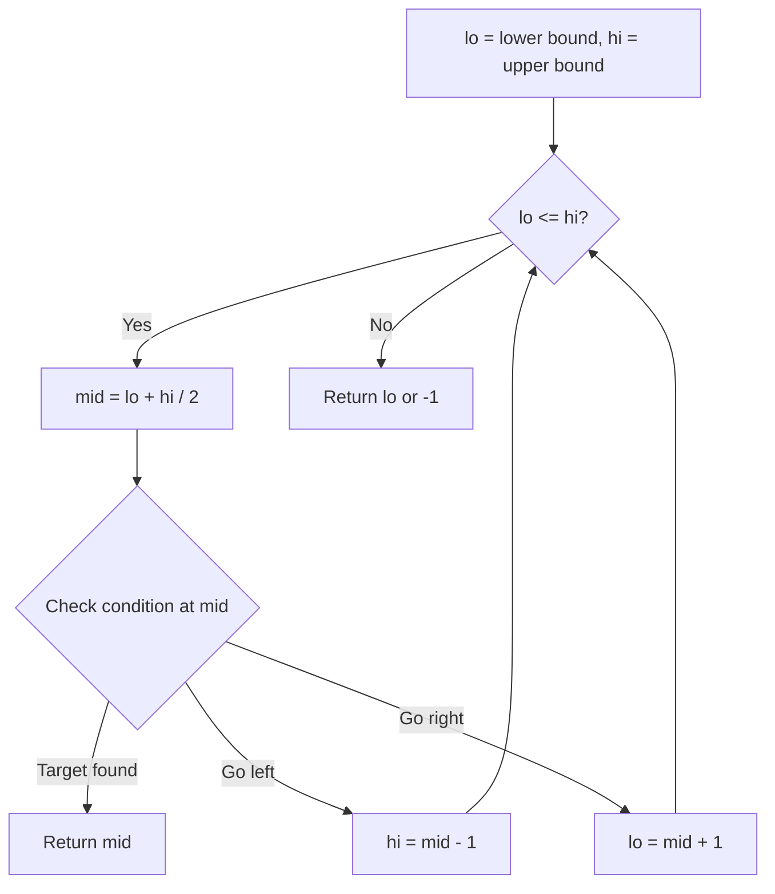
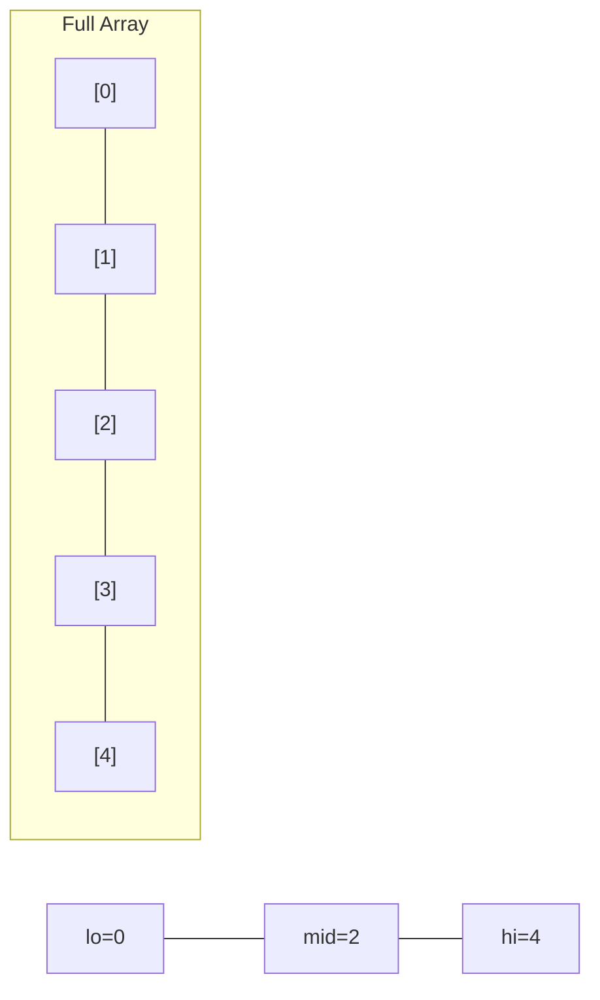
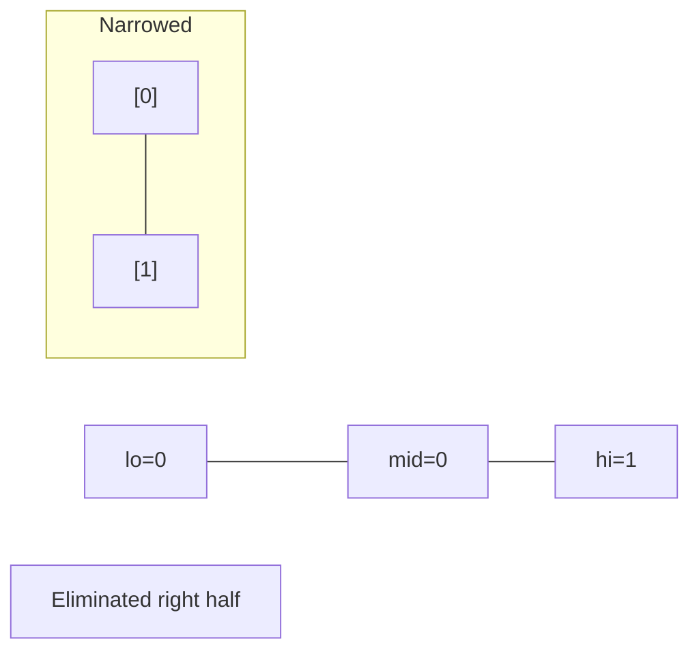
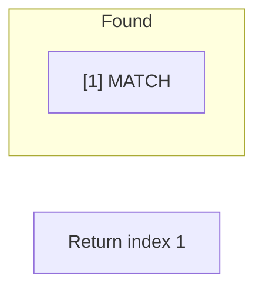

# Problem 1923: Longest Common Subpath

**Difficulty:** Hard  
**Tags:** Array, Binary Search, Rolling Hash, Suffix Array, Hash Function  
**Pattern:** Binary Search  
**Link:** [leetcode.com/problems/longest-common-subpath](https://leetcode.com/problems/longest-common-subpath/)

## Description

There is a country of `n` cities numbered from `0` to `n - 1`. In this country, there is a road connecting **every pair** of cities.

There are `m` friends numbered from `0` to `m - 1` who are traveling through the country. Each one of them will take a path consisting of some cities. Each path is represented by an integer array that contains the visited cities in order. The path may contain a city **more than once**, but the same city will not be listed consecutively.

Given an integer `n` and a 2D integer array `paths` where `paths[i]` is an integer array representing the path of the `i^th` friend, return *the length of the **longest common subpath** that is shared by **every** friend's path, or *`0`* if there is no common subpath at all*.

A **subpath** of a path is a contiguous sequence of cities within that path.

 

Example 1:

```

**Input:** n = 5, paths = [[0,1,2,3,4],
                       [2,3,4],
                       [4,0,1,2,3]]
**Output:** 2
**Explanation:** The longest common subpath is [2,3].

```

Example 2:

```

**Input:** n = 3, paths = [[0],[1],[2]]
**Output:** 0
**Explanation:** There is no common subpath shared by the three paths.

```

Example 3:

```

**Input:** n = 5, paths = [[0,1,2,3,4],
                       [4,3,2,1,0]]
**Output:** 1
**Explanation:** The possible longest common subpaths are [0], [1], [2], [3], and [4]. All have a length of 1.
```

 

**Constraints:**

	- `1 <= n <= 10^5`
	- `m == paths.length`
	- `2 <= m <= 10^5`
	- `sum(paths[i].length) <= 10^5`
	- `0 <= paths[i][j] < n`
	- The same city is not listed multiple times consecutively in `paths[i]`.

## Approach: Binary Search

Use binary search to halve the search space each iteration. Define the search range [lo, hi], compute mid, and decide which half to keep based on the problem's monotonic condition.

## Pseudocode

```
1. lo = lower_bound, hi = upper_bound
2. While lo <= hi (or lo < hi):
   a. mid = (lo + hi) // 2
   b. If condition(mid) is satisfied: record answer, search left half
   c. Else: search right half
3. Return answer
```

## Algorithm Flow



## Visual State Transitions

**Binary Search Step-by-Step:**

**Frame 1: Initial search space**


**Frame 2: Compare mid, narrow search**


**Frame 3: Found target**



## Complexity Analysis

- **Time:** O(log n)
- **Space:** O(1)

## Solution (Python3)

```python
class Solution:
    def longestCommonSubpath(self, n: int, paths: List[List[int]]) -> int:
        # Binary search - O(log n) time, O(1) space
        lo, hi = 0, len(n) - 1
        while lo <= hi:
            mid = lo + (hi - lo) // 2
            if n[mid] == paths:
                return mid
            elif n[mid] < paths:
                lo = mid + 1
            else:
                hi = mid - 1
        return 0
```

## Solution (C++)

```cpp
#include <string>
#include <vector>
using namespace std;

class Solution {
public:
    int longestCommonSubpath(int n, vector<vector<int>>& paths) {
        // Binary search - O(log n) time, O(1) space
        int lo = 0, hi = n.size() - 1;
        while (lo <= hi) {
            int mid = lo + (hi - lo) / 2;
            if (n[mid] == paths) {
                return mid;
            } else if (n[mid] < paths) {
                lo = mid + 1;
            } else {
                hi = mid - 1;
            }
        }
        return 0;
    }
};
```
