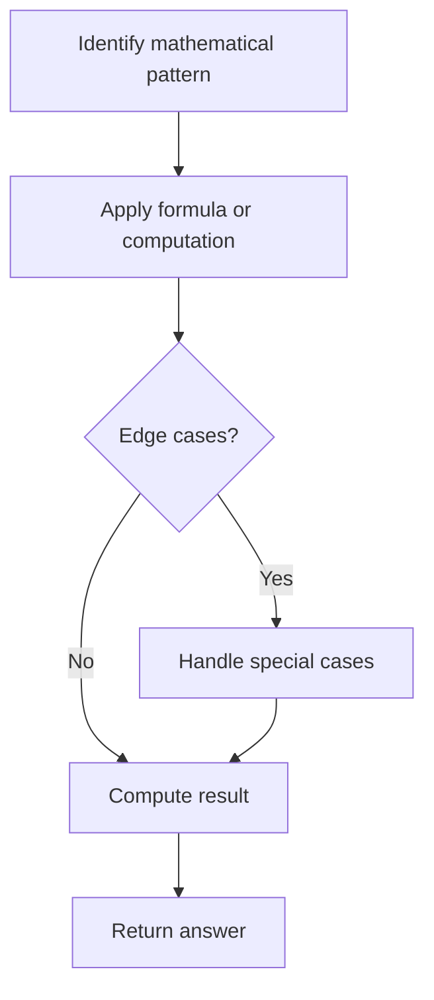

# Problem 1925: Count Square Sum Triples

**Difficulty:** Easy  
**Tags:** Math, Enumeration  
**Pattern:** Math  
**Link:** [leetcode.com/problems/count-square-sum-triples](https://leetcode.com/problems/count-square-sum-triples/)

## Description

A **square triple** `(a,b,c)` is a triple where `a`, `b`, and `c` are **integers** and `a^2 + b^2 = c^2`.

Given an integer `n`, return *the number of **square triples** such that *`1 <= a, b, c <= n`.

 

Example 1:

```

**Input:** n = 5
**Output:** 2
**Explanation**: The square triples are (3,4,5) and (4,3,5).

```

Example 2:

```

**Input:** n = 10
**Output:** 4
**Explanation**: The square triples are (3,4,5), (4,3,5), (6,8,10), and (8,6,10).

```

 

**Constraints:**

	- `1 <= n <= 250`

## Approach: Math

Apply mathematical properties, formulas, or number-theoretic concepts. Look for patterns, modular arithmetic, or closed-form solutions.

## Pseudocode

```
1. Identify the mathematical pattern or formula
2. Apply computation:
   - Modular arithmetic for large numbers
   - GCD/LCM for divisibility
   - Sieve for primes
3. Handle edge cases
4. Return result
```

## Algorithm Flow



## Complexity Analysis

- **Time:** O(n) or O(sqrt(n))
- **Space:** O(1)

## Solution (Python3)

```python
class Solution:
    def countTriples(self, n: int) -> int:
        # Mathematical approach
        result = 0
        x = n
        while x != 0:
            result = result * 10 + x % 10
            x //= 10 if isinstance(x, int) else 1
        return result
```

## Solution (C++)

```cpp
#include <string>
#include <vector>
using namespace std;

class Solution {
public:
    int countTriples(int n) {
        // Mathematical approach
        long long result = 0;
        int x = n;
        while (x != 0) {
            result = result * 10 + x % 10;
            x /= 10;
        }
        return (int)result;
    }
};
```
