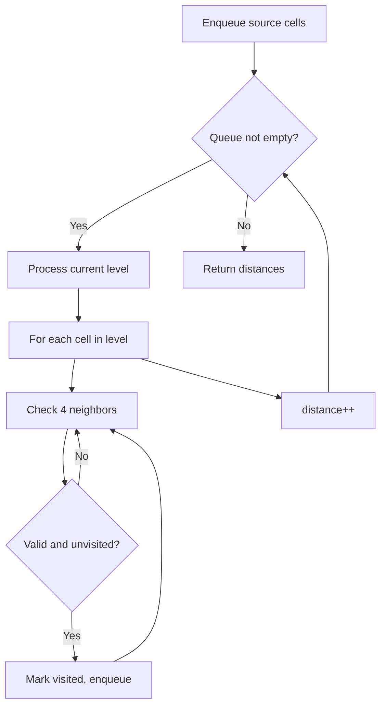
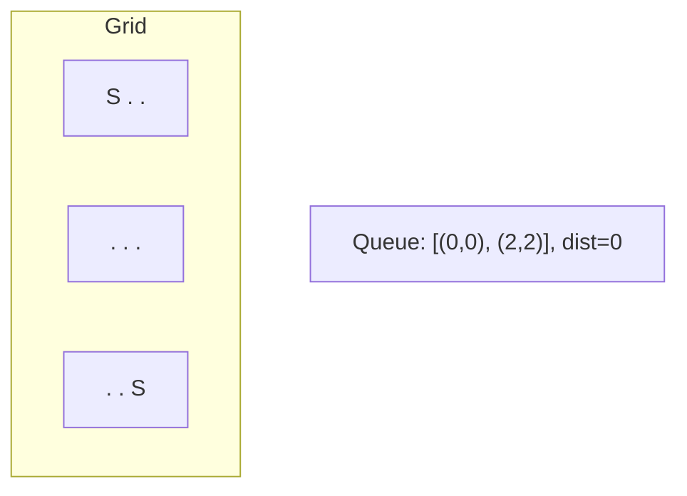
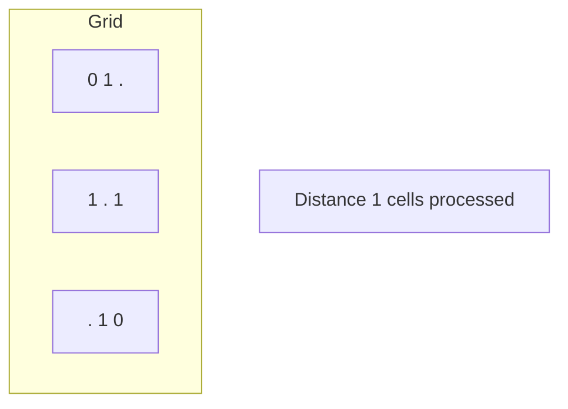
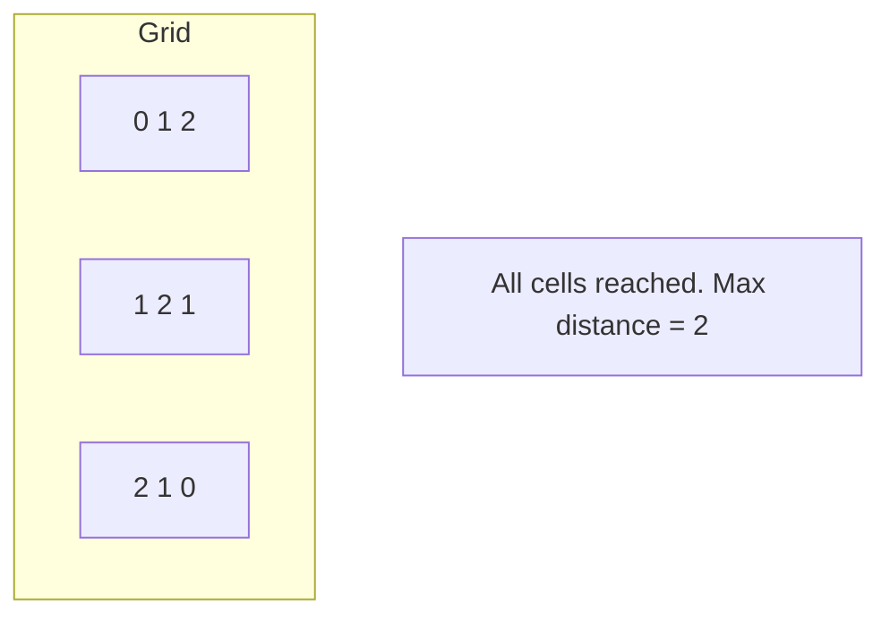

# Problem 1926: Nearest Exit from Entrance in Maze

**Difficulty:** Medium  
**Tags:** Array, Breadth-First Search, Matrix  
**Pattern:** BFS on Matrix / Grid  
**Link:** [leetcode.com/problems/nearest-exit-from-entrance-in-maze](https://leetcode.com/problems/nearest-exit-from-entrance-in-maze/)

## Description

You are given an `m x n` matrix `maze` (**0-indexed**) with empty cells (represented as `'.'`) and walls (represented as `'+'`). You are also given the `entrance` of the maze, where `entrance = [entrancerow, entrancecol]` denotes the row and column of the cell you are initially standing at.

In one step, you can move one cell **up**, **down**, **left**, or **right**. You cannot step into a cell with a wall, and you cannot step outside the maze. Your goal is to find the **nearest exit** from the `entrance`. An **exit** is defined as an **empty cell** that is at the **border** of the `maze`. The `entrance` **does not count** as an exit.

Return *the **number of steps** in the shortest path from the *`entrance`* to the nearest exit, or *`-1`* if no such path exists*.

 

Example 1:

```

**Input:** maze = [["+","+",".","+"],[".",".",".","+"],["+","+","+","."]], entrance = [1,2]
**Output:** 1
**Explanation:** There are 3 exits in this maze at [1,0], [0,2], and [2,3].
Initially, you are at the entrance cell [1,2].
- You can reach [1,0] by moving 2 steps left.
- You can reach [0,2] by moving 1 step up.
It is impossible to reach [2,3] from the entrance.
Thus, the nearest exit is [0,2], which is 1 step away.

```

Example 2:

```

**Input:** maze = [["+","+","+"],[".",".","."],["+","+","+"]], entrance = [1,0]
**Output:** 2
**Explanation:** There is 1 exit in this maze at [1,2].
[1,0] does not count as an exit since it is the entrance cell.
Initially, you are at the entrance cell [1,0].
- You can reach [1,2] by moving 2 steps right.
Thus, the nearest exit is [1,2], which is 2 steps away.

```

Example 3:

```

**Input:** maze = [[".","+"]], entrance = [0,0]
**Output:** -1
**Explanation:** There are no exits in this maze.

```

 

**Constraints:**

	- `maze.length == m`
	- `maze[i].length == n`
	- `1 <= m, n <= 100`
	- `maze[i][j]` is either `'.'` or `'+'`.
	- `entrance.length == 2`
	- `0 <= entrancerow < m`
	- `0 <= entrancecol < n`
	- `entrance` will always be an empty cell.

## Approach: BFS on Matrix / Grid

Breadth-first search on the grid. Enqueue all starting cells, then expand level by level. BFS on grids finds shortest distance from source(s).

## Pseudocode

```
1. Enqueue all source cells, mark visited
2. distance = 0
3. While queue not empty:
   a. Process all cells at current distance
   b. For each cell, enqueue unvisited neighbors
   c. distance++
4. Return result
```

## Algorithm Flow



## Visual State Transitions

**Multi-source BFS on Grid:**

**Frame 1: Enqueue all sources**


**Frame 2: Expand distance 1**


**Frame 3: Expand distance 2**



## Complexity Analysis

- **Time:** O(m * n)
- **Space:** O(m * n)

## Solution (Python3)

```python
class Solution:
    def nearestExit(self, maze: List[List[str]], entrance: List[int]) -> int:
        # BFS on grid - O(m*n) time
        from collections import deque
        if not maze:
            return 0
        rows, cols = len(maze), len(maze[0])
        queue = deque()
        visited = set()
        # Initialize BFS sources
        for r in range(rows):
            for c in range(cols):
                if maze[r][c] == 1 or maze[r][c] == '1':
                    queue.append((r, c, 0))
                    visited.add((r, c))
        steps = 0
        while queue:
            r, c, d = queue.popleft()
            steps = max(steps, d)
            for dr, dc in [(1,0),(-1,0),(0,1),(0,-1)]:
                nr, nc = r+dr, c+dc
                if 0 <= nr < rows and 0 <= nc < cols and (nr,nc) not in visited:
                    visited.add((nr, nc))
                    queue.append((nr, nc, d+1))
        return steps
```

## Solution (C++)

```cpp
#include <algorithm>
#include <queue>
#include <string>
#include <tuple>
#include <vector>
using namespace std;

class Solution {
public:
    int nearestExit(vector<vector<string>>& maze, vector<int>& entrance) {
        // BFS on grid - O(m*n) time
        if (maze.empty()) return 0;
        int rows = maze.size(), cols = maze[0].size();
        queue<tuple<int,int,int>> q;
        vector<vector<bool>> visited(rows, vector<bool>(cols, false));
        int dirs[4][2] = {{1,0},{-1,0},{0,1},{0,-1}};
        for (int r = 0; r < rows; r++)
            for (int c = 0; c < cols; c++)
                if (maze[r][c] == 1) {
                    q.push({r, c, 0});
                    visited[r][c] = true;
                }
        int steps = 0;
        while (!q.empty()) {
            auto [r, c, d] = q.front(); q.pop();
            steps = max(steps, d);
            for (auto& dir : dirs) {
                int nr = r+dir[0], nc = c+dir[1];
                if (nr>=0 && nr<rows && nc>=0 && nc<cols && !visited[nr][nc]) {
                    visited[nr][nc] = true;
                    q.push({nr, nc, d+1});
                }
            }
        }
        return steps;
    }
};
```
