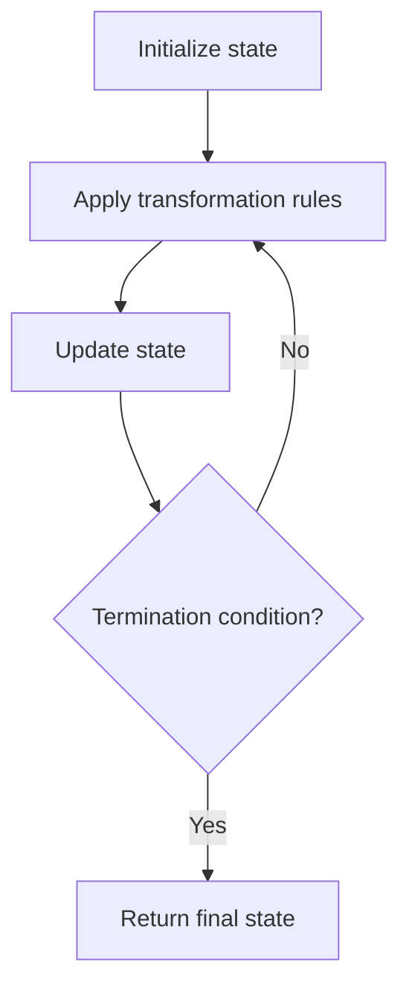

# Problem 1929: Concatenation of Array

**Difficulty:** Easy  
**Tags:** Array, Simulation  
**Pattern:** Simulation  
**Link:** [leetcode.com/problems/concatenation-of-array](https://leetcode.com/problems/concatenation-of-array/)

## Description

Given an integer array `nums` of length `n`, you want to create an array `ans` of length `2n` where `ans[i] == nums[i]` and `ans[i + n] == nums[i]` for `0 <= i < n` (**0-indexed**).

Specifically, `ans` is the **concatenation** of two `nums` arrays.

Return *the array *`ans`.

 

Example 1:

```

**Input:** nums = [1,2,1]
**Output:** [1,2,1,1,2,1]
**Explanation:** The array ans is formed as follows:
- ans = [nums[0],nums[1],nums[2],nums[0],nums[1],nums[2]]
- ans = [1,2,1,1,2,1]
```

Example 2:

```

**Input:** nums = [1,3,2,1]
**Output:** [1,3,2,1,1,3,2,1]
**Explanation:** The array ans is formed as follows:
- ans = [nums[0],nums[1],nums[2],nums[3],nums[0],nums[1],nums[2],nums[3]]
- ans = [1,3,2,1,1,3,2,1]

```

 

**Constraints:**

	- `n == nums.length`
	- `1 <= n <= 1000`
	- `1 <= nums[i] <= 1000`

## Approach: Simulation

Simulate the process described in the problem step by step. Follow the rules exactly, tracking state at each step.

## Pseudocode

```
1. Initialize state (grid, pointers, counters)
2. For each step / iteration:
   a. Apply the transformation rules
   b. Update state
   c. Check termination condition
3. Return final state or result
```

## Algorithm Flow



## Complexity Analysis

- **Time:** O(n) or O(n * k)
- **Space:** O(n)

## Solution (Python3)

```python
class Solution:
    def getConcatenation(self, nums: List[int]) -> List[int]:
        # Simulation approach - follow the rules step by step
        result = []
        for i in range(len(nums) if isinstance(nums, list) else nums):
            # Simulate each step
            pass
        return result
```

## Solution (C++)

```cpp
#include <string>
#include <vector>
using namespace std;

class Solution {
public:
    vector<int> getConcatenation(vector<int>& nums) {
        // Simulation approach
        int n = nums.size();
        for (int i = 0; i < n; i++) {
            // Simulate each step
        }
        return {};
    }
};
```
