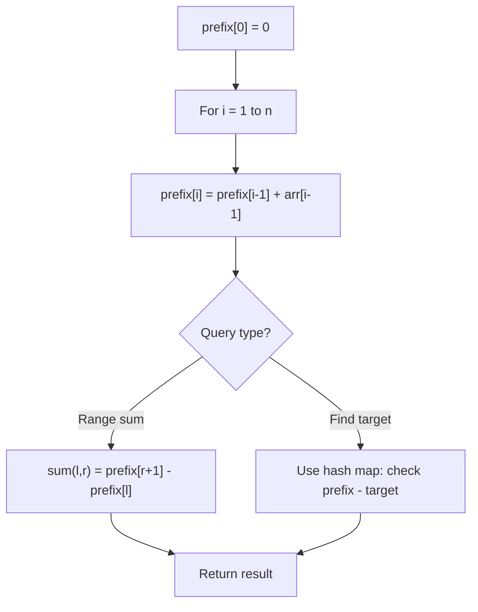

# Problem 1930: Unique Length-3 Palindromic Subsequences

**Difficulty:** Medium  
**Tags:** Hash Table, String, Bit Manipulation, Prefix Sum  
**Pattern:** Prefix Sum  
**Link:** [leetcode.com/problems/unique-length-3-palindromic-subsequences](https://leetcode.com/problems/unique-length-3-palindromic-subsequences/)

## Description

Given a string `s`, return *the number of **unique palindromes of length three** that are a **subsequence** of *`s`.

Note that even if there are multiple ways to obtain the same subsequence, it is still only counted **once**.

A **palindrome** is a string that reads the same forwards and backwards.

A **subsequence** of a string is a new string generated from the original string with some characters (can be none) deleted without changing the relative order of the remaining characters.

	- For example, `"ace"` is a subsequence of `"abcde"`.

 

Example 1:

```

**Input:** s = "aabca"
**Output:** 3
**Explanation:** The 3 palindromic subsequences of length 3 are:
- "aba" (subsequence of "aabca")
- "aaa" (subsequence of "aabca")
- "aca" (subsequence of "aabca")

```

Example 2:

```

**Input:** s = "adc"
**Output:** 0
**Explanation:** There are no palindromic subsequences of length 3 in "adc".

```

Example 3:

```

**Input:** s = "bbcbaba"
**Output:** 4
**Explanation:** The 4 palindromic subsequences of length 3 are:
- "bbb" (subsequence of "bbcbaba")
- "bcb" (subsequence of "bbcbaba")
- "bab" (subsequence of "bbcbaba")
- "aba" (subsequence of "bbcbaba")

```

 

**Constraints:**

	- `3 <= s.length <= 10^5`
	- `s` consists of only lowercase English letters.

## Approach: Prefix Sum

Build a prefix sum array where prefix[i] = sum of elements 0..i-1. Any subarray sum [l..r] = prefix[r+1] - prefix[l]. Combine with hash map for O(n) subarray sum queries.

## Pseudocode

```
1. Build prefix sum array: prefix[0]=0, prefix[i]=prefix[i-1]+arr[i-1]
2. Use prefix sums to answer queries:
   - Subarray sum [l..r] = prefix[r+1] - prefix[l]
   - Or use hash map to find prefix[j]-prefix[i] == target
3. Return result
```

## Algorithm Flow



## Complexity Analysis

- **Time:** O(n)
- **Space:** O(n)

## Solution (Python3)

```python
class Solution:
    def countPalindromicSubsequence(self, s: str) -> int:
        # Prefix sum approach - O(n) time, O(n) space
        prefix = {0: -1}
        curr_sum = 0
        result = 0
        target = s if isinstance(s, int) else 0
        for i, val in enumerate(s):
            curr_sum += val
            if curr_sum - target in prefix:
                result = max(result, i - prefix[curr_sum - target])
            if curr_sum not in prefix:
                prefix[curr_sum] = i
        return result
```

## Solution (C++)

```cpp
#include <algorithm>
#include <string>
#include <unordered_map>
#include <vector>
using namespace std;

class Solution {
public:
    int countPalindromicSubsequence(string& s) {
        // Prefix sum approach - O(n) time, O(n) space
        unordered_map<int, int> prefix;
        prefix[0] = -1;
        int curr_sum = 0, result = 0;
        int target = s;
        for (int i = 0; i < (int)s.size(); i++) {
            curr_sum += s[i];
            if (prefix.count(curr_sum - target)) {
                result = max(result, i - prefix[curr_sum - target]);
            }
            if (!prefix.count(curr_sum)) {
                prefix[curr_sum] = i;
            }
        }
        return result;
    }
};
```
