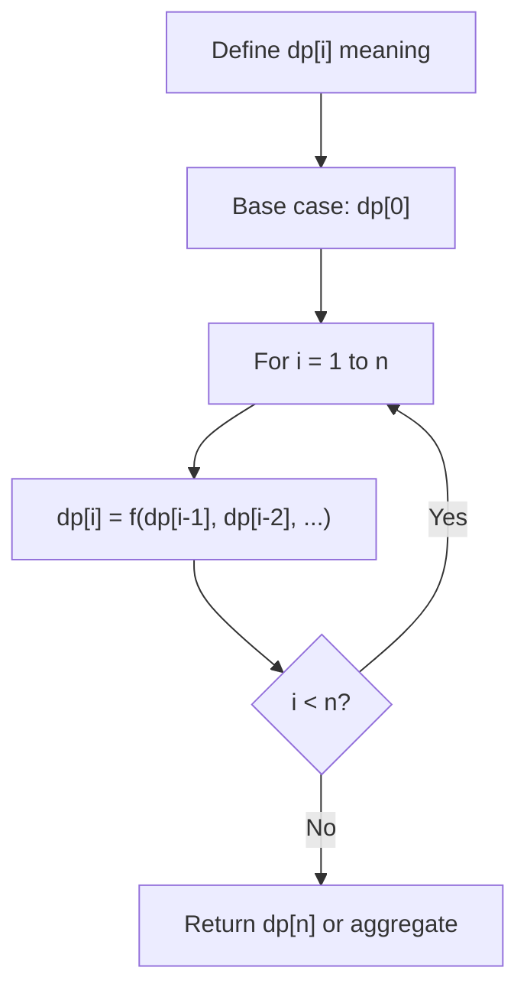
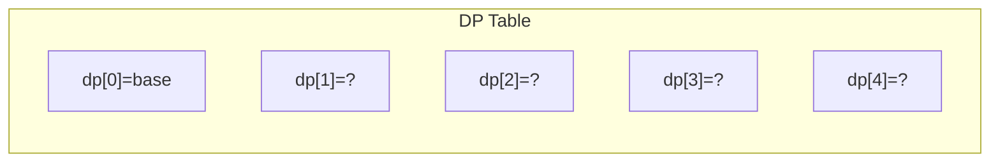
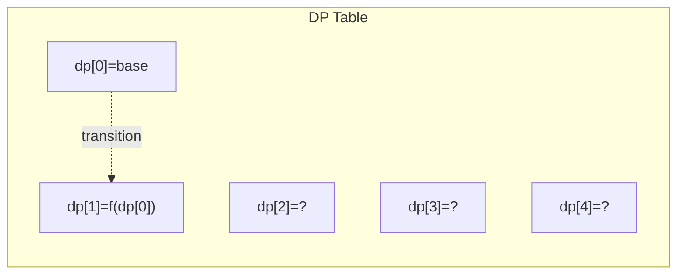
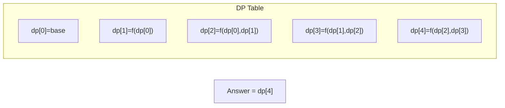

# Problem 1931: Painting a Grid With Three Different Colors

**Difficulty:** Hard  
**Tags:** Dynamic Programming  
**Pattern:** Dynamic Programming (1D)  
**Link:** [leetcode.com/problems/painting-a-grid-with-three-different-colors](https://leetcode.com/problems/painting-a-grid-with-three-different-colors/)

## Description

You are given two integers `m` and `n`. Consider an `m x n` grid where each cell is initially white. You can paint each cell **red**, **green**, or **blue**. All cells **must** be painted.

Return* the number of ways to color the grid with **no two adjacent cells having the same color***. Since the answer can be very large, return it **modulo** `10^9 + 7`.

 

Example 1:

```

**Input:** m = 1, n = 1
**Output:** 3
**Explanation:** The three possible colorings are shown in the image above.

```

Example 2:

```

**Input:** m = 1, n = 2
**Output:** 6
**Explanation:** The six possible colorings are shown in the image above.

```

Example 3:

```

**Input:** m = 5, n = 5
**Output:** 580986

```

 

**Constraints:**

	- `1 <= m <= 5`
	- `1 <= n <= 1000`

## Approach: Dynamic Programming (1D)

Break the problem into overlapping subproblems. Define dp[i] as the optimal value for the subproblem ending at or considering index i. Build the solution bottom-up, using previously computed dp values.

## Pseudocode

```
1. Define dp[i] = optimal value for subproblem i
2. Base case: dp[0] = initial value
3. For i from 1 to n:
   a. dp[i] = recurrence(dp[i-1], dp[i-2], ...)
4. Return dp[n] or max/min of dp
```

## Algorithm Flow



## Visual State Transitions

**1D Dynamic Programming Table Build:**

**Frame 1: Initialize base cases**


**Frame 2: Fill dp[1] from dp[0]**


**Frame 3: Fill remaining cells**



## Complexity Analysis

- **Time:** O(n)
- **Space:** O(n)

## Solution (Python3)

```python
class Solution:
    def colorTheGrid(self, m: int, n: int) -> int:
        # Dynamic programming (1D) - O(n) time, O(n) space
        if not m:
            return 0
        n = len(m) if isinstance(m, list) else m
        dp = [0] * (n + 1)
        dp[0] = 1  # base case
        for i in range(1, n + 1):
            dp[i] = dp[i-1]  # transition (customize per problem)
            if i >= 2:
                dp[i] += dp[i-2]
        return dp[n]
```

## Solution (C++)

```cpp
#include <string>
#include <vector>
using namespace std;

class Solution {
public:
    int colorTheGrid(int m, int n) {
        // Dynamic programming (1D) - O(n) time, O(n) space
        int n = m;
        if (n <= 0) return 0;
        vector<int> dp(n + 1, 0);
        dp[0] = 1;
        for (int i = 1; i <= n; i++) {
            dp[i] = dp[i-1];
            if (i >= 2) dp[i] += dp[i-2];
        }
        return dp[n];
    }
};
```
