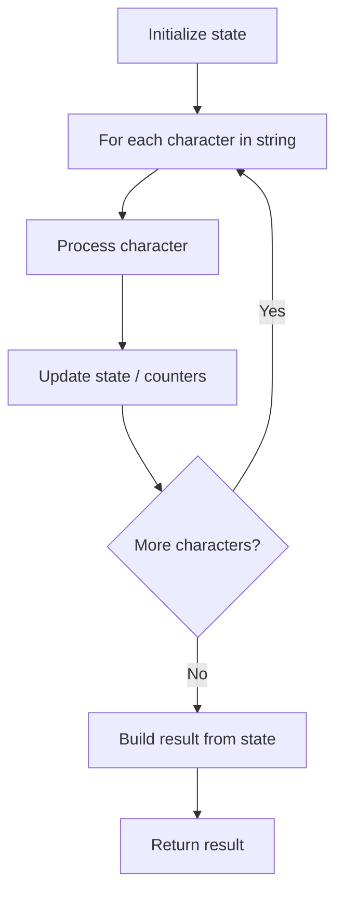

# Problem 1933: Check if String Is Decomposable Into Value-Equal Substrings

**Difficulty:** Easy  
**Tags:** String  
**Pattern:** String Processing  
**Link:** [leetcode.com/problems/check-if-string-is-decomposable-into-value-equal-substrings](https://leetcode.com/problems/check-if-string-is-decomposable-into-value-equal-substrings/)

## Description

*(Premium problem -- description requires LeetCode subscription)*

## Approach: String Processing

Process the string character by character. Common techniques: two pointers, sliding window, hash map for frequencies, stack for matching.

## Pseudocode

```
1. Initialize result / tracking state
2. Iterate through string characters:
   a. Process character based on rules
   b. Update state (counters, pointers, stack)
3. Build and return result
```

## Algorithm Flow



## Complexity Analysis

- **Time:** O(n)
- **Space:** O(n)

## Solution (Python3)

```python
class Solution:
    pass
```

## Solution (C++)

```cpp
class Solution {
public:
    // Design problem stub
};
```
