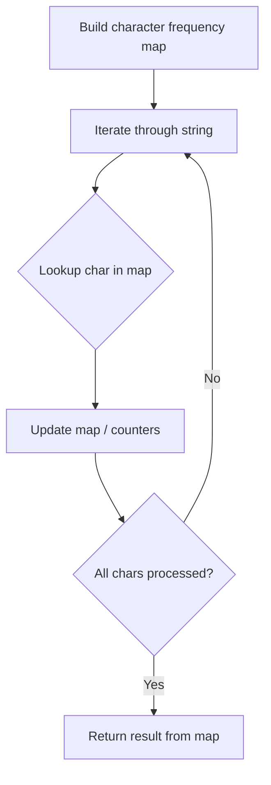

# Problem 1935: Maximum Number of Words You Can Type

**Difficulty:** Easy  
**Tags:** Hash Table, String  
**Pattern:** Hash Map String Processing  
**Link:** [leetcode.com/problems/maximum-number-of-words-you-can-type](https://leetcode.com/problems/maximum-number-of-words-you-can-type/)

## Description

There is a malfunctioning keyboard where some letter keys do not work. All other keys on the keyboard work properly.

Given a string `text` of words separated by a single space (no leading or trailing spaces) and a string `brokenLetters` of all **distinct** letter keys that are broken, return *the **number of words** in* `text` *you can fully type using this keyboard*.

 

Example 1:

```

**Input:** text = "hello world", brokenLetters = "ad"
**Output:** 1
**Explanation:** We cannot type "world" because the 'd' key is broken.

```

Example 2:

```

**Input:** text = "leet code", brokenLetters = "lt"
**Output:** 1
**Explanation:** We cannot type "leet" because the 'l' and 't' keys are broken.

```

Example 3:

```

**Input:** text = "leet code", brokenLetters = "e"
**Output:** 0
**Explanation:** We cannot type either word because the 'e' key is broken.

```

 

**Constraints:**

	- `1 <= text.length <= 10^4`
	- `0 <= brokenLetters.length <= 26`
	- `text` consists of words separated by a single space without any leading or trailing spaces.
	- Each word only consists of lowercase English letters.
	- `brokenLetters` consists of **distinct** lowercase English letters.

## Approach: Hash Map String Processing

Use a hash map to count character frequencies or map characters/strings for O(1) lookups. Process the string in one or two passes.

## Pseudocode

```
1. Build frequency map / char-to-index map
2. Iterate through string:
   a. Look up character in map
   b. Update counts or mappings
3. Return result based on map state
```

## Algorithm Flow



## Complexity Analysis

- **Time:** O(n)
- **Space:** O(n)

## Solution (Python3)

```python
class Solution:
    def canBeTypedWords(self, text: str, brokenLetters: str) -> int:
        # Hash map for string/character frequency - O(n) time
        freq = {}
        for ch in text:
            freq[ch] = freq.get(ch, 0) + 1
        # Process frequency map
        for ch, cnt in freq.items():
            if cnt == 1:
                return text.index(ch)
        return 0
```

## Solution (C++)

```cpp
#include <string>
#include <unordered_map>
#include <vector>
using namespace std;

class Solution {
public:
    int canBeTypedWords(string& text, string& brokenLetters) {
        // Hash map for string/character frequency - O(n) time
        unordered_map<char, int> freq;
        for (char ch : text) {
            freq[ch]++;
        }
        // Process frequency map
        for (int i = 0; i < text.size(); i++) {
            if (freq[text[i]] == 1) return i;
        }
        return 0;
    }
};
```
