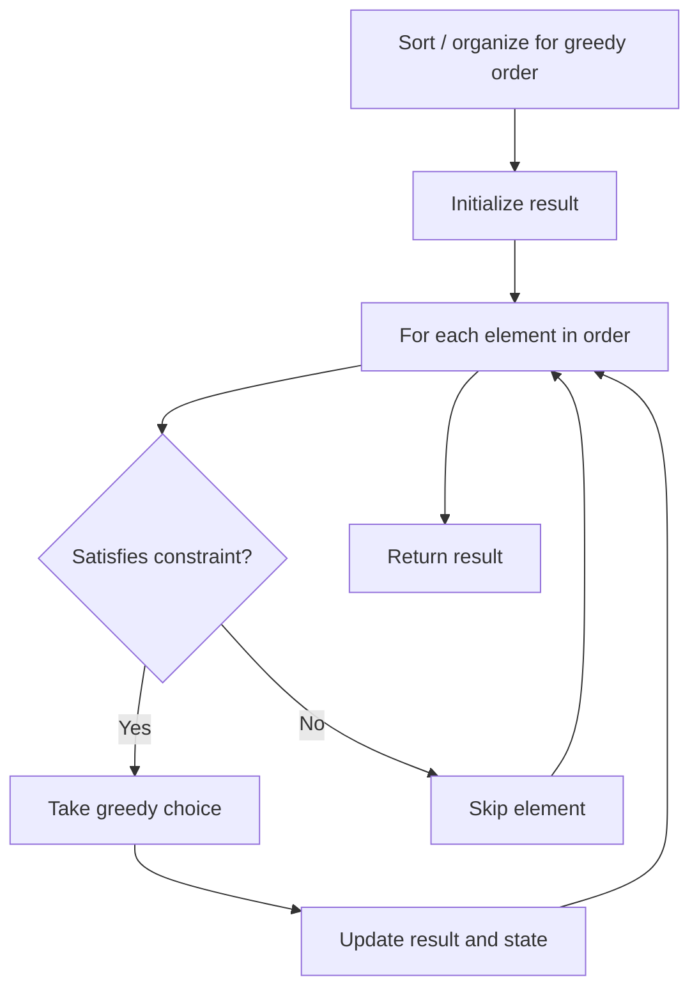

# Problem 1936: Add Minimum Number of Rungs

**Difficulty:** Medium  
**Tags:** Array, Greedy  
**Pattern:** Greedy  
**Link:** [leetcode.com/problems/add-minimum-number-of-rungs](https://leetcode.com/problems/add-minimum-number-of-rungs/)

## Description

You are given a **strictly increasing** integer array `rungs` that represents the **height** of rungs on a ladder. You are currently on the **floor** at height `0`, and you want to reach the last rung.

You are also given an integer `dist`. You can only climb to the next highest rung if the distance between where you are currently at (the floor or on a rung) and the next rung is **at most** `dist`. You are able to insert rungs at any positive **integer** height if a rung is not already there.

Return *the **minimum** number of rungs that must be added to the ladder in order for you to climb to the last rung.*

 

Example 1:

```

**Input:** rungs = [1,3,5,10], dist = 2
**Output:** 2
Explanation:
You currently cannot reach the last rung.
Add rungs at heights 7 and 8 to climb this ladder. 
The ladder will now have rungs at [1,3,5,7,8,10].

```

Example 2:

```

**Input:** rungs = [3,6,8,10], dist = 3
**Output:** 0
**Explanation:**
This ladder can be climbed without adding additional rungs.

```

Example 3:

```

**Input:** rungs = [3,4,6,7], dist = 2
**Output:** 1
**Explanation:**
You currently cannot reach the first rung from the ground.
Add a rung at height 1 to climb this ladder.
The ladder will now have rungs at [1,3,4,6,7].

```

 

**Constraints:**

	- `1 <= rungs.length <= 10^5`
	- `1 <= rungs[i] <= 10^9`
	- `1 <= dist <= 10^9`
	- `rungs` is **strictly increasing**.

## Approach: Greedy

Make the locally optimal choice at each step, trusting it leads to a global optimum. Greedy works when the problem has the greedy-choice property and optimal substructure.

## Pseudocode

```
1. Sort or organize data for greedy ordering
2. Initialize result
3. For each element in greedy order:
   a. If element satisfies constraint:
      - Take the greedy choice
      - Update result and state
4. Return result
```

## Algorithm Flow



## Complexity Analysis

- **Time:** O(n log n)
- **Space:** O(1)

## Solution (Python3)

```python
class Solution:
    def addRungs(self, rungs: List[int], dist: int) -> int:
        # Greedy approach - O(n) time
        result = 0
        curr_max = 0
        for i in range(len(rungs)):
            if isinstance(rungs[i], int):
                curr_max = max(curr_max, rungs[i])
                result = max(result, curr_max)
            else:
                result += 1
        return result
```

## Solution (C++)

```cpp
#include <algorithm>
#include <string>
#include <vector>
using namespace std;

class Solution {
public:
    int addRungs(vector<int>& rungs, int dist) {
        // Greedy approach - O(n) time
        int result = 0, curr_max = 0;
        for (int i = 0; i < (int)rungs.size(); i++) {
            curr_max = max(curr_max, rungs[i]);
            result = max(result, curr_max);
        }
        return result;
    }
};
```
