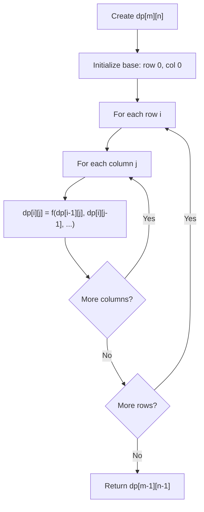
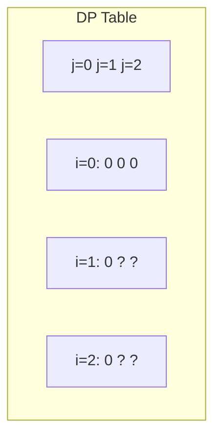
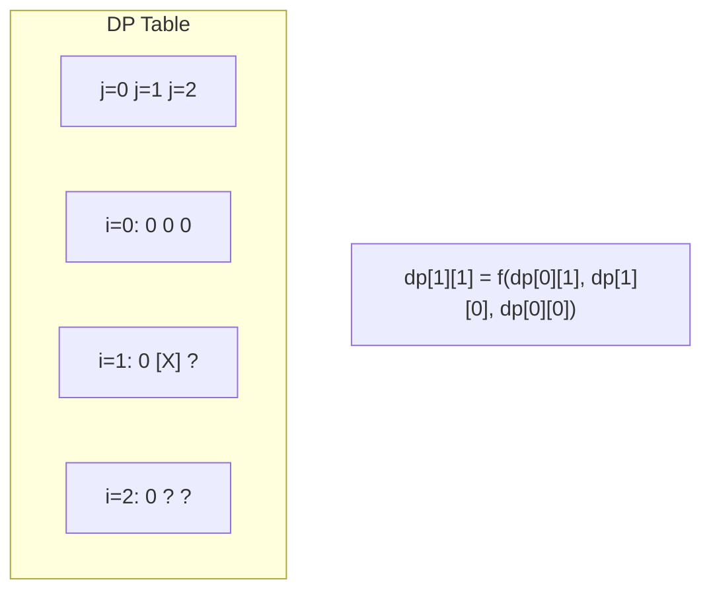
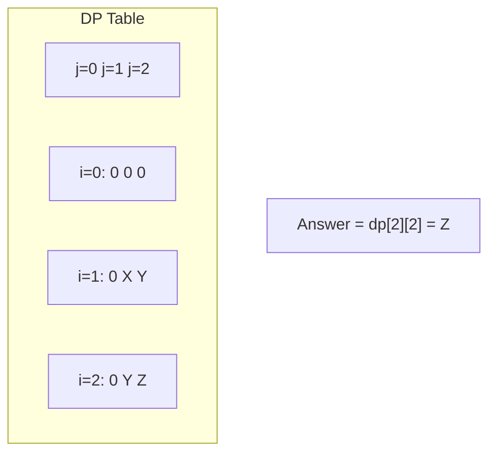

# Problem 1937: Maximum Number of Points with Cost

**Difficulty:** Medium  
**Tags:** Array, Dynamic Programming, Matrix  
**Pattern:** Dynamic Programming (2D Grid/Matrix)  
**Link:** [leetcode.com/problems/maximum-number-of-points-with-cost](https://leetcode.com/problems/maximum-number-of-points-with-cost/)

## Description

You are given an `m x n` integer matrix `points` (**0-indexed**). Starting with `0` points, you want to **maximize** the number of points you can get from the matrix.

To gain points, you must pick one cell in **each row**. Picking the cell at coordinates `(r, c)` will **add** `points[r][c]` to your score.

However, you will lose points if you pick a cell too far from the cell that you picked in the previous row. For every two adjacent rows `r` and `r + 1` (where `0 <= r < m - 1`), picking cells at coordinates `(r, c1)` and `(r + 1, c2)` will **subtract** `abs(c1 - c2)` from your score.

Return *the **maximum** number of points you can achieve*.

`abs(x)` is defined as:

	- `x` for `x >= 0`.
	- `-x` for `x < 0`.

 

Example 1:** **

```

**Input:** points = [[1,2,3],[1,5,1],[3,1,1]]
**Output:** 9
**Explanation:**
The blue cells denote the optimal cells to pick, which have coordinates (0, 2), (1, 1), and (2, 0).
You add 3 + 5 + 3 = 11 to your score.
However, you must subtract abs(2 - 1) + abs(1 - 0) = 2 from your score.
Your final score is 11 - 2 = 9.

```

Example 2:

```

**Input:** points = [[1,5],[2,3],[4,2]]
**Output:** 11
**Explanation:**
The blue cells denote the optimal cells to pick, which have coordinates (0, 1), (1, 1), and (2, 0).
You add 5 + 3 + 4 = 12 to your score.
However, you must subtract abs(1 - 1) + abs(1 - 0) = 1 from your score.
Your final score is 12 - 1 = 11.

```

 

**Constraints:**

	- `m == points.length`
	- `n == points[r].length`
	- `1 <= m, n <= 10^5`
	- `1 <= m * n <= 10^5`
	- `0 <= points[r][c] <= 10^5`

## Approach: Dynamic Programming (2D Grid/Matrix)

Use a 2D DP table where dp[i][j] represents the optimal value for the subproblem defined by rows 0..i and columns 0..j. Fill row by row or column by column.

## Pseudocode

```
1. Create dp[m][n] table
2. Initialize base cases (first row, first column)
3. For i from 1 to m-1:
   For j from 1 to n-1:
     dp[i][j] = recurrence(dp[i-1][j], dp[i][j-1], dp[i-1][j-1])
4. Return dp[m-1][n-1]
```

## Algorithm Flow



## Visual State Transitions

**2D DP Table Build:**

**Frame 1: Initialize borders**


**Frame 2: Fill cell by cell**


**Frame 3: Table complete**



## Complexity Analysis

- **Time:** O(m * n)
- **Space:** O(m * n)

## Solution (Python3)

```python
class Solution:
    def maxPoints(self, points: List[List[int]]) -> int:
        # Dynamic programming (2D) - O(m*n) time and space
        if not points:
            return 0
        m, n = len(points), len(points[0])
        dp = [[0] * (n + 1) for _ in range(m + 1)]
        for i in range(1, m + 1):
            for j in range(1, n + 1):
                dp[i][j] = max(dp[i-1][j], dp[i][j-1])
                # Add problem-specific transition
        return dp[m][n]
```

## Solution (C++)

```cpp
#include <algorithm>
#include <string>
#include <vector>
using namespace std;

class Solution {
public:
    int maxPoints(vector<vector<int>>& points) {
        // Dynamic programming (2D) - O(m*n) time and space
        if (points.empty()) return 0;
        int m = points.size(), n = points[0].size();
        vector<vector<int>> dp(m + 1, vector<int>(n + 1, 0));
        for (int i = 1; i <= m; i++) {
            for (int j = 1; j <= n; j++) {
                dp[i][j] = max(dp[i-1][j], dp[i][j-1]);
            }
        }
        return dp[m][n];
    }
};
```
