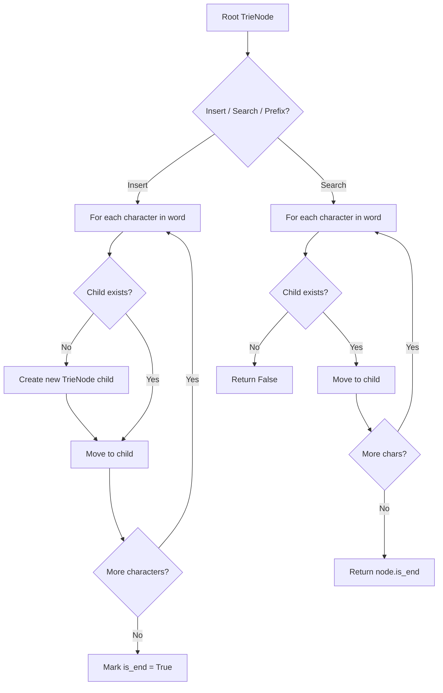
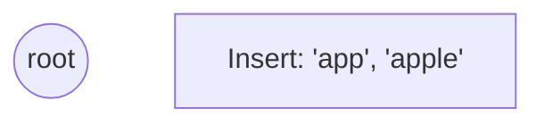
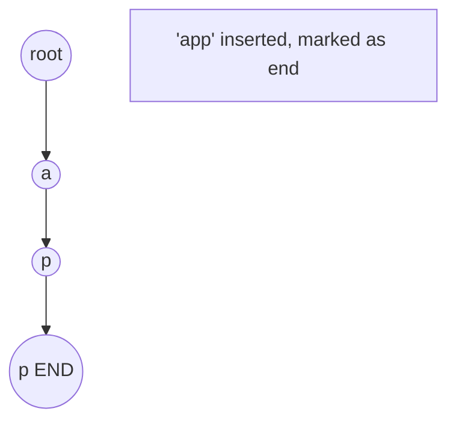
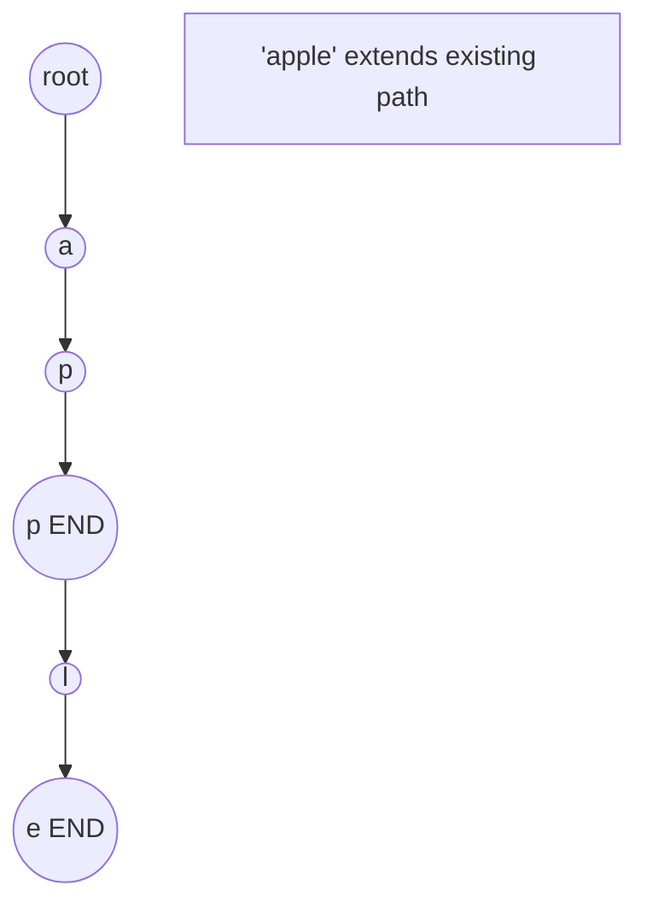
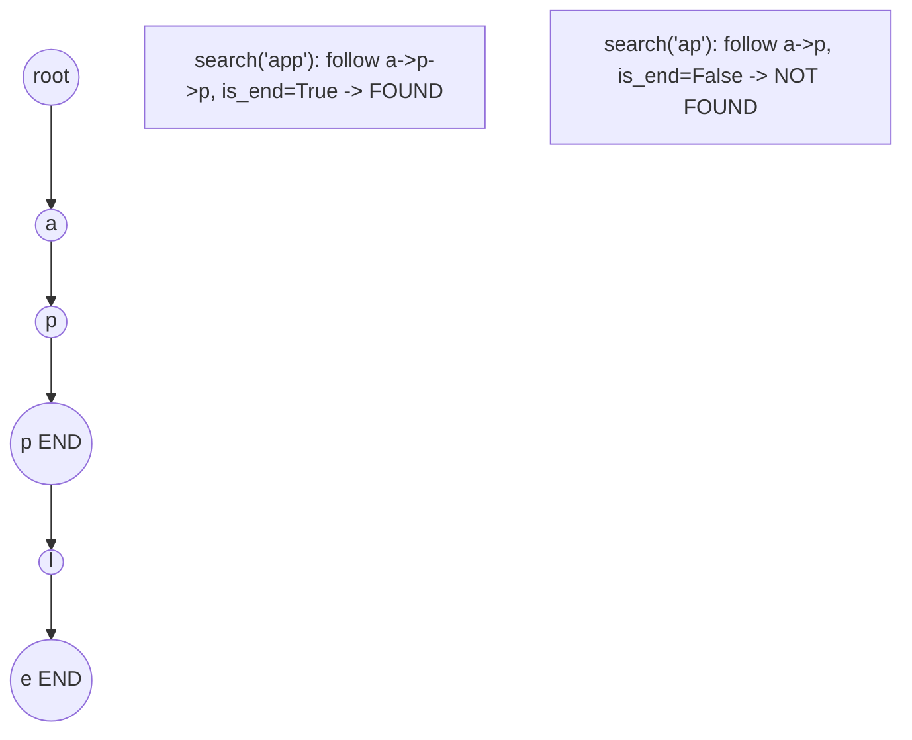

# Problem 1938: Maximum Genetic Difference Query

**Difficulty:** Hard  
**Tags:** Array, Hash Table, Bit Manipulation, Depth-First Search, Trie  
**Pattern:** Trie / Prefix Tree  
**Link:** [leetcode.com/problems/maximum-genetic-difference-query](https://leetcode.com/problems/maximum-genetic-difference-query/)

## Description

There is a rooted tree consisting of `n` nodes numbered `0` to `n - 1`. Each node's number denotes its **unique genetic value** (i.e. the genetic value of node `x` is `x`). The **genetic difference** between two genetic values is defined as the **bitwise-****XOR** of their values. You are given the integer array `parents`, where `parents[i]` is the parent for node `i`. If node `x` is the **root** of the tree, then `parents[x] == -1`.

You are also given the array `queries` where `queries[i] = [nodei, vali]`. For each query `i`, find the **maximum genetic difference** between `vali` and `pi`, where `pi` is the genetic value of any node that is on the path between `nodei` and the root (including `nodei` and the root). More formally, you want to maximize `vali XOR pi`.

Return *an array *`ans`* where *`ans[i]`* is the answer to the *`i^th`* query*.

 

Example 1:

```

**Input:** parents = [-1,0,1,1], queries = [[0,2],[3,2],[2,5]]
**Output:** [2,3,7]
**Explanation: **The queries are processed as follows:
- [0,2]: The node with the maximum genetic difference is 0, with a difference of 2 XOR 0 = 2.
- [3,2]: The node with the maximum genetic difference is 1, with a difference of 2 XOR 1 = 3.
- [2,5]: The node with the maximum genetic difference is 2, with a difference of 5 XOR 2 = 7.

```

Example 2:

```

**Input:** parents = [3,7,-1,2,0,7,0,2], queries = [[4,6],[1,15],[0,5]]
**Output:** [6,14,7]
**Explanation: **The queries are processed as follows:
- [4,6]: The node with the maximum genetic difference is 0, with a difference of 6 XOR 0 = 6.
- [1,15]: The node with the maximum genetic difference is 1, with a difference of 15 XOR 1 = 14.
- [0,5]: The node with the maximum genetic difference is 2, with a difference of 5 XOR 2 = 7.

```

 

**Constraints:**

	- `2 <= parents.length <= 10^5`
	- `0 <= parents[i] <= parents.length - 1` for every node `i` that is **not** the root.
	- `parents[root] == -1`
	- `1 <= queries.length <= 3 * 10^4`
	- `0 <= nodei <= parents.length - 1`
	- `0 <= vali <= 2 * 10^5`

## Approach: Trie / Prefix Tree

Build a trie (prefix tree) where each node represents a character. Insert words character by character, and search by following child pointers. Supports efficient prefix matching.

## Pseudocode

```
1. TrieNode: children = {}, is_end = False
2. Insert(word):
   - For each char: create child if absent, move to child
   - Mark last node as end
3. Search(word):
   - For each char: if child absent return False, move to child
   - Return node.is_end
4. StartsWith(prefix): same as search but return True at end
```

## Algorithm Flow



## Visual State Transitions

**Trie Insert and Search:**

**Frame 1: Empty trie**


**Frame 2: Insert 'app'**


**Frame 3: Insert 'apple'**


**Frame 4: Search 'app' = True, 'ap' = False**



## Complexity Analysis

- **Time:** O(L) per operation
- **Space:** O(N * L)

## Solution (Python3)

```python
class Solution:
    def maxGeneticDifference(self, parents: List[int], queries: List[List[int]]) -> List[int]:
        # Trie-based approach
        trie = {}
        # Build trie from word list
        words = parents if isinstance(parents, list) else [parents]
        for word in words:
            node = trie
            for ch in word:
                if ch not in node:
                    node[ch] = {}
                node = node[ch]
            node['#'] = True
        
        # Search in trie
        def search(word):
            node = trie
            for ch in word:
                if ch not in node:
                    return False
                node = node[ch]
            return '#' in node
        
        return []
```

## Solution (C++)

```cpp
#include <string>
#include <vector>
using namespace std;

class Solution {
public:
    vector<int> maxGeneticDifference(vector<int>& parents, vector<vector<int>>& queries) {
        // Trie-based approach
        struct TrieNode {
            TrieNode* children[26] = {};
            bool isEnd = false;
        };
        TrieNode* root = new TrieNode();
        // Build trie
        for (auto& word : parents) {
            TrieNode* node = root;
            for (char ch : word) {
                int idx = ch - 'a';
                if (!node->children[idx])
                    node->children[idx] = new TrieNode();
                node = node->children[idx];
            }
            node->isEnd = true;
        }
        return {};
    }
};
```
