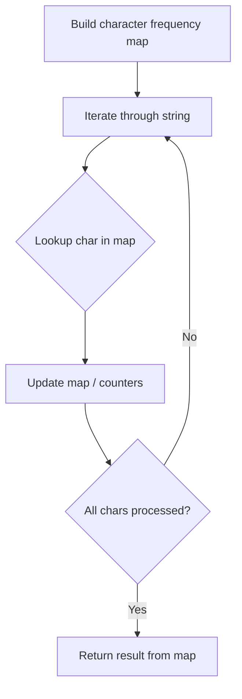

# Problem 1941: Check if All Characters Have Equal Number of Occurrences

**Difficulty:** Easy  
**Tags:** Hash Table, String, Counting  
**Pattern:** Hash Map String Processing  
**Link:** [leetcode.com/problems/check-if-all-characters-have-equal-number-of-occurrences](https://leetcode.com/problems/check-if-all-characters-have-equal-number-of-occurrences/)

## Description

Given a string `s`, return `true`* if *`s`* is a **good** string, or *`false`* otherwise*.

A string `s` is **good** if **all** the characters that appear in `s` have the **same** number of occurrences (i.e., the same frequency).

 

Example 1:

```

**Input:** s = "abacbc"
**Output:** true
**Explanation:** The characters that appear in s are 'a', 'b', and 'c'. All characters occur 2 times in s.

```

Example 2:

```

**Input:** s = "aaabb"
**Output:** false
**Explanation:** The characters that appear in s are 'a' and 'b'.
'a' occurs 3 times while 'b' occurs 2 times, which is not the same number of times.

```

 

**Constraints:**

	- `1 <= s.length <= 1000`
	- `s` consists of lowercase English letters.

## Approach: Hash Map String Processing

Use a hash map to count character frequencies or map characters/strings for O(1) lookups. Process the string in one or two passes.

## Pseudocode

```
1. Build frequency map / char-to-index map
2. Iterate through string:
   a. Look up character in map
   b. Update counts or mappings
3. Return result based on map state
```

## Algorithm Flow



## Complexity Analysis

- **Time:** O(n)
- **Space:** O(n)

## Solution (Python3)

```python
class Solution:
    def areOccurrencesEqual(self, s: str) -> bool:
        # Hash map for string/character frequency - O(n) time
        freq = {}
        for ch in s:
            freq[ch] = freq.get(ch, 0) + 1
        # Process frequency map
        for ch, cnt in freq.items():
            if cnt == 1:
                return s.index(ch)
        return False
```

## Solution (C++)

```cpp
#include <string>
#include <unordered_map>
#include <vector>
using namespace std;

class Solution {
public:
    bool areOccurrencesEqual(string& s) {
        // Hash map for string/character frequency - O(n) time
        unordered_map<char, int> freq;
        for (char ch : s) {
            freq[ch]++;
        }
        // Process frequency map
        for (int i = 0; i < s.size(); i++) {
            if (freq[s[i]] == 1) return i;
        }
        return false;
    }
};
```
