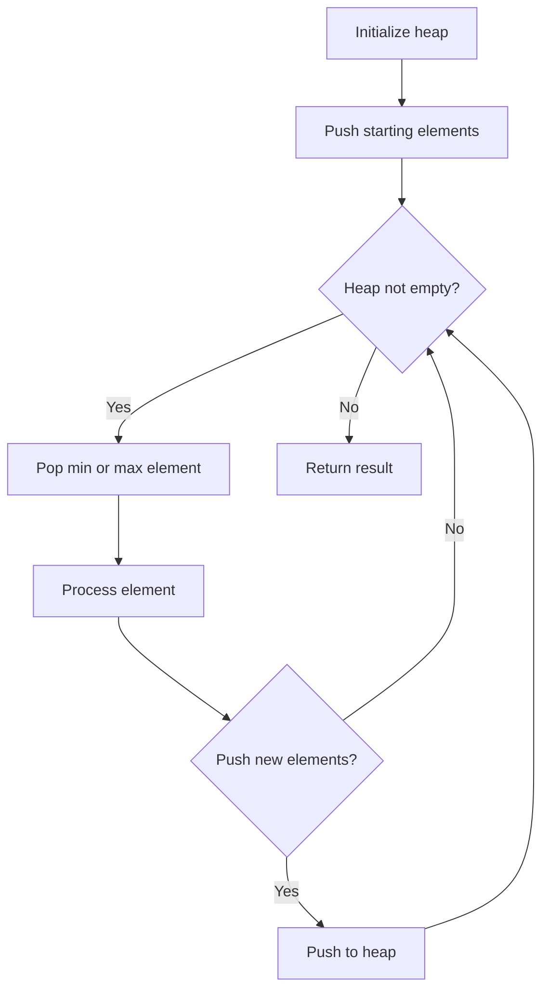
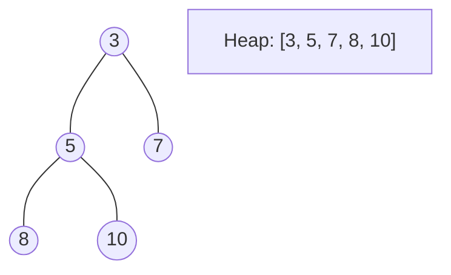
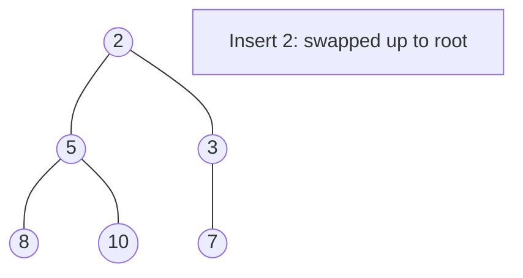
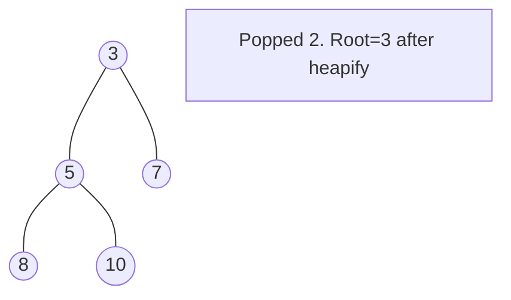

# Problem 1942: The Number of the Smallest Unoccupied Chair

**Difficulty:** Medium  
**Tags:** Array, Hash Table, Heap (Priority Queue)  
**Pattern:** Heap / Priority Queue  
**Link:** [leetcode.com/problems/the-number-of-the-smallest-unoccupied-chair](https://leetcode.com/problems/the-number-of-the-smallest-unoccupied-chair/)

## Description

There is a party where `n` friends numbered from `0` to `n - 1` are attending. There is an **infinite** number of chairs in this party that are numbered from `0` to `infinity`. When a friend arrives at the party, they sit on the unoccupied chair with the **smallest number**.

	- For example, if chairs `0`, `1`, and `5` are occupied when a friend comes, they will sit on chair number `2`.

When a friend leaves the party, their chair becomes unoccupied at the moment they leave. If another friend arrives at that same moment, they can sit in that chair.

You are given a **0-indexed** 2D integer array `times` where `times[i] = [arrivali, leavingi]`, indicating the arrival and leaving times of the `i^th` friend respectively, and an integer `targetFriend`. All arrival times are **distinct**.

Return* the **chair number** that the friend numbered *`targetFriend`* will sit on*.

 

Example 1:

```

**Input:** times = [[1,4],[2,3],[4,6]], targetFriend = 1
**Output:** 1
**Explanation:** 
- Friend 0 arrives at time 1 and sits on chair 0.
- Friend 1 arrives at time 2 and sits on chair 1.
- Friend 1 leaves at time 3 and chair 1 becomes empty.
- Friend 0 leaves at time 4 and chair 0 becomes empty.
- Friend 2 arrives at time 4 and sits on chair 0.
Since friend 1 sat on chair 1, we return 1.

```

Example 2:

```

**Input:** times = [[3,10],[1,5],[2,6]], targetFriend = 0
**Output:** 2
**Explanation:** 
- Friend 1 arrives at time 1 and sits on chair 0.
- Friend 2 arrives at time 2 and sits on chair 1.
- Friend 0 arrives at time 3 and sits on chair 2.
- Friend 1 leaves at time 5 and chair 0 becomes empty.
- Friend 2 leaves at time 6 and chair 1 becomes empty.
- Friend 0 leaves at time 10 and chair 2 becomes empty.
Since friend 0 sat on chair 2, we return 2.

```

 

**Constraints:**

	- `n == times.length`
	- `2 <= n <= 10^4`
	- `times[i].length == 2`
	- `1 <= arrivali < leavingi <= 10^5`
	- `0 <= targetFriend <= n - 1`
	- Each `arrivali` time is **distinct**.

## Approach: Heap / Priority Queue

Use a min-heap or max-heap to efficiently access the smallest/largest element. Push elements and pop the top to process in priority order.

## Pseudocode

```
1. Initialize heap (min or max)
2. Push initial elements onto heap
3. While heap not empty and condition:
   a. Pop top element (min or max)
   b. Process element
   c. Push new elements if needed
4. Return result
```

## Algorithm Flow



## Visual State Transitions

**Heap Operations (Min-Heap):**

**Frame 1: Initial heap**


**Frame 2: Insert 2 - bubble up**


**Frame 3: Pop minimum (2) - heapify down**



## Complexity Analysis

- **Time:** O(n log n)
- **Space:** O(n)

## Solution (Python3)

```python
class Solution:
    def smallestChair(self, times: List[List[int]], targetFriend: int) -> int:
        # Heap/Priority Queue - O(n log k) time
        import heapq
        if not times:
            return 0
        # Min heap (negate for max heap)
        heap = []
        for val in times:
            heapq.heappush(heap, val)
            if len(heap) > (targetFriend if isinstance(targetFriend, int) else len(times)):
                heapq.heappop(heap)
        return heap[0] if heap else 0
```

## Solution (C++)

```cpp
#include <queue>
#include <string>
#include <vector>
using namespace std;

class Solution {
public:
    int smallestChair(vector<vector<int>>& times, int targetFriend) {
        // Heap/Priority Queue - O(n log k) time
        priority_queue<int, vector<int>, greater<int>> pq;
        for (int val : times) {
            pq.push(val);
            if ((int)pq.size() > targetFriend)
                pq.pop();
        }
        return pq.empty() ? 0 : pq.top();
    }
};
```
