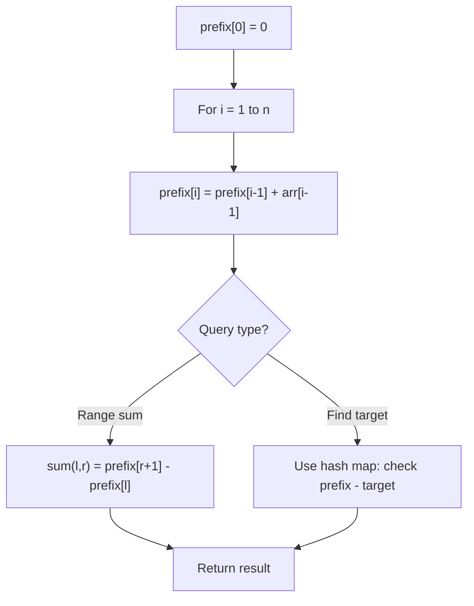

# Problem 1943: Describe the Painting

**Difficulty:** Medium  
**Tags:** Array, Hash Table, Sorting, Prefix Sum  
**Pattern:** Prefix Sum  
**Link:** [leetcode.com/problems/describe-the-painting](https://leetcode.com/problems/describe-the-painting/)

## Description

There is a long and thin painting that can be represented by a number line. The painting was painted with multiple overlapping segments where each segment was painted with a **unique** color. You are given a 2D integer array `segments`, where `segments[i] = [starti, endi, colori]` represents the **half-closed segment** `[starti, endi)` with `colori` as the color.

The colors in the overlapping segments of the painting were **mixed** when it was painted. When two or more colors mix, they form a new color that can be represented as a **set** of mixed colors.

	- For example, if colors `2`, `4`, and `6` are mixed, then the resulting mixed color is `{2,4,6}`.

For the sake of simplicity, you should only output the **sum** of the elements in the set rather than the full set.

You want to **describe** the painting with the **minimum** number of non-overlapping **half-closed segments** of these mixed colors. These segments can be represented by the 2D array `painting` where `painting[j] = [leftj, rightj, mixj]` describes a **half-closed segment** `[leftj, rightj)` with the mixed color **sum** of `mixj`.

	- For example, the painting created with `segments = [[1,4,5],[1,7,7]]` can be described by `painting = [[1,4,12],[4,7,7]]` because:

	
		`[1,4)` is colored `{5,7}` (with a sum of `12`) from both the first and second segments.
		- `[4,7)` is colored `{7}` from only the second segment.
	
	

Return *the 2D array *`painting`* describing the finished painting (excluding any parts that are **not **painted). You may return the segments in **any order***.

A **half-closed segment** `[a, b)` is the section of the number line between points `a` and `b` **including** point `a` and **not including** point `b`.

 

Example 1:

```

**Input:** segments = [[1,4,5],[4,7,7],[1,7,9]]
**Output:** [[1,4,14],[4,7,16]]
**Explanation: **The painting can be described as follows:
- [1,4) is colored {5,9} (with a sum of 14) from the first and third segments.
- [4,7) is colored {7,9} (with a sum of 16) from the second and third segments.

```

Example 2:

```

**Input:** segments = [[1,7,9],[6,8,15],[8,10,7]]
**Output:** [[1,6,9],[6,7,24],[7,8,15],[8,10,7]]
**Explanation: **The painting can be described as follows:
- [1,6) is colored 9 from the first segment.
- [6,7) is colored {9,15} (with a sum of 24) from the first and second segments.
- [7,8) is colored 15 from the second segment.
- [8,10) is colored 7 from the third segment.

```

Example 3:

```

**Input:** segments = [[1,4,5],[1,4,7],[4,7,1],[4,7,11]]
**Output:** [[1,4,12],[4,7,12]]
**Explanation: **The painting can be described as follows:
- [1,4) is colored {5,7} (with a sum of 12) from the first and second segments.
- [4,7) is colored {1,11} (with a sum of 12) from the third and fourth segments.
Note that returning a single segment [1,7) is incorrect because the mixed color sets are different.

```

 

**Constraints:**

	- `1 <= segments.length <= 2 * 10^4`
	- `segments[i].length == 3`
	- `1 <= starti < endi <= 10^5`
	- `1 <= colori <= 10^9`
	- Each `colori` is distinct.

## Approach: Prefix Sum

Build a prefix sum array where prefix[i] = sum of elements 0..i-1. Any subarray sum [l..r] = prefix[r+1] - prefix[l]. Combine with hash map for O(n) subarray sum queries.

## Pseudocode

```
1. Build prefix sum array: prefix[0]=0, prefix[i]=prefix[i-1]+arr[i-1]
2. Use prefix sums to answer queries:
   - Subarray sum [l..r] = prefix[r+1] - prefix[l]
   - Or use hash map to find prefix[j]-prefix[i] == target
3. Return result
```

## Algorithm Flow



## Complexity Analysis

- **Time:** O(n)
- **Space:** O(n)

## Solution (Python3)

```python
class Solution:
    def splitPainting(self, segments: List[List[int]]) -> List[List[int]]:
        # Prefix sum approach - O(n) time, O(n) space
        prefix = {0: -1}
        curr_sum = 0
        result = 0
        target = segments if isinstance(segments, int) else 0
        for i, val in enumerate(segments):
            curr_sum += val
            if curr_sum - target in prefix:
                result = max(result, i - prefix[curr_sum - target])
            if curr_sum not in prefix:
                prefix[curr_sum] = i
        return result
```

## Solution (C++)

```cpp
#include <algorithm>
#include <string>
#include <unordered_map>
#include <vector>
using namespace std;

class Solution {
public:
    vector<vector<int>> splitPainting(vector<vector<int>>& segments) {
        // Prefix sum approach - O(n) time, O(n) space
        unordered_map<int, int> prefix;
        prefix[0] = -1;
        int curr_sum = 0, result = 0;
        int target = segments;
        for (int i = 0; i < (int)segments.size(); i++) {
            curr_sum += segments[i];
            if (prefix.count(curr_sum - target)) {
                result = max(result, i - prefix[curr_sum - target]);
            }
            if (!prefix.count(curr_sum)) {
                prefix[curr_sum] = i;
            }
        }
        return result;
    }
};
```
