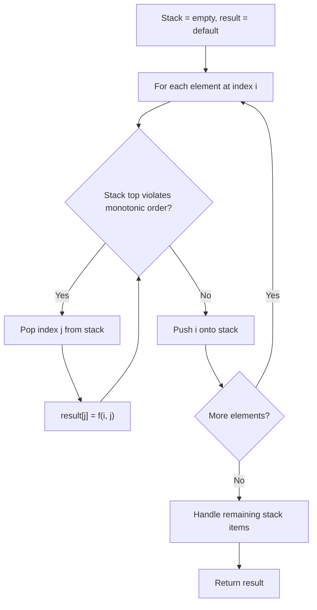
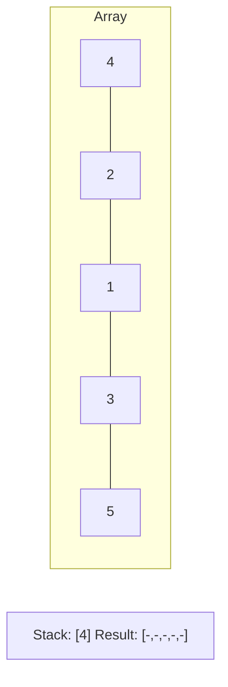
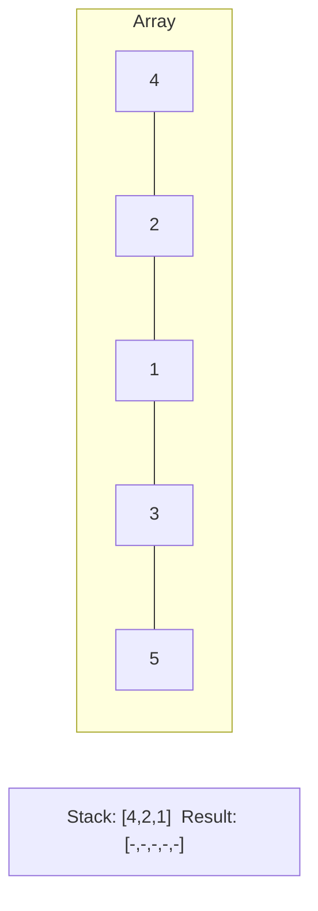
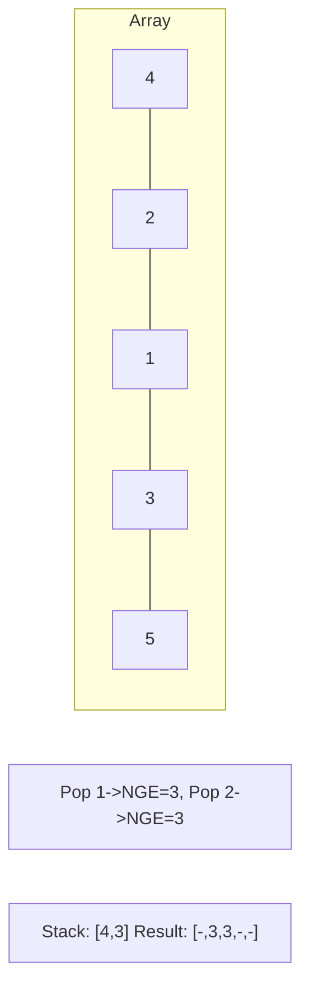
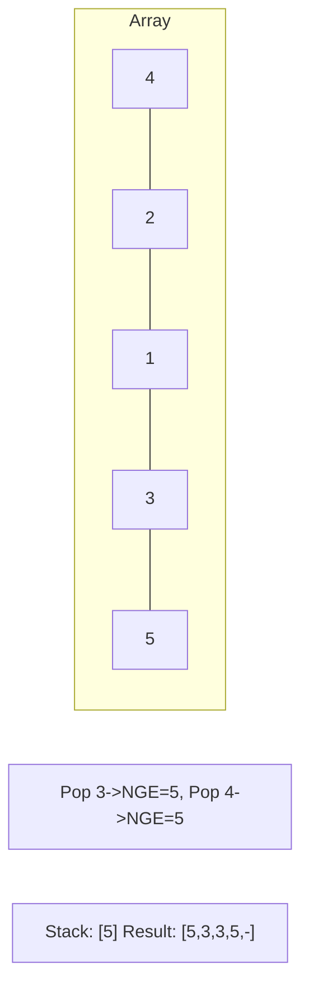

# Problem 1944: Number of Visible People in a Queue

**Difficulty:** Hard  
**Tags:** Array, Stack, Monotonic Stack  
**Pattern:** Monotonic Stack  
**Link:** [leetcode.com/problems/number-of-visible-people-in-a-queue](https://leetcode.com/problems/number-of-visible-people-in-a-queue/)

## Description

There are `n` people standing in a queue, and they numbered from `0` to `n - 1` in **left to right** order. You are given an array `heights` of **distinct** integers where `heights[i]` represents the height of the `i^th` person.

A person can **see** another person to their right in the queue if everybody in between is **shorter** than both of them. More formally, the `i^th` person can see the `j^th` person if `i < j` and `min(heights[i], heights[j]) > max(heights[i+1], heights[i+2], ..., heights[j-1])`.

Return *an array *`answer`* of length *`n`* where *`answer[i]`* is the **number of people** the *`i^th`* person can **see** to their right in the queue*.

 

Example 1:

```

**Input:** heights = [10,6,8,5,11,9]
**Output:** [3,1,2,1,1,0]
**Explanation:**
Person 0 can see person 1, 2, and 4.
Person 1 can see person 2.
Person 2 can see person 3 and 4.
Person 3 can see person 4.
Person 4 can see person 5.
Person 5 can see no one since nobody is to the right of them.

```

Example 2:

```

**Input:** heights = [5,1,2,3,10]
**Output:** [4,1,1,1,0]

```

 

**Constraints:**

	- `n == heights.length`
	- `1 <= n <= 10^5`
	- `1 <= heights[i] <= 10^5`
	- All the values of `heights` are **unique**.

## Approach: Monotonic Stack

Maintain a stack where elements are always in monotonic order (increasing or decreasing). When a new element violates the monotonic property, pop elements and compute results (e.g., next greater/smaller element, spans, areas).

## Pseudocode

```
1. Initialize empty stack, result array
2. For each element (index i):
   a. While stack not empty and arr[i] breaks monotonic order:
      - Pop index j from stack
      - result[j] = compute(i, j)
   b. Push i onto stack
3. Handle remaining elements in stack
4. Return result
```

## Algorithm Flow



## Visual State Transitions

**Monotonic Stack (Next Greater Element):**

**Frame 1: Process first elements**


**Frame 2: Push smaller elements**


**Frame 3: Element 3 pops 1 and 2**


**Frame 4: Element 5 pops all**



## Complexity Analysis

- **Time:** O(n)
- **Space:** O(n)

## Solution (Python3)

```python
class Solution:
    def canSeePersonsCount(self, heights: List[int]) -> List[int]:
        # Monotonic stack - O(n) time, O(n) space
        n = len(heights)
        result = [0] * n
        stack = []  # indices
        for i in range(n):
            while stack and heights[i] > heights[stack[-1]]:
                idx = stack.pop()
                result[idx] = i - idx
            stack.append(i)
        return result
```

## Solution (C++)

```cpp
#include <stack>
#include <string>
#include <vector>
using namespace std;

class Solution {
public:
    vector<int> canSeePersonsCount(vector<int>& heights) {
        // Monotonic stack - O(n) time, O(n) space
        int n = heights.size();
        vector<int> result(n, 0);
        stack<int> st;
        for (int i = 0; i < n; i++) {
            while (!st.empty() && heights[i] > heights[st.top()]) {
                int idx = st.top(); st.pop();
                result[idx] = i - idx;
            }
            st.push(i);
        }
        return result;
    }
};
```
