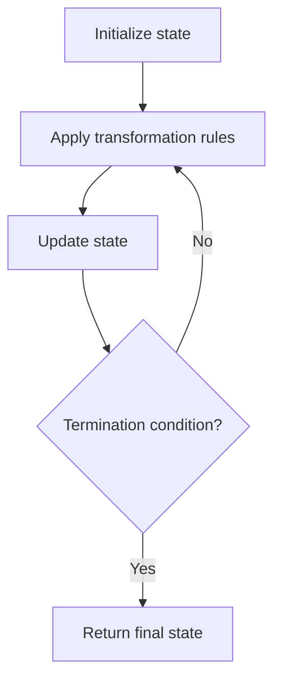

# Problem 1945: Sum of Digits of String After Convert

**Difficulty:** Easy  
**Tags:** String, Simulation  
**Pattern:** Simulation  
**Link:** [leetcode.com/problems/sum-of-digits-of-string-after-convert](https://leetcode.com/problems/sum-of-digits-of-string-after-convert/)

## Description

You are given a string `s` consisting of lowercase English letters, and an integer `k`. Your task is to *convert* the string into an integer by a special process, and then *transform* it by summing its digits repeatedly `k` times. More specifically, perform the following steps:

	- **Convert** `s` into an integer by replacing each letter with its position in the alphabet (i.e. replace `'a'` with `1`, `'b'` with `2`, ..., `'z'` with `26`).
	- **T****ransform** the integer by replacing it with the **sum of its digits**.
	- Repeat the **transform** operation (step 2) `k`** times** in total.

For example, if `s = "zbax"` and `k = 2`, then the resulting integer would be `8` by the following operations:

	- **Convert**: `"zbax" ➝ "(26)(2)(1)(24)" ➝ "262124" ➝ 262124`
	- **Transform #1**: `262124 ➝ 2 + 6 + 2 + 1 + 2 + 4 ➝ 17`
	- **Transform #2**: `17 ➝ 1 + 7 ➝ 8`

Return the **resulting** **integer** after performing the **operations** described above.

 

Example 1:

**Input:** s = "iiii", k = 1

**Output:** 36

**Explanation:**

The operations are as follows:

- Convert: "iiii" ➝ "(9)(9)(9)(9)" ➝ "9999" ➝ 9999

- Transform #1: 9999 ➝ 9 + 9 + 9 + 9 ➝ 36

Thus the resulting integer is 36.

Example 2:

**Input:** s = "leetcode", k = 2

**Output:** 6

**Explanation:**

The operations are as follows:

- Convert: "leetcode" ➝ "(12)(5)(5)(20)(3)(15)(4)(5)" ➝ "12552031545" ➝ 12552031545

- Transform #1: 12552031545 ➝ 1 + 2 + 5 + 5 + 2 + 0 + 3 + 1 + 5 + 4 + 5 ➝ 33

- Transform #2: 33 ➝ 3 + 3 ➝ 6

Thus the resulting integer is 6.

Example 3:

**Input:** s = "zbax", k = 2

**Output:** 8

 

**Constraints:**

	- `1 <= s.length <= 100`
	- `1 <= k <= 10`
	- `s` consists of lowercase English letters.

## Approach: Simulation

Simulate the process described in the problem step by step. Follow the rules exactly, tracking state at each step.

## Pseudocode

```
1. Initialize state (grid, pointers, counters)
2. For each step / iteration:
   a. Apply the transformation rules
   b. Update state
   c. Check termination condition
3. Return final state or result
```

## Algorithm Flow



## Complexity Analysis

- **Time:** O(n) or O(n * k)
- **Space:** O(n)

## Solution (Python3)

```python
class Solution:
    def getLucky(self, s: str, k: int) -> int:
        # Simulation approach - follow the rules step by step
        result = 0
        for i in range(len(s) if isinstance(s, list) else s):
            # Simulate each step
            pass
        return result
```

## Solution (C++)

```cpp
#include <string>
#include <vector>
using namespace std;

class Solution {
public:
    int getLucky(string& s, int k) {
        // Simulation approach
        int n = s.size();
        for (int i = 0; i < n; i++) {
            // Simulate each step
        }
        return 0;
    }
};
```
