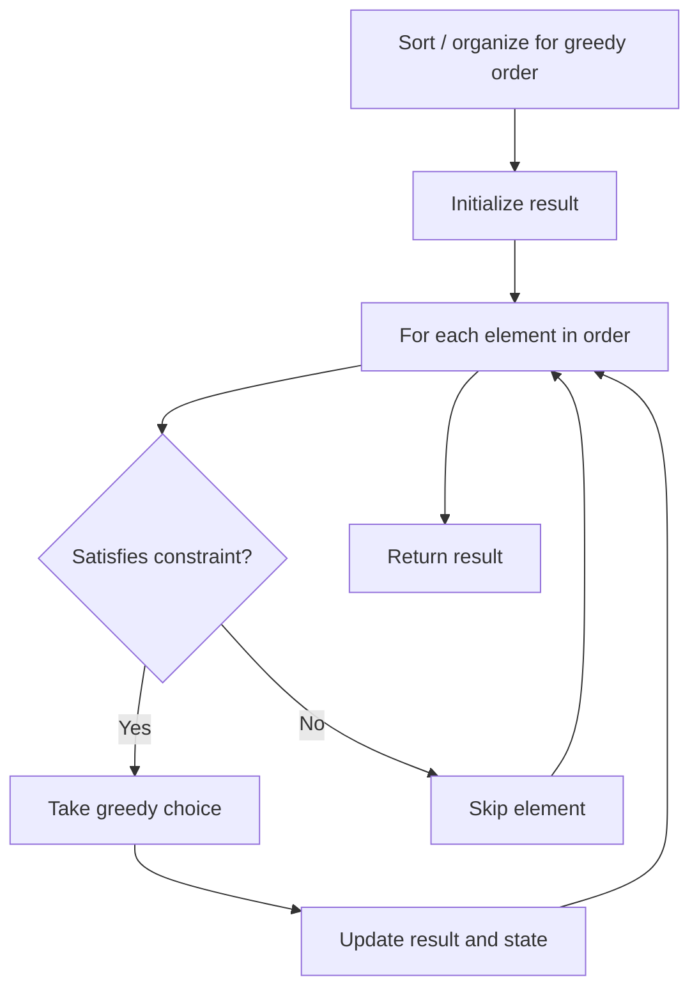

# Problem 1946: Largest Number After Mutating Substring

**Difficulty:** Medium  
**Tags:** Array, String, Greedy  
**Pattern:** Greedy  
**Link:** [leetcode.com/problems/largest-number-after-mutating-substring](https://leetcode.com/problems/largest-number-after-mutating-substring/)

## Description

You are given a string `num`, which represents a large integer. You are also given a **0-indexed** integer array `change` of length `10` that maps each digit `0-9` to another digit. More formally, digit `d` maps to digit `change[d]`.

You may **choose** to **mutate a single substring** of `num`. To mutate a substring, replace each digit `num[i]` with the digit it maps to in `change` (i.e. replace `num[i]` with `change[num[i]]`).

Return *a string representing the **largest** possible integer after **mutating** (or choosing not to) a **single substring** of *`num`.

A **substring** is a contiguous sequence of characters within the string.

 

Example 1:

```

**Input:** num = "132", change = [9,8,5,0,3,6,4,2,6,8]
**Output:** "832"
**Explanation:** Replace the substring "1":
- 1 maps to change[1] = 8.
Thus, "132" becomes "832".
"832" is the largest number that can be created, so return it.

```

Example 2:

```

**Input:** num = "021", change = [9,4,3,5,7,2,1,9,0,6]
**Output:** "934"
**Explanation:** Replace the substring "021":
- 0 maps to change[0] = 9.
- 2 maps to change[2] = 3.
- 1 maps to change[1] = 4.
Thus, "021" becomes "934".
"934" is the largest number that can be created, so return it.

```

Example 3:

```

**Input:** num = "5", change = [1,4,7,5,3,2,5,6,9,4]
**Output:** "5"
**Explanation:** "5" is already the largest number that can be created, so return it.

```

 

**Constraints:**

	- `1 <= num.length <= 10^5`
	- `num` consists of only digits `0-9`.
	- `change.length == 10`
	- `0 <= change[d] <= 9`

## Approach: Greedy

Make the locally optimal choice at each step, trusting it leads to a global optimum. Greedy works when the problem has the greedy-choice property and optimal substructure.

## Pseudocode

```
1. Sort or organize data for greedy ordering
2. Initialize result
3. For each element in greedy order:
   a. If element satisfies constraint:
      - Take the greedy choice
      - Update result and state
4. Return result
```

## Algorithm Flow



## Complexity Analysis

- **Time:** O(n log n)
- **Space:** O(1)

## Solution (Python3)

```python
class Solution:
    def maximumNumber(self, num: str, change: List[int]) -> str:
        # Greedy approach - O(n) time
        result = 0
        curr_max = 0
        for i in range(len(num)):
            if isinstance(num[i], int):
                curr_max = max(curr_max, num[i])
                result = max(result, curr_max)
            else:
                result += 1
        return result
```

## Solution (C++)

```cpp
#include <algorithm>
#include <string>
#include <vector>
using namespace std;

class Solution {
public:
    string maximumNumber(string& num, vector<int>& change) {
        // Greedy approach - O(n) time
        int result = 0, curr_max = 0;
        for (int i = 0; i < (int)num.size(); i++) {
            curr_max = max(curr_max, num[i]);
            result = max(result, curr_max);
        }
        return result;
    }
};
```
