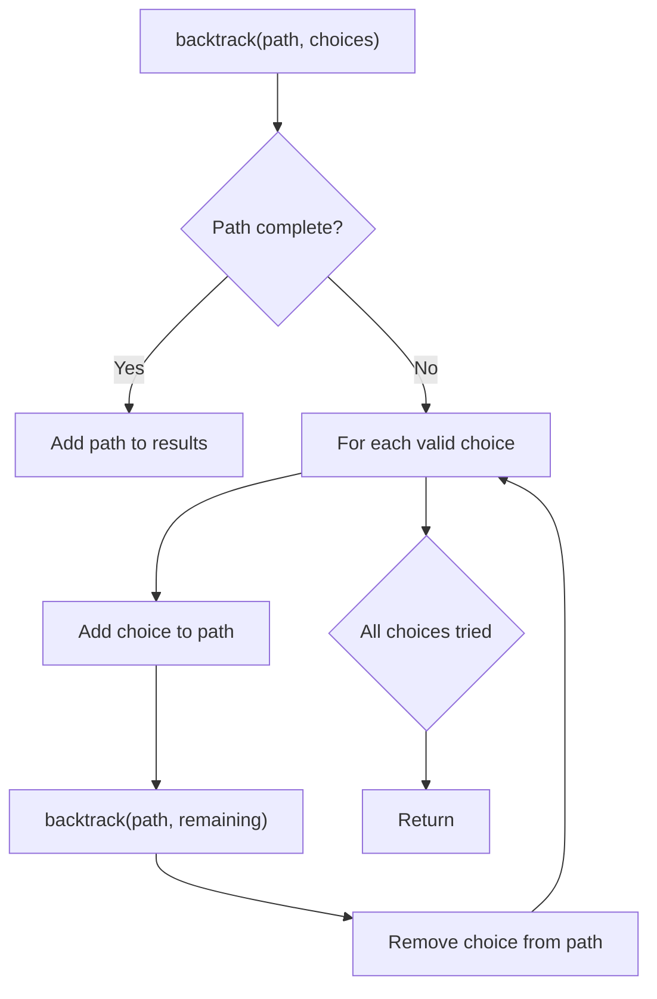
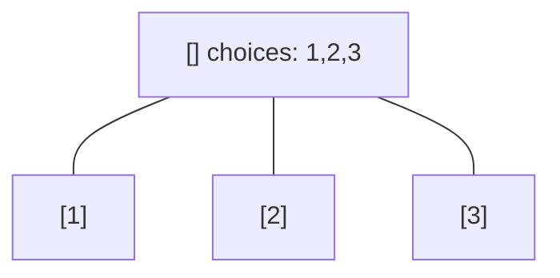
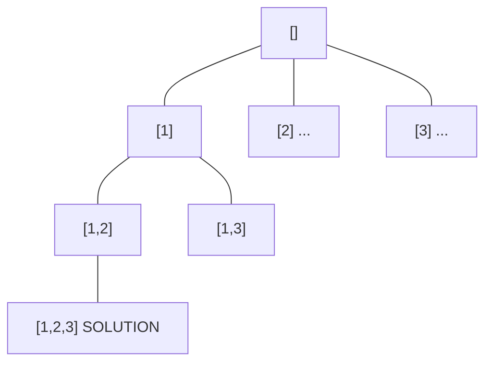
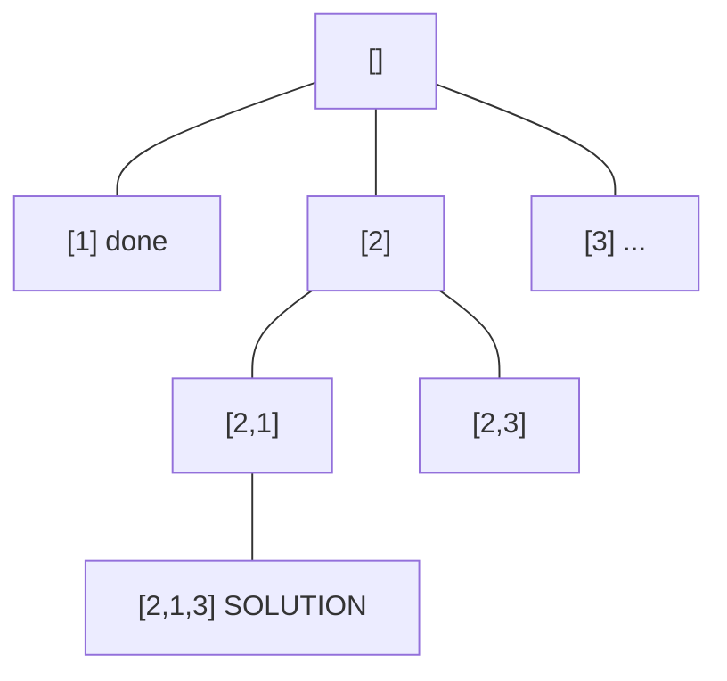
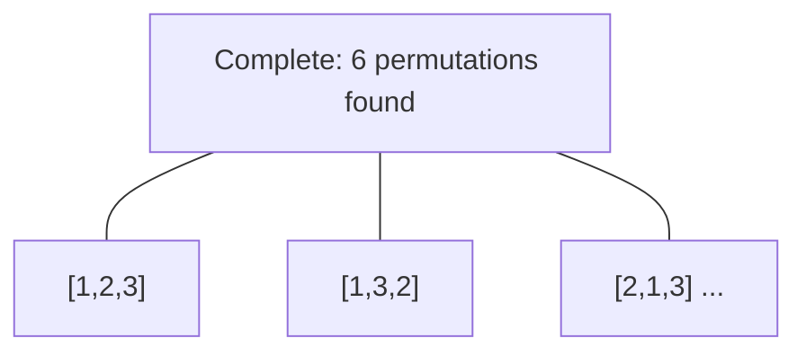

# Problem 1947: Maximum Compatibility Score Sum

**Difficulty:** Medium  
**Tags:** Array, Dynamic Programming, Backtracking, Bit Manipulation, Bitmask  
**Pattern:** Backtracking  
**Link:** [leetcode.com/problems/maximum-compatibility-score-sum](https://leetcode.com/problems/maximum-compatibility-score-sum/)

## Description

There is a survey that consists of `n` questions where each question's answer is either `0` (no) or `1` (yes).

The survey was given to `m` students numbered from `0` to `m - 1` and `m` mentors numbered from `0` to `m - 1`. The answers of the students are represented by a 2D integer array `students` where `students[i]` is an integer array that contains the answers of the `i^th` student (**0-indexed**). The answers of the mentors are represented by a 2D integer array `mentors` where `mentors[j]` is an integer array that contains the answers of the `j^th` mentor (**0-indexed**).

Each student will be assigned to **one** mentor, and each mentor will have **one** student assigned to them. The **compatibility score** of a student-mentor pair is the number of answers that are the same for both the student and the mentor.

	- For example, if the student's answers were `[1, 0, 1]` and the mentor's answers were `[0, 0, 1]`, then their compatibility score is 2 because only the second and the third answers are the same.

You are tasked with finding the optimal student-mentor pairings to **maximize** the** sum of the compatibility scores**.

Given `students` and `mentors`, return *the **maximum compatibility score sum** that can be achieved.*

 

Example 1:

```

**Input:** students = [[1,1,0],[1,0,1],[0,0,1]], mentors = [[1,0,0],[0,0,1],[1,1,0]]
**Output:** 8
**Explanation:** We assign students to mentors in the following way:
- student 0 to mentor 2 with a compatibility score of 3.
- student 1 to mentor 0 with a compatibility score of 2.
- student 2 to mentor 1 with a compatibility score of 3.
The compatibility score sum is 3 + 2 + 3 = 8.

```

Example 2:

```

**Input:** students = [[0,0],[0,0],[0,0]], mentors = [[1,1],[1,1],[1,1]]
**Output:** 0
**Explanation:** The compatibility score of any student-mentor pair is 0.

```

 

**Constraints:**

	- `m == students.length == mentors.length`
	- `n == students[i].length == mentors[j].length`
	- `1 <= m, n <= 8`
	- `students[i][k]` is either `0` or `1`.
	- `mentors[j][k]` is either `0` or `1`.

## Approach: Backtracking

Explore all possible solutions by building candidates incrementally. At each step, make a choice and recurse. If the choice leads to a dead end, undo the choice (backtrack) and try the next option.

## Pseudocode

```
1. Define backtrack(path, choices):
   a. If path is a complete solution: add to results
   b. For each choice in choices:
      - If choice is valid:
        * Add choice to path
        * backtrack(path, remaining_choices)
        * Remove choice from path (backtrack)
2. Call backtrack([], all_choices)
```

## Algorithm Flow



## Visual State Transitions

**Backtracking Decision Tree:**

**Frame 1: Root - start with empty path**


**Frame 2: Explore branch [1]**


**Frame 3: Backtrack, explore [2]**


**Frame 4: All solutions found**



## Complexity Analysis

- **Time:** O(k^n) or O(n!)
- **Space:** O(n)

## Solution (Python3)

```python
class Solution:
    def maxCompatibilitySum(self, students: List[List[int]], mentors: List[List[int]]) -> int:
        # Backtracking - O(2^n) or O(n!) time
        result = []
        
        def backtrack(path, start):
            result.append(path[:])
            for i in range(start, len(students)):
                path.append(students[i])
                backtrack(path, i + 1)
                path.pop()
        
        backtrack([], 0)
        return result
```

## Solution (C++)

```cpp
#include <functional>
#include <string>
#include <vector>
using namespace std;

class Solution {
public:
    int maxCompatibilitySum(vector<vector<int>>& students, vector<vector<int>>& mentors) {
        // Backtracking - O(2^n) or O(n!) time
        vector<vector<int>> result;
        vector<int> path;
        function<void(int)> backtrack = [&](int start) {
            result.push_back(path);
            for (int i = start; i < (int)students.size(); i++) {
                path.push_back(students[i]);
                backtrack(i + 1);
                path.pop_back();
            }
        };
        backtrack(0);
        return result;
    }
};
```
