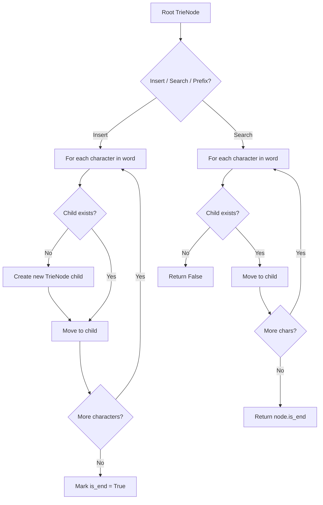
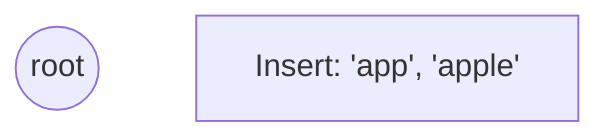
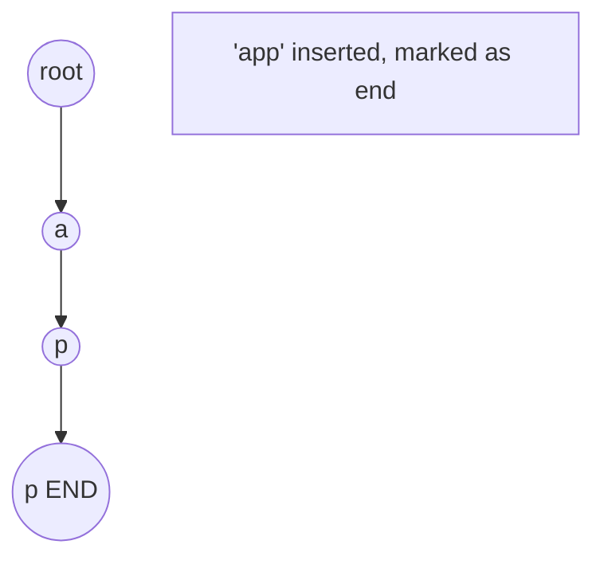
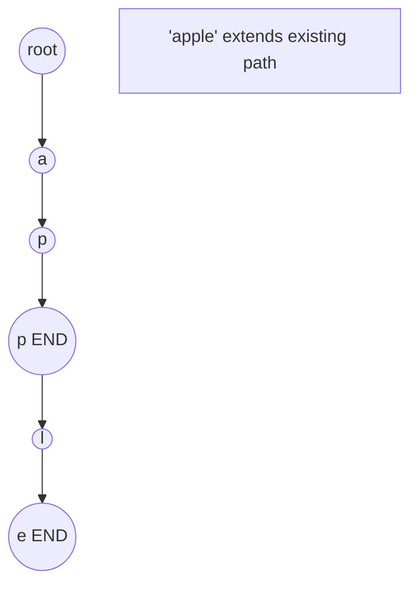
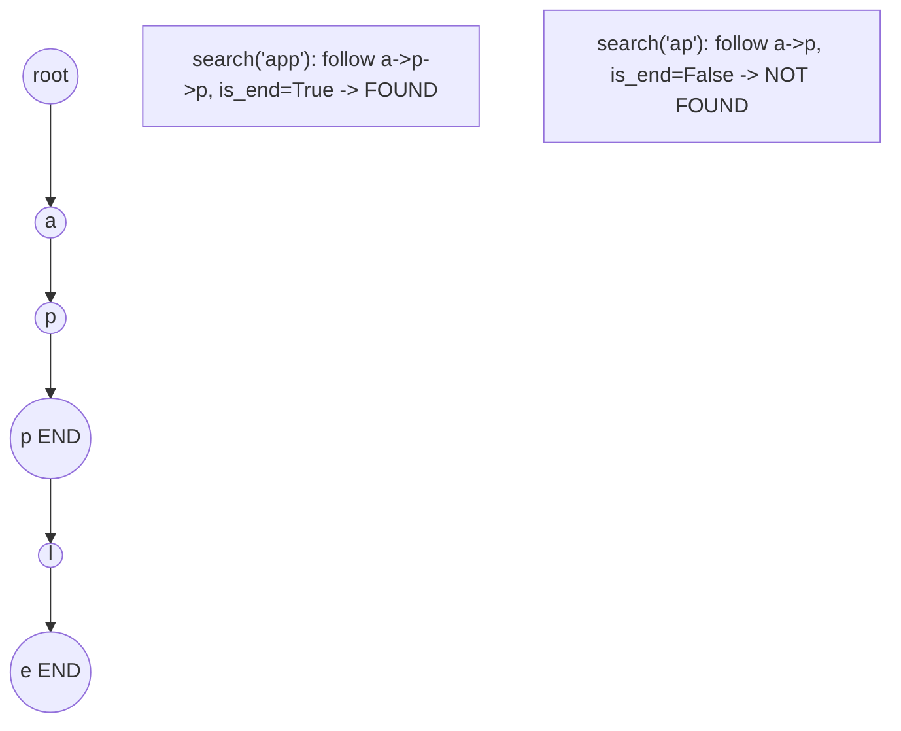

# Problem 1948: Delete Duplicate Folders in System

**Difficulty:** Hard  
**Tags:** Array, Hash Table, String, Trie, Hash Function  
**Pattern:** Trie / Prefix Tree  
**Link:** [leetcode.com/problems/delete-duplicate-folders-in-system](https://leetcode.com/problems/delete-duplicate-folders-in-system/)

## Description

Due to a bug, there are many duplicate folders in a file system. You are given a 2D array `paths`, where `paths[i]` is an array representing an absolute path to the `i^th` folder in the file system.

	- For example, `["one", "two", "three"]` represents the path `"/one/two/three"`.

Two folders (not necessarily on the same level) are **identical** if they contain the **same non-empty** set of identical subfolders and underlying subfolder structure. The folders **do not** need to be at the root level to be identical. If two or more folders are **identical**, then **mark** the folders as well as all their subfolders.

	- For example, folders `"/a"` and `"/b"` in the file structure below are identical. They (as well as their subfolders) should **all** be marked:

	
		`/a`
		- `/a/x`
		- `/a/x/y`
		- `/a/z`
		- `/b`
		- `/b/x`
		- `/b/x/y`
		- `/b/z`
	
	
	- However, if the file structure also included the path `"/b/w"`, then the folders `"/a"` and `"/b"` would not be identical. Note that `"/a/x"` and `"/b/x"` would still be considered identical even with the added folder.

Once all the identical folders and their subfolders have been marked, the file system will **delete** all of them. The file system only runs the deletion once, so any folders that become identical after the initial deletion are not deleted.

Return *the 2D array *`ans` *containing the paths of the **remaining** folders after deleting all the marked folders. The paths may be returned in **any** order*.

 

Example 1:

```

**Input:** paths = [["a"],["c"],["d"],["a","b"],["c","b"],["d","a"]]
**Output:** [["d"],["d","a"]]
**Explanation:** The file structure is as shown.
Folders "/a" and "/c" (and their subfolders) are marked for deletion because they both contain an empty
folder named "b".

```

Example 2:

```

**Input:** paths = [["a"],["c"],["a","b"],["c","b"],["a","b","x"],["a","b","x","y"],["w"],["w","y"]]
**Output:** [["c"],["c","b"],["a"],["a","b"]]
**Explanation: **The file structure is as shown. 
Folders "/a/b/x" and "/w" (and their subfolders) are marked for deletion because they both contain an empty folder named "y".
Note that folders "/a" and "/c" are identical after the deletion, but they are not deleted because they were not marked beforehand.

```

Example 3:

```

**Input:** paths = [["a","b"],["c","d"],["c"],["a"]]
**Output:** [["c"],["c","d"],["a"],["a","b"]]
**Explanation:** All folders are unique in the file system.
Note that the returned array can be in a different order as the order does not matter.

```

 

**Constraints:**

	- `1 <= paths.length <= 2 * 10^4`
	- `1 <= paths[i].length <= 500`
	- `1 <= paths[i][j].length <= 10`
	- `1 <= sum(paths[i][j].length) <= 2 * 10^5`
	- `path[i][j]` consists of lowercase English letters.
	- No two paths lead to the same folder.
	- For any folder not at the root level, its parent folder will also be in the input.

## Approach: Trie / Prefix Tree

Build a trie (prefix tree) where each node represents a character. Insert words character by character, and search by following child pointers. Supports efficient prefix matching.

## Pseudocode

```
1. TrieNode: children = {}, is_end = False
2. Insert(word):
   - For each char: create child if absent, move to child
   - Mark last node as end
3. Search(word):
   - For each char: if child absent return False, move to child
   - Return node.is_end
4. StartsWith(prefix): same as search but return True at end
```

## Algorithm Flow



## Visual State Transitions

**Trie Insert and Search:**

**Frame 1: Empty trie**


**Frame 2: Insert 'app'**


**Frame 3: Insert 'apple'**


**Frame 4: Search 'app' = True, 'ap' = False**



## Complexity Analysis

- **Time:** O(L) per operation
- **Space:** O(N * L)

## Solution (Python3)

```python
class Solution:
    def deleteDuplicateFolder(self, paths: List[List[str]]) -> List[List[str]]:
        # Trie-based approach
        trie = {}
        # Build trie from word list
        words = paths if isinstance(paths, list) else [paths]
        for word in words:
            node = trie
            for ch in word:
                if ch not in node:
                    node[ch] = {}
                node = node[ch]
            node['#'] = True
        
        # Search in trie
        def search(word):
            node = trie
            for ch in word:
                if ch not in node:
                    return False
                node = node[ch]
            return '#' in node
        
        return []
```

## Solution (C++)

```cpp
#include <string>
#include <vector>
using namespace std;

class Solution {
public:
    vector<vector<string>> deleteDuplicateFolder(vector<vector<string>>& paths) {
        // Trie-based approach
        struct TrieNode {
            TrieNode* children[26] = {};
            bool isEnd = false;
        };
        TrieNode* root = new TrieNode();
        // Build trie
        for (auto& word : paths) {
            TrieNode* node = root;
            for (char ch : word) {
                int idx = ch - 'a';
                if (!node->children[idx])
                    node->children[idx] = new TrieNode();
                node = node->children[idx];
            }
            node->isEnd = true;
        }
        return {};
    }
};
```
