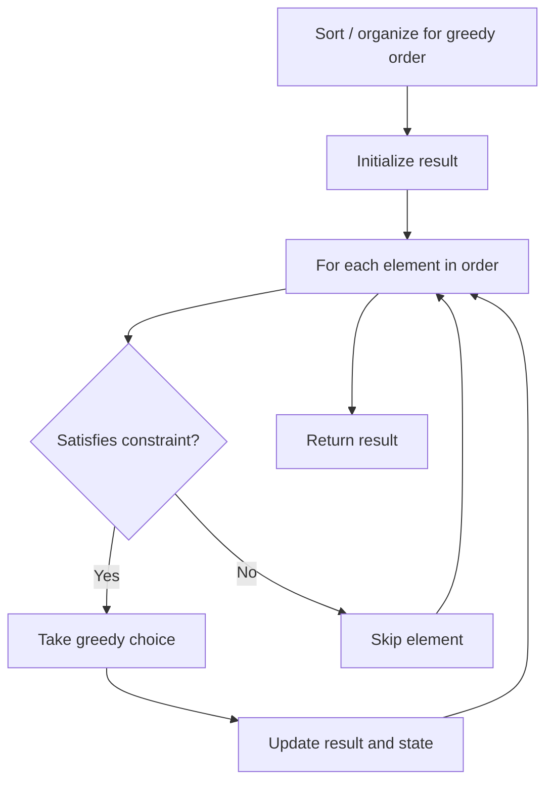

# Problem 1953: Maximum Number of Weeks for Which You Can Work

**Difficulty:** Medium  
**Tags:** Array, Greedy  
**Pattern:** Greedy  
**Link:** [leetcode.com/problems/maximum-number-of-weeks-for-which-you-can-work](https://leetcode.com/problems/maximum-number-of-weeks-for-which-you-can-work/)

## Description

There are `n` projects numbered from `0` to `n - 1`. You are given an integer array `milestones` where each `milestones[i]` denotes the number of milestones the `i^th` project has.

You can work on the projects following these two rules:

	- Every week, you will finish **exactly one** milestone of **one** project. You **must** work every week.
	- You **cannot** work on two milestones from the same project for two **consecutive** weeks.

Once all the milestones of all the projects are finished, or if the only milestones that you can work on will cause you to violate the above rules, you will **stop working**. Note that you may not be able to finish every project's milestones due to these constraints.

Return *the **maximum** number of weeks you would be able to work on the projects without violating the rules mentioned above*.

 

Example 1:

```

**Input:** milestones = [1,2,3]
**Output:** 6
**Explanation:** One possible scenario is:
​​​​- During the 1st week, you will work on a milestone of project 0.
- During the 2nd week, you will work on a milestone of project 2.
- During the 3rd week, you will work on a milestone of project 1.
- During the 4th week, you will work on a milestone of project 2.
- During the 5th week, you will work on a milestone of project 1.
- During the 6th week, you will work on a milestone of project 2.
The total number of weeks is 6.

```

Example 2:

```

**Input:** milestones = [5,2,1]
**Output:** 7
**Explanation:** One possible scenario is:
- During the 1st week, you will work on a milestone of project 0.
- During the 2nd week, you will work on a milestone of project 1.
- During the 3rd week, you will work on a milestone of project 0.
- During the 4th week, you will work on a milestone of project 1.
- During the 5th week, you will work on a milestone of project 0.
- During the 6th week, you will work on a milestone of project 2.
- During the 7th week, you will work on a milestone of project 0.
The total number of weeks is 7.
Note that you cannot work on the last milestone of project 0 on 8th week because it would violate the rules.
Thus, one milestone in project 0 will remain unfinished.

```

 

**Constraints:**

	- `n == milestones.length`
	- `1 <= n <= 10^5`
	- `1 <= milestones[i] <= 10^9`

## Approach: Greedy

Make the locally optimal choice at each step, trusting it leads to a global optimum. Greedy works when the problem has the greedy-choice property and optimal substructure.

## Pseudocode

```
1. Sort or organize data for greedy ordering
2. Initialize result
3. For each element in greedy order:
   a. If element satisfies constraint:
      - Take the greedy choice
      - Update result and state
4. Return result
```

## Algorithm Flow



## Complexity Analysis

- **Time:** O(n log n)
- **Space:** O(1)

## Solution (Python3)

```python
class Solution:
    def numberOfWeeks(self, milestones: List[int]) -> int:
        # Greedy approach - O(n) time
        result = 0
        curr_max = 0
        for i in range(len(milestones)):
            if isinstance(milestones[i], int):
                curr_max = max(curr_max, milestones[i])
                result = max(result, curr_max)
            else:
                result += 1
        return result
```

## Solution (C++)

```cpp
#include <algorithm>
#include <string>
#include <vector>
using namespace std;

class Solution {
public:
    int numberOfWeeks(vector<int>& milestones) {
        // Greedy approach - O(n) time
        int result = 0, curr_max = 0;
        for (int i = 0; i < (int)milestones.size(); i++) {
            curr_max = max(curr_max, milestones[i]);
            result = max(result, curr_max);
        }
        return result;
    }
};
```
