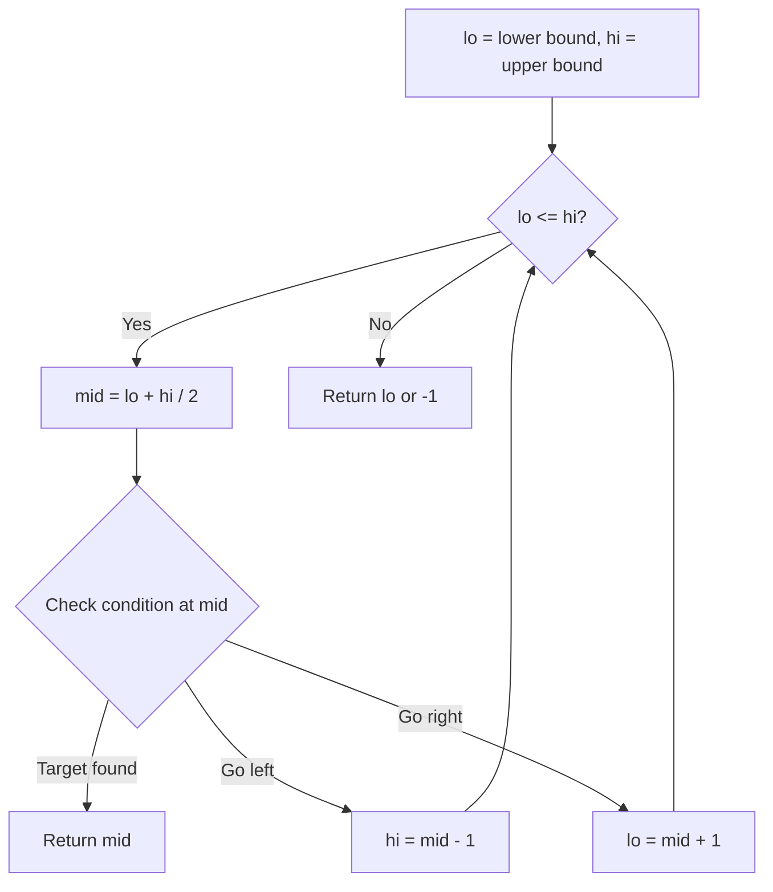
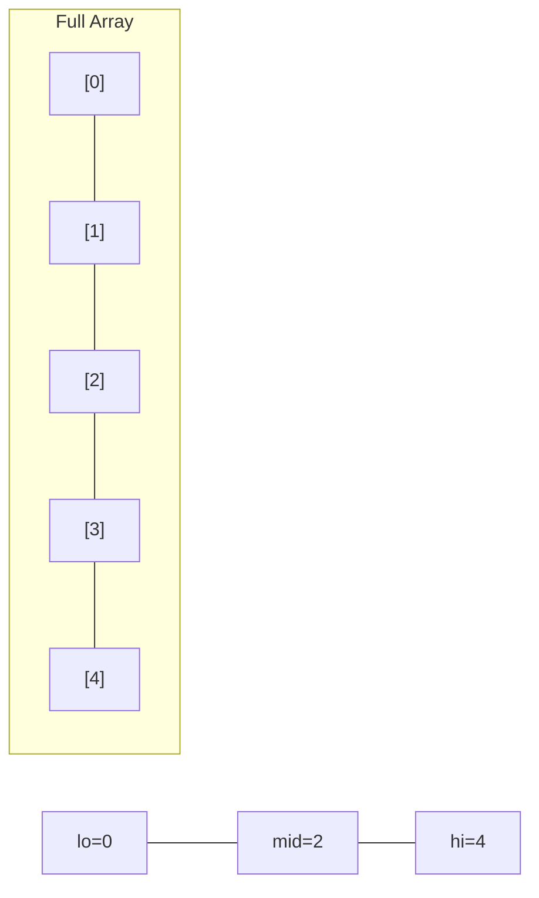
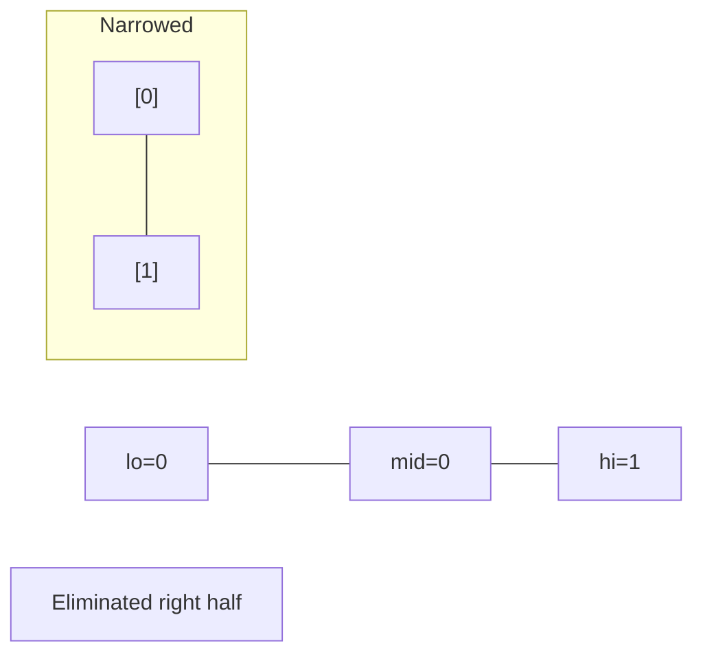
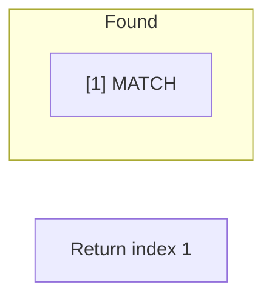

# Problem 1954: Minimum Garden Perimeter to Collect Enough Apples

**Difficulty:** Medium  
**Tags:** Math, Binary Search  
**Pattern:** Binary Search  
**Link:** [leetcode.com/problems/minimum-garden-perimeter-to-collect-enough-apples](https://leetcode.com/problems/minimum-garden-perimeter-to-collect-enough-apples/)

## Description

In a garden represented as an infinite 2D grid, there is an apple tree planted at **every** integer coordinate. The apple tree planted at an integer coordinate `(i, j)` has `|i| + |j|` apples growing on it.

You will buy an axis-aligned **square plot** of land that is centered at `(0, 0)`.

Given an integer `neededApples`, return *the **minimum perimeter** of a plot such that **at least***** **`neededApples` *apples are **inside or on** the perimeter of that plot*.

The value of `|x|` is defined as:

	- `x` if `x >= 0`
	- `-x` if `x < 0`

 

Example 1:

```

**Input:** neededApples = 1
**Output:** 8
**Explanation:** A square plot of side length 1 does not contain any apples.
However, a square plot of side length 2 has 12 apples inside (as depicted in the image above).
The perimeter is 2 * 4 = 8.

```

Example 2:

```

**Input:** neededApples = 13
**Output:** 16

```

Example 3:

```

**Input:** neededApples = 1000000000
**Output:** 5040

```

 

**Constraints:**

	- `1 <= neededApples <= 10^15`

## Approach: Binary Search

Use binary search to halve the search space each iteration. Define the search range [lo, hi], compute mid, and decide which half to keep based on the problem's monotonic condition.

## Pseudocode

```
1. lo = lower_bound, hi = upper_bound
2. While lo <= hi (or lo < hi):
   a. mid = (lo + hi) // 2
   b. If condition(mid) is satisfied: record answer, search left half
   c. Else: search right half
3. Return answer
```

## Algorithm Flow



## Visual State Transitions

**Binary Search Step-by-Step:**

**Frame 1: Initial search space**


**Frame 2: Compare mid, narrow search**


**Frame 3: Found target**



## Complexity Analysis

- **Time:** O(log n)
- **Space:** O(1)

## Solution (Python3)

```python
class Solution:
    def minimumPerimeter(self, neededApples: int) -> int:
        # Binary search - O(log n) time, O(1) space
        lo, hi = 0, len(neededApples) - 1
        while lo <= hi:
            mid = lo + (hi - lo) // 2
            if neededApples[mid] == neededApples:
                return mid
            elif neededApples[mid] < neededApples:
                lo = mid + 1
            else:
                hi = mid - 1
        return 0
```

## Solution (C++)

```cpp
#include <string>
#include <vector>
using namespace std;

class Solution {
public:
    int minimumPerimeter(int neededApples) {
        // Binary search - O(log n) time, O(1) space
        int lo = 0, hi = neededApples.size() - 1;
        while (lo <= hi) {
            int mid = lo + (hi - lo) / 2;
            if (neededApples[mid] == neededApples) {
                return mid;
            } else if (neededApples[mid] < neededApples) {
                lo = mid + 1;
            } else {
                hi = mid - 1;
            }
        }
        return 0;
    }
};
```
