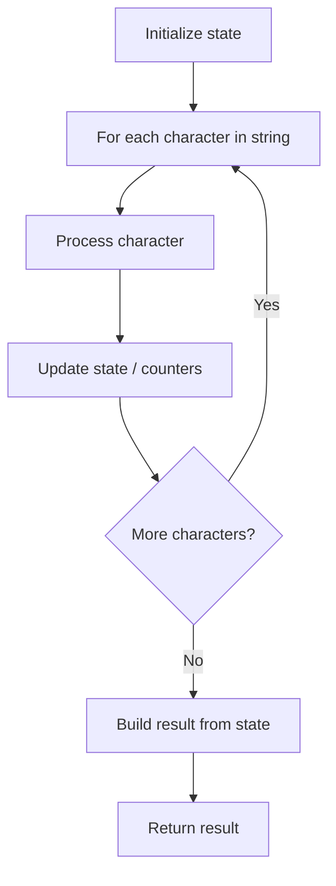

# Problem 1957: Delete Characters to Make Fancy String

**Difficulty:** Easy  
**Tags:** String  
**Pattern:** String Processing  
**Link:** [leetcode.com/problems/delete-characters-to-make-fancy-string](https://leetcode.com/problems/delete-characters-to-make-fancy-string/)

## Description

A **fancy string** is a string where no **three** **consecutive** characters are equal.

Given a string `s`, delete the **minimum** possible number of characters from `s` to make it **fancy**.

Return *the final string after the deletion*. It can be shown that the answer will always be **unique**.

 

Example 1:

```

**Input:** s = "leeetcode"
**Output:** "leetcode"
**Explanation:**
Remove an 'e' from the first group of 'e's to create "leetcode".
No three consecutive characters are equal, so return "leetcode".

```

Example 2:

```

**Input:** s = "aaabaaaa"
**Output:** "aabaa"
**Explanation:**
Remove an 'a' from the first group of 'a's to create "aabaaaa".
Remove two 'a's from the second group of 'a's to create "aabaa".
No three consecutive characters are equal, so return "aabaa".

```

Example 3:

```

**Input:** s = "aab"
**Output:** "aab"
**Explanation:** No three consecutive characters are equal, so return "aab".

```

 

**Constraints:**

	- `1 <= s.length <= 10^5`
	- `s` consists only of lowercase English letters.

## Approach: String Processing

Process the string character by character. Common techniques: two pointers, sliding window, hash map for frequencies, stack for matching.

## Pseudocode

```
1. Initialize result / tracking state
2. Iterate through string characters:
   a. Process character based on rules
   b. Update state (counters, pointers, stack)
3. Build and return result
```

## Algorithm Flow



## Complexity Analysis

- **Time:** O(n)
- **Space:** O(n)

## Solution (Python3)

```python
class Solution:
    def makeFancyString(self, s: str) -> str:
        # String processing approach - O(n) time
        result = []
        for ch in s:
            if ch.isalnum():
                result.append(ch.lower())
        # Check palindrome or process
        processed = ''.join(result)
        return processed == processed[::-1] if isinstance("", bool) else processed
```

## Solution (C++)

```cpp
#include <algorithm>
#include <cctype>
#include <string>
#include <vector>
using namespace std;

class Solution {
public:
    string makeFancyString(string& s) {
        // String processing approach - O(n) time
        string processed;
        for (char ch : s) {
            if (isalnum(ch)) {
                processed += tolower(ch);
            }
        }
        string rev = processed;
        reverse(rev.begin(), rev.end());
        return processed == rev;
    }
};
```
