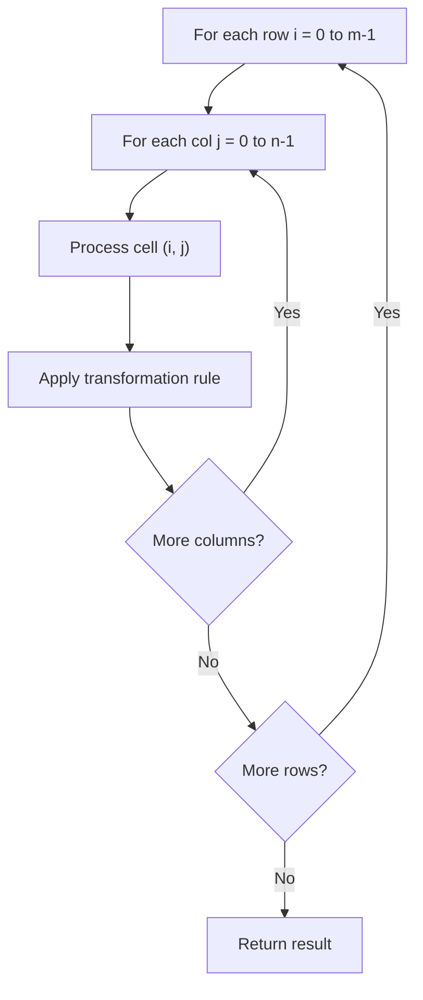

# Problem 1958: Check if Move is Legal

**Difficulty:** Medium  
**Tags:** Array, Matrix, Enumeration  
**Pattern:** Matrix / 2D Array  
**Link:** [leetcode.com/problems/check-if-move-is-legal](https://leetcode.com/problems/check-if-move-is-legal/)

## Description

You are given a **0-indexed** `8 x 8` grid `board`, where `board[r][c]` represents the cell `(r, c)` on a game board. On the board, free cells are represented by `'.'`, white cells are represented by `'W'`, and black cells are represented by `'B'`.

Each move in this game consists of choosing a free cell and changing it to the color you are playing as (either white or black). However, a move is only **legal** if, after changing it, the cell becomes the **endpoint of a good line** (horizontal, vertical, or diagonal).

A **good line** is a line of **three or more cells (including the endpoints)** where the endpoints of the line are **one color**, and the remaining cells in the middle are the **opposite color** (no cells in the line are free). You can find examples for good lines in the figure below:

Given two integers `rMove` and `cMove` and a character `color` representing the color you are playing as (white or black), return `true` *if changing cell *`(rMove, cMove)` *to color* `color` *is a **legal** move, or *`false`* if it is not legal*.

 

Example 1:

```

**Input:** board = [[".",".",".","B",".",".",".","."],[".",".",".","W",".",".",".","."],[".",".",".","W",".",".",".","."],[".",".",".","W",".",".",".","."],["W","B","B",".","W","W","W","B"],[".",".",".","B",".",".",".","."],[".",".",".","B",".",".",".","."],[".",".",".","W",".",".",".","."]], rMove = 4, cMove = 3, color = "B"
**Output:** true
**Explanation:** '.', 'W', and 'B' are represented by the colors blue, white, and black respectively, and cell (rMove, cMove) is marked with an 'X'.
The two good lines with the chosen cell as an endpoint are annotated above with the red rectangles.

```

Example 2:

```

**Input:** board = [[".",".",".",".",".",".",".","."],[".","B",".",".","W",".",".","."],[".",".","W",".",".",".",".","."],[".",".",".","W","B",".",".","."],[".",".",".",".",".",".",".","."],[".",".",".",".","B","W",".","."],[".",".",".",".",".",".","W","."],[".",".",".",".",".",".",".","B"]], rMove = 4, cMove = 4, color = "W"
**Output:** false
**Explanation:** While there are good lines with the chosen cell as a middle cell, there are no good lines with the chosen cell as an endpoint.

```

 

**Constraints:**

	- `board.length == board[r].length == 8`
	- `0 <= rMove, cMove < 8`
	- `board[rMove][cMove] == '.'`
	- `color` is either `'B'` or `'W'`.

## Approach: Matrix / 2D Array

Process the matrix row by row or column by column. Common patterns: rotation, spiral traversal, in-place modification, transposition.

## Pseudocode

```
1. For each row i:
   For each column j:
     Process cell (i, j) based on neighbors or rules
2. Handle boundary conditions
3. Return modified matrix or computed result
```

## Algorithm Flow



## Complexity Analysis

- **Time:** O(m * n)
- **Space:** O(1) extra

## Solution (Python3)

```python
class Solution:
    def checkMove(self, board: List[List[str]], rMove: int, cMove: int, color: str) -> bool:
        # Matrix manipulation - O(m*n) time
        if not board:
            return False
        m, n = len(board), len(board[0])
        # Process matrix in-place or build result
        for i in range(m):
            for j in range(n):
                pass  # Process board[i][j]
        return False
```

## Solution (C++)

```cpp
#include <string>
#include <vector>
using namespace std;

class Solution {
public:
    bool checkMove(vector<vector<string>>& board, int rMove, int cMove, string& color) {
        // Matrix manipulation - O(m*n) time
        if (board.empty()) return false;
        int m = board.size(), n = board[0].size();
        for (int i = 0; i < m; i++) {
            for (int j = 0; j < n; j++) {
                // Process matrix[i][j]
            }
        }
        return false;
    }
};
```
