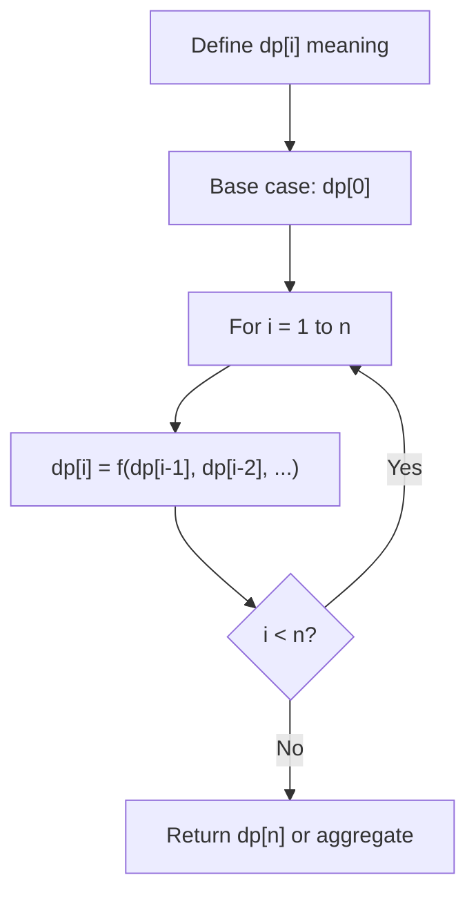
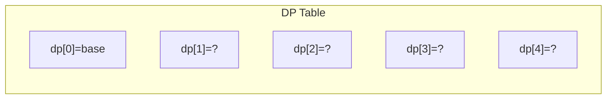
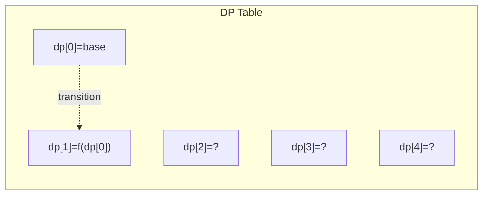
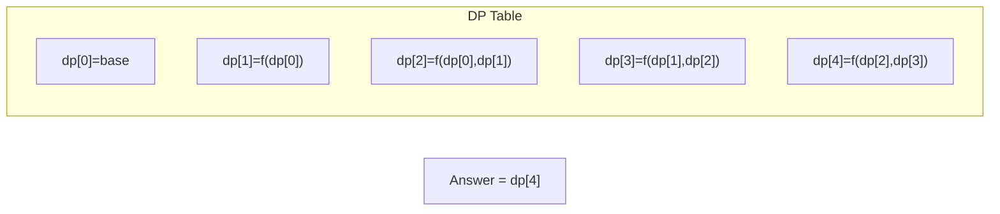

# Problem 1959: Minimum Total Space Wasted With K Resizing Operations

**Difficulty:** Medium  
**Tags:** Array, Dynamic Programming, Prefix Sum  
**Pattern:** Dynamic Programming (1D)  
**Link:** [leetcode.com/problems/minimum-total-space-wasted-with-k-resizing-operations](https://leetcode.com/problems/minimum-total-space-wasted-with-k-resizing-operations/)

## Description

You are currently designing a dynamic array. You are given a **0-indexed** integer array `nums`, where `nums[i]` is the number of elements that will be in the array at time `i`. In addition, you are given an integer `k`, the **maximum** number of times you can **resize** the array (to** any** size).

The size of the array at time `t`, `sizet`, must be at least `nums[t]` because there needs to be enough space in the array to hold all the elements. The **space wasted** at time `t` is defined as `sizet - nums[t]`, and the **total** space wasted is the **sum** of the space wasted across every time `t` where `0 <= t < nums.length`.

Return *the **minimum** **total space wasted** if you can resize the array at most* `k` *times*.

**Note:** The array can have **any size** at the start and does** not **count towards the number of resizing operations.

 

Example 1:

```

**Input:** nums = [10,20], k = 0
**Output:** 10
**Explanation:** size = [20,20].
We can set the initial size to be 20.
The total wasted space is (20 - 10) + (20 - 20) = 10.

```

Example 2:

```

**Input:** nums = [10,20,30], k = 1
**Output:** 10
**Explanation:** size = [20,20,30].
We can set the initial size to be 20 and resize to 30 at time 2. 
The total wasted space is (20 - 10) + (20 - 20) + (30 - 30) = 10.

```

Example 3:

```

**Input:** nums = [10,20,15,30,20], k = 2
**Output:** 15
**Explanation:** size = [10,20,20,30,30].
We can set the initial size to 10, resize to 20 at time 1, and resize to 30 at time 3.
The total wasted space is (10 - 10) + (20 - 20) + (20 - 15) + (30 - 30) + (30 - 20) = 15.

```

 

**Constraints:**

	- `1 <= nums.length <= 200`
	- `1 <= nums[i] <= 10^6`
	- `0 <= k <= nums.length - 1`

## Approach: Dynamic Programming (1D)

Break the problem into overlapping subproblems. Define dp[i] as the optimal value for the subproblem ending at or considering index i. Build the solution bottom-up, using previously computed dp values.

## Pseudocode

```
1. Define dp[i] = optimal value for subproblem i
2. Base case: dp[0] = initial value
3. For i from 1 to n:
   a. dp[i] = recurrence(dp[i-1], dp[i-2], ...)
4. Return dp[n] or max/min of dp
```

## Algorithm Flow



## Visual State Transitions

**1D Dynamic Programming Table Build:**

**Frame 1: Initialize base cases**


**Frame 2: Fill dp[1] from dp[0]**


**Frame 3: Fill remaining cells**



## Complexity Analysis

- **Time:** O(n)
- **Space:** O(n)

## Solution (Python3)

```python
class Solution:
    def minSpaceWastedKResizing(self, nums: List[int], k: int) -> int:
        # Dynamic programming (1D) - O(n) time, O(n) space
        if not nums:
            return 0
        n = len(nums) if isinstance(nums, list) else nums
        dp = [0] * (n + 1)
        dp[0] = 1  # base case
        for i in range(1, n + 1):
            dp[i] = dp[i-1]  # transition (customize per problem)
            if i >= 2:
                dp[i] += dp[i-2]
        return dp[n]
```

## Solution (C++)

```cpp
#include <string>
#include <vector>
using namespace std;

class Solution {
public:
    int minSpaceWastedKResizing(vector<int>& nums, int k) {
        // Dynamic programming (1D) - O(n) time, O(n) space
        int n = nums;
        if (n <= 0) return 0;
        vector<int> dp(n + 1, 0);
        dp[0] = 1;
        for (int i = 1; i <= n; i++) {
            dp[i] = dp[i-1];
            if (i >= 2) dp[i] += dp[i-2];
        }
        return dp[n];
    }
};
```
