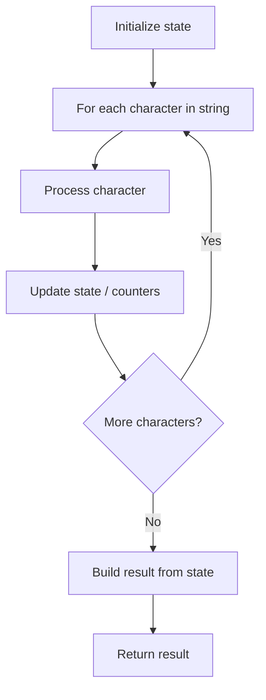

# Problem 1960: Maximum Product of the Length of Two Palindromic Substrings

**Difficulty:** Hard  
**Tags:** String, Rolling Hash, Hash Function  
**Pattern:** String Processing  
**Link:** [leetcode.com/problems/maximum-product-of-the-length-of-two-palindromic-substrings](https://leetcode.com/problems/maximum-product-of-the-length-of-two-palindromic-substrings/)

## Description

You are given a **0-indexed** string `s` and are tasked with finding two **non-intersecting palindromic **substrings of **odd** length such that the product of their lengths is maximized.

More formally, you want to choose four integers `i`, `j`, `k`, `l` such that `0 <= i <= j < k <= l < s.length` and both the substrings `s[i...j]` and `s[k...l]` are palindromes and have odd lengths. `s[i...j]` denotes a substring from index `i` to index `j` **inclusive**.

Return *the **maximum** possible product of the lengths of the two non-intersecting palindromic substrings.*

A **palindrome** is a string that is the same forward and backward. A **substring** is a contiguous sequence of characters in a string.

 

Example 1:

```

**Input:** s = "ababbb"
**Output:** 9
**Explanation:** Substrings "aba" and "bbb" are palindromes with odd length. product = 3 * 3 = 9.

```

Example 2:

```

**Input:** s = "zaaaxbbby"
**Output:** 9
**Explanation:** Substrings "aaa" and "bbb" are palindromes with odd length. product = 3 * 3 = 9.

```

 

**Constraints:**

	- `2 <= s.length <= 10^5`
	- `s` consists of lowercase English letters.

## Approach: String Processing

Process the string character by character. Common techniques: two pointers, sliding window, hash map for frequencies, stack for matching.

## Pseudocode

```
1. Initialize result / tracking state
2. Iterate through string characters:
   a. Process character based on rules
   b. Update state (counters, pointers, stack)
3. Build and return result
```

## Algorithm Flow



## Complexity Analysis

- **Time:** O(n)
- **Space:** O(n)

## Solution (Python3)

```python
class Solution:
    def maxProduct(self, s: str) -> int:
        # String processing approach - O(n) time
        result = []
        for ch in s:
            if ch.isalnum():
                result.append(ch.lower())
        # Check palindrome or process
        processed = ''.join(result)
        return processed == processed[::-1] if isinstance(0, bool) else processed
```

## Solution (C++)

```cpp
#include <algorithm>
#include <cctype>
#include <string>
#include <vector>
using namespace std;

class Solution {
public:
    int maxProduct(string& s) {
        // String processing approach - O(n) time
        string processed;
        for (char ch : s) {
            if (isalnum(ch)) {
                processed += tolower(ch);
            }
        }
        string rev = processed;
        reverse(rev.begin(), rev.end());
        return processed == rev;
    }
};
```
